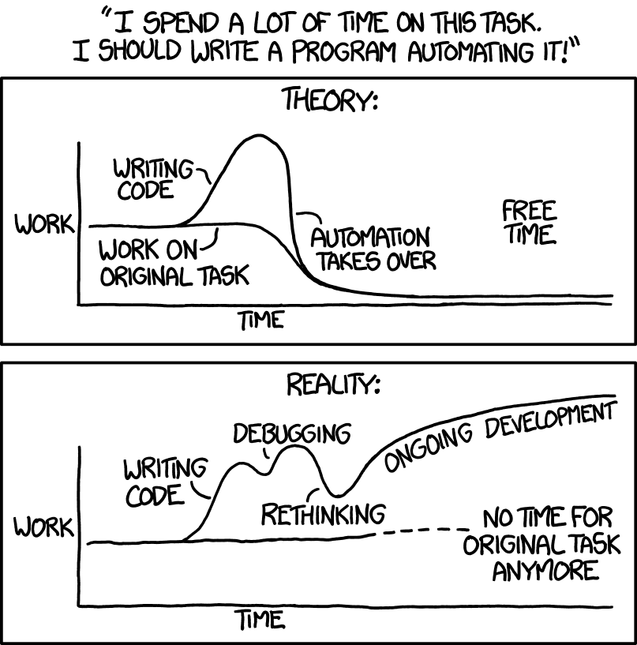

Your working software keeps working, if you just stop poking at it ... right? Yes! Sort of.

The promise of software is that you build it once and then the code keeps doing your job. That's [why engineers are paid so much](https://swizec.com/blog/why-engineers-are-worth-so-much/). Our work compounds in value! 5 hours of coding brings dozens, even thousands, of hours worth of value.

At work one day I spent an afternoon to turn a standard operating procedure into a CMS for our non-technical admins. That saved the engineering team an estimated _2 months of work per year_. From one afternoon!

But software automation has a flaw – once built, you keep fiddling with it. There's always _something_ you could make a little better. Feynman called this [the computer disease](https://www.goodreads.com/quotes/325051-well-mr-frankel-who-started-this-program-began-to-suffer).

## Stop fiddling!

The solution, my friend, is to build your code _and leave it alone_. Once it works, just let it be.

- You won't introduce new bugs,
- you won't waste time poking around,
- you won't have to learn new ways of doing things,
- you won't even have to make changes to chase every breaking library change 💪

Can't have a breaking library change if you don't upgrade your libraries. Smart.

Your users will thank you. We're tired of constant fiddling from every engineer, designer, product manager, and library author on the planet. When's the last time you _appreciated_ a surprise update?

You click a button, the app turns blank, reloads, AND NOW YOU HAVE A WHOLE NEW REDESIGNED UI! (╯°□°)╯︵ ┻━┻

## But software is a red queen's game

The leave it be strategy has worked great for many of my side projects. [TechLetter.App](https://techletter.app) has been running unchanged for years and I use it every day. The ["platform" I built](https://swizec.com/blog/why-and-how-i-built-my-own-course-platform/) for swizec.com and a few others got a couple commits per year since 2020.

But software is a red queen's game.

While you're standing still, everyone else is running. Full speed ahead. A change here, a tweak there, a tiny feature over yonder. _All the time_. In [Software Engineering at Google](https://swizec.com/blog/what-i-learned-from-software-engineering-at-google/), the authors mentioned that someone merges a commit to Google's code every few seconds.

Globally, I bet we do multiple commits per second in just the JavaScript/TypeScript ecosystem.

That means standing still accumulates a debt. **The longer you leave your code unchanged, the more it falls behind**. Coding standards become stale and misunderstood. Quirky workarounds get official library solutions. 3rd party APIs change. New features become unavailable to you. Libraries evolve.

### The debt comes due

Eventually, you _will_ have to make an update. Something breaks and you need to fix it. A new regulation comes and you have to adapt. You need a new feature and someone has to build it.

That's when waiting blows up in your face. The debt comes due. 🫠

Hosting for swizec.com recently became deprecated. Netlify bought Gatsby Cloud and decided to shut it down. Move somewhere else or go offline. There's a deadline.

But my blog is large – 1822 pages not counting category/tag listings – and takes forever to build with Gatsby. That's why I used Gatsby Cloud, it was the only host that didn't choke.

Netlify? Broke. Vercel? Broke. Build locally and deploy static files? Haha, no.

I know! [Gatsby v5](https://www.gatsbyjs.com/docs/reference/release-notes/v5.0/) came out a year ago and build performance was a big selling point. Maybe upgrading will fix my problem?

And that's when it all went to shit.

The upgrade took me _five weeks_. At one point I found myself adding `debugger` statements deep inside node_modules dependencies like a Sisyphean nightmare from hell. The platform package went through 88 pre-release versions before things started working 🙃

You know it's bad when your browser looks like this

I don't even remember everything that broke. The [MDXv2](https://mdxjs.com) upgrade was the biggest pain. Now I'm dealing with strange issues coming out of [ThemeUI](https://theme-ui.com).

Dark mode is broken. Black font on black background wtf? Syntax highlighting doesn't work, MDX and ThemeUI can't agree what counts as a code tag. I had to disable my Giphy integration because I don't know, something blows up.

But I was right! The blog now lives and builds on Vercel. Faster than before and I can fix the rest later.

## The lesson?

Small upgrades are easier to manage.

Going from v1.2.3 to v1.2.4 is no big deal. Jumping from v1.2.3 to v1.82.3984 can be a huge hassle even if each version bump doesn't cause a breaking change on its own.

[Upgrade early and often](https://swizec.com/blog/what-i-learned-from-software-engineering-at-google/#upgrade-dependencies-early-fast-and-often) as they say in Software Engineering at Google. Or pay the big price later.

Cheers, 
\~Swizec
