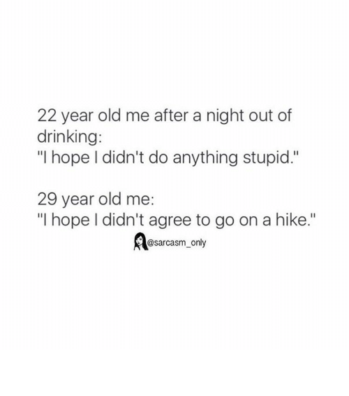

https://youtu.be/PWvgHcjmuXcThis is a story of how I got spread thin like butter on too much toast, as Bilbo Baggins would say.It starts on the [flight back from Boston](https://swizec.com/blog/teaching-backend-devs-react-redux-stubhub-boston/swizec/7952) in December. My friend asks _&quot;Hey, so I&#x27;ve got this project that&#x27;s almost finished, and my guy can&#x27;t work on it anymore. It&#x27;s just a little polish to wrap up. Would you be interested in helping me out?&quot;_

I gave my usual weasel-out-of-this answer. Errr I dunno man I&#x27;m pretty busy there&#x27;s a lot going on not sure I can help you with this. Maybe.

You never say No. Learned that from the general Silicon Valley culture. Everything&#x27;s a maybe. Keep your options open.

He asked me again a few weeks later.

This time, I was chilling. Solving Advent of Code puzzles, thinking about projects I might do in 2018, getting ready for some holiday downtime. Felt like I had all the time in the world.

So I said, “Yes, I&#x27;ll help you out. Let&#x27;s talk in January after the holidays.”

Aaaaaaand crap. January comes, life gets back to normal, things kick back into high gear, and guess who doesn&#x27;t _really_ have as much time as he thought.

Now, here I am, spread thin like butter over too much toast.

Guess it&#x27;s just one of those lessons you always learn the hard way again and again and again and then some more. It never really sinks in.

When agreeing to projects and ideas, consider your mental state and how it differs from the usual. You&#x27;re more likely to say Yes to things when you&#x27;re happy, and you&#x27;re very likely to think you&#x27;ll always have time if you currently have time.

Or as a popular meme once put it 👇

P.S.: The project is never &quot;quick&quot; or &quot;just some polish&quot;. Never.
