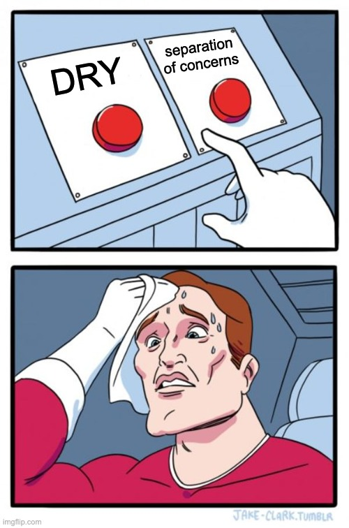
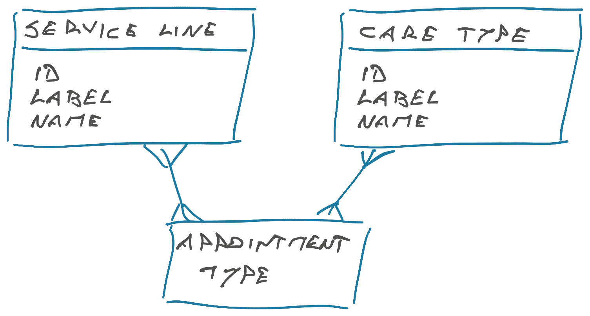

My favorite manager called this "_the most_ important concept for a software engineer to grasp". How do you choose between DRY – do not repeat yourself – and Separation of Concerns?



This is fun because Do Not Repeat Yourself and Separation of Concerns are engineering maxims that we all parrot as essential rules of how software is built. But when they butt heads we get stuck because we understand the words, not the idea.

## DRY – Do Not Repeat Yourself

DRY is the first rule every software engineer learns. My high school C professor loved to share this example from a parent-teacher conference. (yes I went to a weird school)

She once wrote an exam that said _"Print numbers 1 to 5"_

The student solved it like this:

```c
printf("1\n");
printf("2\n");
printf("3\n");
printf("4\n")
printf("5\n")
```

And got an F. The parents complained. _"Does this code not do what the question asked?"_

Imagine the professor rubbing her temples in frustration. _"Ugh yes, but it's wrong ... what if N was 100? Are you gonna add 100 more lines?"_

_"Yeah, that sounds easy. Would it not work?"_


She was looking for something like this:

```c
for (int i = 0; i < 5; i++) {
	printf("%d\n", i)
}
```

You DRY up the print, make it take an integer parameter, and run the whole thing in a loop. Now there's only one place to ~~make a mistake~~ change when you want to update the output.

## Separation of Concerns

Separation of Concerns is DRY's opposite cousin. It talks about detangling code so it can work in isolation.

Engineers learn this one by getting hit in the face with a shovel they left lying around. Unit testing and TDD are common tricks to encourage this practice. Can't test things in isolation if they're not isolated. 😉

The easiest tell that you need to separate concerns is when the word "and" sneaks into your description of a class, function, or component.

Imagine if sending an email also wiped your hard drive. You probably want different buttons for that ...

## The superficial similarity trap

DRY and SoC are rules, ask anyone. Here's the nuance people miss: _They aren't talking about code_.

These are _conceptual_ rules. You have to DRY concepts, not code. Same with separating _conceptual_ concerns. Sending email and wiping drives need to be separated, but "turn off lights and music" is a perfectly sensible operation to perform when you leave the house.

Here's an example we're dealing with at work.

You have two database tables, they look like this:



Two tables, different names, same columns, both with a many-to-many relation to appointment types. Should you DRY them up?

NO!

That's the problem we're dealing with. Years of this being DRY because it looks similar and now it's a pain to detangle.

"Service Line" and "Care Type" are different _concepts_. Despite superficial similarities. Service lines are a marketing concept that drives how appointments appear to users. Care types are a clinical concept that drives which providers can do what.

## Focus on the concepts

Forget if the code looks similar. Is it describing the same business concept? If yes, DRY. If no, separate.

Cheers,<br/>
~Swizec
