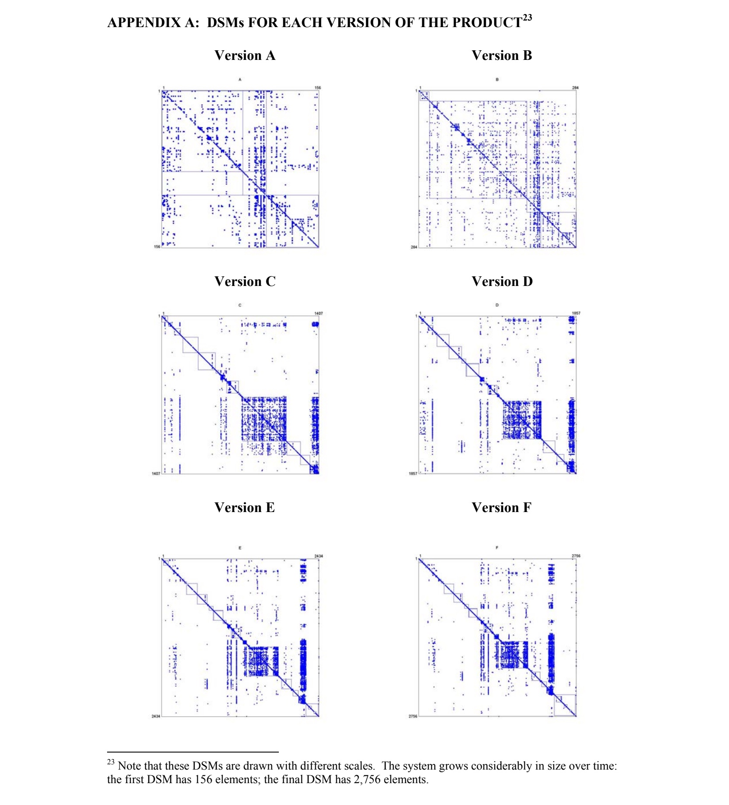

Few of your engineering decisions matter long-term. Software is soft. You can change your mind. But how you structure your components is here to stay.

A [2007 study by MacCormack et al](https://papers.ssrn.com/sol3/papers.cfm?abstract_id=1071720) looked at how a commercial piece of software evolved over 15 years. Primarily they wanted to see how architecture impacts evolution. Do past decisions get you stuck?

You can [read the paper with my annotations, here](https://swizec.com/pdfs/impact-of-modularity.pdf). I enjoyed it. Super insightful. I'm not at all biased because it confirms my own observations over the years.

_PS: you can [read and share this online](https://swizec.com/blog/empirical-evidence-for-code-modularity/)_

## Measuring modularity

The authors use a [Design Structure Matrix](https://en.wikipedia.org/wiki/Design_structure_matrix) to measure modularity. Files in rows and columns, put a `1` where they depend on each other.

You can multiply this matrix with itself to find which files depend on each other after multiple steps. Lets you find those A->B->C->D dependencies and realize that A depends on D.

They call this "visibility". Because a file can "see" changes in other files. You can compute a file's visibility by summing its row (fan-out – whose changes A can see) or its column (fan-in – who can see changes in A).

## Measuring evolution

The authors use version control to go through 15 years of a software's history and look at how components evolve. They looked at major versions only and ignored intermediate releases.

Every new version builds on the previous state and adds new code. This code can be clean new or integrate with previous code in two ways.

The aspects you care about are

1. **churn** – code changes that bring no new functionality or bug fixes
2. **component survival** – old code that sticks around
3. **augmentation** – is new code more modular

## The results

As you might expect, the science has proven something obvious is true. But it's cool that you can measure and verify this folk wisdom.

- The software grew 17x in 15 years.
- Initial code was a mess.
- It became more and more modular over time.
- Tightly coupled components are nearly impossible to kill.
- Tight coupling leads to lots of churn.
- Loosely coupled components eventually become stable (stop changing).
- Tightly couple components never stabilize.

That means the core of your system is defined early in its life when [there's no time to think about architecture](https://swizec.com/blog/big-ball-of-mud-the-worlds-most-popular-software-architecture/) and those decisions reduce your future flexibility. Each new version of the code adds fewer and fewer new components as you slowly become bogged down under the weight of your past decisions and build on top of this immovable core.

You can beautifully see this evolution from a ball of mud to a modular system with an untouchable core when you put DSMs of each version side by side.

But that's a "future me" problem so managers systematically under-invest in modularity and want everything now now now ✌️

\~Swizec

PS: MacCormack did a followup study 6 years later that looks into how organization design impacts code structure (conway's law). Looks promising
