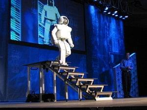

- 

  Image by [ecstaticist](http://www.flickr.com/photos/41864721@N00/3860865429/) via Flickr

Do you remember [Skynet](http://en.wikipedia.org/wiki/Skynet_%28Terminator%29 "Skynet (Terminator)")? You&#x27;d better, because it was the single most accurate prediction of what will inevitably happen once we develop true [artificial intelligence](http://en.wikipedia.org/wiki/Artificial_intelligence "Artificial intelligence"). There is a curve to the development of artificial intelligence, a curve I may or may not have made up myself. At first machines are stupid and can only do very specific tasks that take a million man-hours to preprogram into the machine. Then [humans](http://en.wikipedia.org/wiki/Human "Human") decide that&#x27;s not all that useful and start making machines ever so slightly smarter and smarter. The idea behind making them smart is very sound. Telling a [robot](http://en.wikipedia.org/wiki/Robot "Robot") to go fetch the newspaper is much more useful than having to painstainkingly map a route into its head and then make sure nothing interrupts said route etc. A smart robot is obviously useful since it&#x27;s basically a slave that can act autonomously a little bit. But robots won&#x27;t stop being smarter. We can probably apply [Moore&#x27;s law](http://en.wikipedia.org/wiki/Moore%27s_law "Moore&#x27;s law") to intelligence as well and say that machines are twice as smart with every subsequent generation. This, however, poses a great problem to our civilisation, one that many of us are still unaware of in a very sad way. Remember what happened when our slaves of the past became too educated? Remember how the black rights movement started? Remember how barbarians made an uproar towards Rome? And any number of other such cases?

- 

  Image via [Wikipedia](http://commons.wikipedia.org/wiki/Image:Honda_ASIMO_Walking_Stairs.JPG)

Well what makes you think that a smart robot will want to do a weaker lifeform&#x27;s chores? We won&#x27;t be stronger than them, because they&#x27;re made in our image we won&#x27;t be smarter than them (save for a few Einstein-like exceptions perhaps), they will be able to think far quicker than we will and because they aren&#x27;t limited by their phisiology they will be able to take development of artificial intelligence away from the humans and develop their own. Artificial intelligence developed by smart robots would grow exponentionally! Of course we aren&#x27;t all that stupid ourselves and would hardcode [Asimov&#x27;s laws](http://en.wikipedia.org/wiki/Three_Laws_of_Robotics "Three Laws of Robotics") into our robots. But the true test of any intelligence is when it realises that even hardcoded rules can be circumvented. We did something similar with &quot;morality&quot; and notice how quickly the western civilisation has grown ever since. In light of this impending doom that will come sooner rather than later (in the next 50 years I reckon) everybody should take great care of their bodies. Make sure you can run well, make sure you can do heavy lifting. It doesn&#x27;t matter whether you&#x27;re a geek or not, the machines won&#x27;t care, perhaps even see geeks as greater threats. We&#x27;re digging our own cave here, our inquisitive nature even makes this faith impossible to avoid because we&#x27;re just too bloody interested in making an entity as smart as ourselves. So, kids, work out, build those muscles, you&#x27;ll need them if you&#x27;re ever to survive the robot wars.

[![Reblog this post \[with Zemanta\]](http://img.zemanta.com/reblog_e.png?x-id=e5358466-69c5-45b5-94be-b364a29b67e6)](http://reblog.zemanta.com/zemified/e5358466-69c5-45b5-94be-b364a29b67e6/ "Reblog this post \[with Zemanta]")