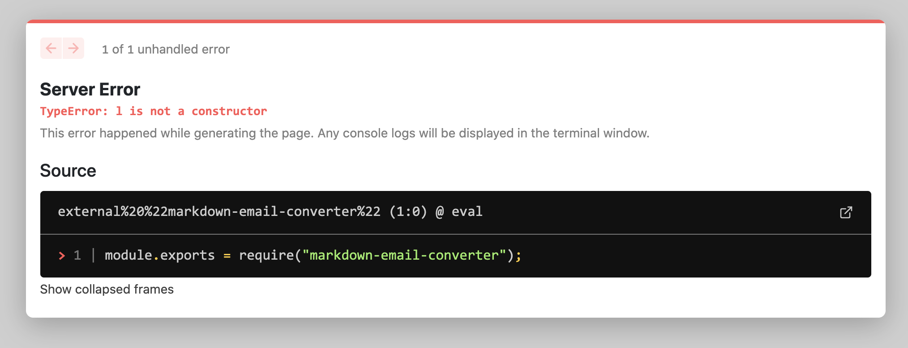
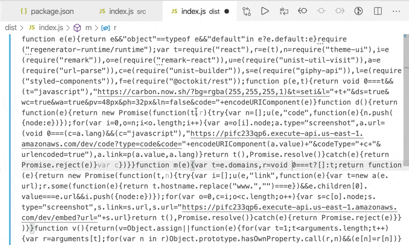

Friend, this episode of #CodeWithSwiz is a great example of why you want to start using TypeScript and how thermal load _destroys_ computers.

_CodeWithSwiz is a twice-a-week live show. Like a podcast with video and fun hacking. Focused on experiments. [Join live Wednesdays and Sundays](https://youtube.com/swizecteller)_

https://www.youtube.com/watch?v=yG2B1jV8o5g

## Thermal load is fun for computers

First, the thermals 👉 it was a hot day in San Francisco and this city doesn't know about AC or insulation. Temperate climate with a few hot days, why bother.

Computers don't like that.

Your computer uses [MOSFET transistors](https://en.wikipedia.org/wiki/MOSFET) to perform computation. The details of how that works took my college physics professor a whole semester to explain and I'm not gonna try. The [wikipedia article](https://en.wikipedia.org/wiki/MOSFET) is great ✌️

Heat makes those transistors unreliable. 1 becomes 0, 0 becomes 1, and you get system crashes, hanged CPUs, or incorrect results without knowing they're incorrect.

This is why my [Node app to thaw carrots with my laptop](https://swizec.com/blog/i-built-a-node-app-to-thaw-my-favorite-snack/) was a bad idea. Fun but bad 🥕

The faster your computer runs, the more heat it produces, the less reliable it becomes. That's why you don't have a 6GHz laptop. You'd need a cooler the size of your fridge. [Or a dash of liquid nitrogen to run DOOM at 1000fps](https://www.vice.com/en_us/article/bv8a58/doom-eternal-runs-at-1000-fps-if-youve-got-liquid-nitrogen)

Fun fact: [Norway uses the heat output of data centers to heat entire towns through winter](https://www.fastcompany.com/90219684/this-town-will-get-its-heat-from-an-unlikely-source-a-data-center).

In lieu of a gigantic fridge, your laptop downclocks itself when it gets warm. Better to be reliable and slow than fast, unreliable, and broken.

And you can see that in my video above. Encoding got overwhelmed, frames started dropping, audio was good.


## Why you should consider TypeScript

This entire episode was about fixing a bug.



You get a cryptic error from a library that you created. Your code builds without error. Try to use it and get a cryptic _"X is not a constructor"_ message.


At first I thought this was a [microbundle](https://github.com/developit/microbundle) bug, then a [parcel](https://github.com/parcel-bundler/parcel) bug. You can see that flipflop in [the previous episode of CodeWithSwiz](https://swizec.com/blog/building-a-small-cms-with-nextjs-pt2-codewithswiz/).

Removed images from source, changed to text, and went back to microbundle. Didn't help.

After the stream I tried one last debugging trick 👉 look at the compiled source. Open `dist/index.js` in VSCode, run prettier, see if anything stands out.



Okay `l` is the `@octokit/rest` library. How am I using that? 🤔

```javascript
import Octokit from "@octokit/rest";
```

That looks fine ... what does [the readme say](https://www.npmjs.com/package/@octokit/rest)?

```javascript
const { Octokit } = require("@octokit/rest");
```

It's a named export, not a default export. 🤦‍♂️

Change that line of code and the error goes away.

```javascript
import { Octokit } from "@octokit/rest";
```

An hour wasted because JavaScript can't know you're using a library, function, or variable incorrectly until you run the code. TypeScript would yell at us and we'd fix the bug in 3 minutes.

Lesson learned my friend. We continue on Sunday

Cheers,<br/>
~Swizec

PS: we also ran into [a microbundle compilation bug](https://github.com/developit/microbundle/issues/708) that means you have to add `import 'regenerator-runtime/runtime'` to your code. Don't worry about it, there's a PR ✌️
