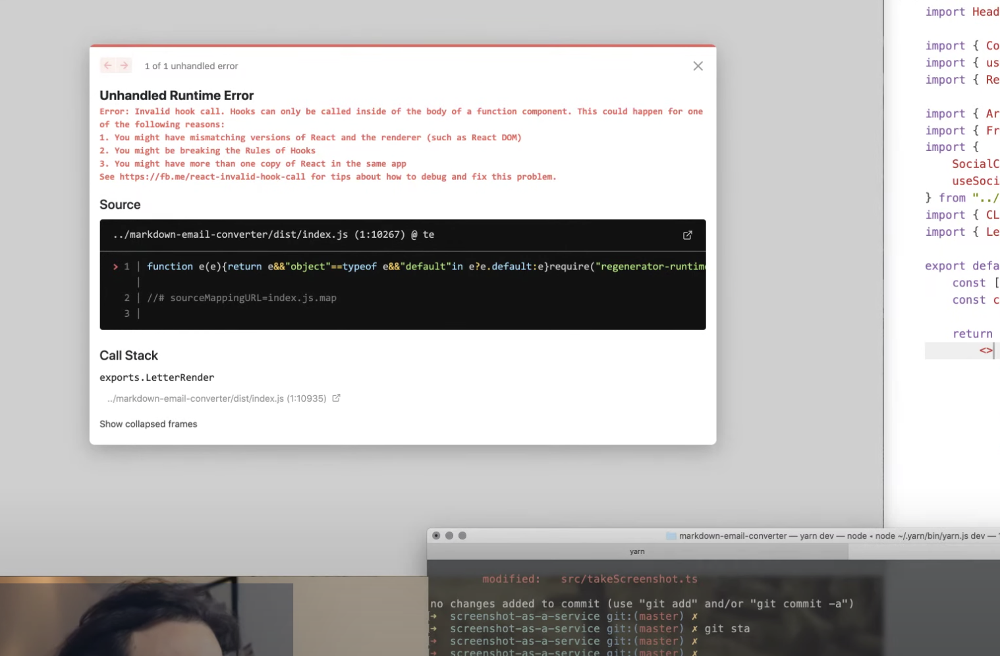
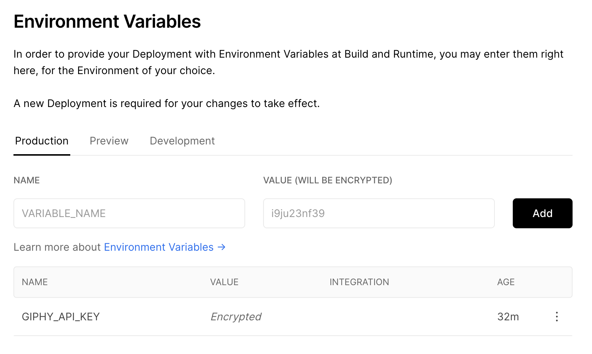

getStaticProps, environment vars, and why you shouldn't use yarn link – all in this episode of #CodeWithSwiz

_CodeWithSwiz is a twice-a-week live show. Like a podcast with video and fun hacking. Focused on experiments. [Join live Wednesdays and Sundays](https://youtube.com/swizecteller)_

https://www.youtube.com/watch?v=npI-NvSyywM

This was a fantastic streaming session. The thing works! You can do what I've been trying to build for the past 3 episodes 🤘

Paste markdown into the new `Markdown pasta 🍝` textarea and your article transforms into a full preview.

- youtube links turn into thumbnails
- tweets turn into screenshots
- code goes through [carbon.now.sh](https://carbon.now.sh)
- twitter names turn into links
- gifs are embedded

Check it out live on [swiz-cms.vercel.app](https://swiz-cms.vercel.app)

[](https://swiz-cms.vercel.app)

## Why yarn link is bad



Much of our frustration budget was spent on this cryptic error. _"Naughty naughty, calling hooks in a class component"_

You get this error when using `yarn link` to develop libraries. Like when you have a piece of code you want to re-use in different projects.

Library development relies on a combination of unit testing and integrating with your target project. I skip unit testing on stream because lazy ✌️

You end up testing through integration.

Best way to do that is to `yarn link` (or `npm link`) a local project into your code. That way changes are reflected immediately.

And it leads to having multiple instances of React in the same project. One from your project, one from your library. Running instances in the browser that is. Happens with Vue too.

You have to publish your library for every change 😩

    1. see bug
    2. make change and pepper console logs
    3. yarn build
    4. git commit
    5. npm version patch
    6. npm publish
    7. change to target project
    8. yarn add library

For every change. Yeah it sucks. You learn to maximize debugging info for every change.

## Environment variables

Environment variables are best used for configuring your API keys and other secrets. You shouldn't hardcode those and they shouldn't be part of your repository.

NextJS has fantastic support out of the box. We kinda guessed on stream and it worked 🤘

For local development, create a `.env.local` file. _Do not add to git_

    // /.env.local
    GIPHY_API_KEY=value

You can then read these variables on the server and during builds with `process.env.GIPHY_API_KEY`.

They're hidden from the browser for security reasons.

For production and preview secrets, you should use Vercel's or Netlify's UI. They keep secrets encrypted and out of your codebase. Like it should be.



## getStaticProps

Having env vars on the server and inside builds is great, but our `<LetterBuilder>` plugin needed them in the browser.

You can expose public vars in NextJS by prefixing with `NEXT_PUBLIC`. I haven't tried if that works on Netlify.

Our API key isn't public though. It's a true secret and should stay secret. You can see it on my stream because I'm a terrible person. _And_ because I can click a button to change it 😉

We used `getStaticProps` to read the key at build time and send it to our page as a React prop. This is insecure.

```javascript
// /pages/index.js

export async function getStaticProps() {
    return {
        // populate props however you want
        props: {
            giphyAPIKey: process.env.GIPHY_API_KEY,
        },
    };
}

// ...

export default function Home({ giphyAPIKey }) {
```

When you export `getStaticProps` from your page, NextJS runs your method when building the page. Either for static rendering or their static generation magic.

Those props are then baked into the render of your exported default component.

Similar to Gatsby's `staticQuery` and `useStaticQuery` without the complication of GraphQL and far more flexible. You can use this method for anything you want. Even API requests.

Make sure your props are serializable JSON ✌️

Cheers,<br/>
~Swizec
