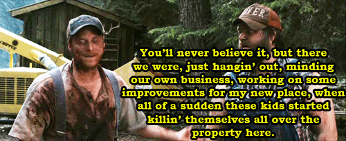
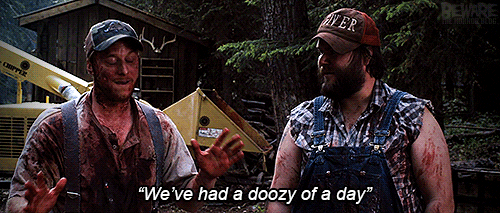
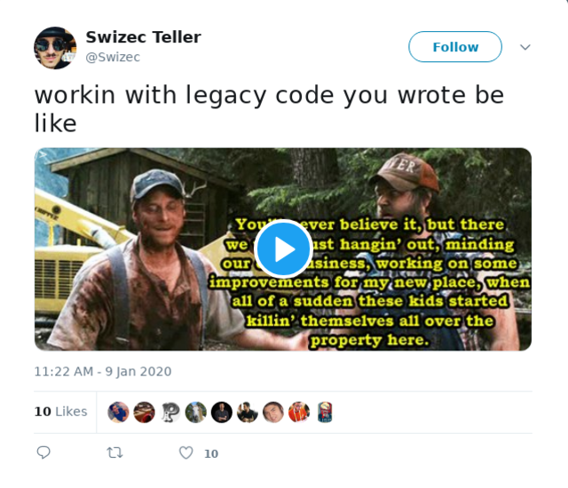
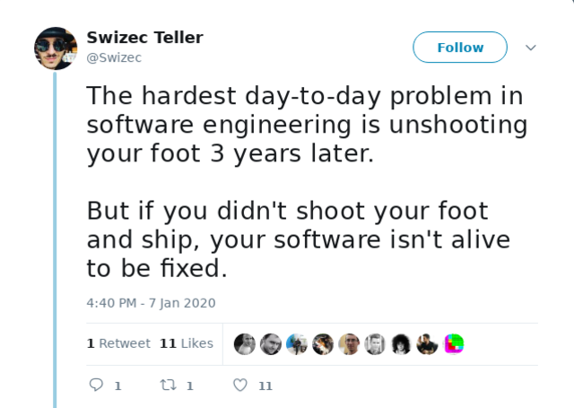
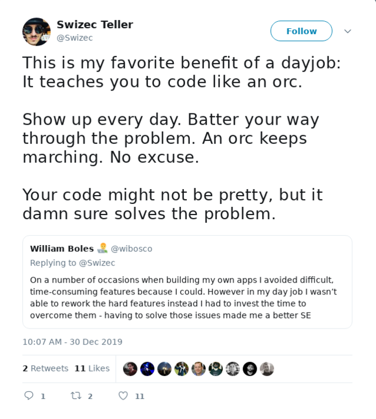

 Coding isn't always fun my friend, sometimes it's work.

Actually, I take that back. _Coding_ is fun, _engineering_ is work. Let me explain.

2 months ago I got a new project at work. Enable customer support to change people's plans. We sell subscriptions and sometimes folks wanna change the plan they're on.

Pfft, that's easy.

Stop old subscription, start new subscription, fiddle start dates so it looks like nothing happened. How hard can it be?

So I estimate the project line by line.

Gonna have to do this, do that, oh and we need a new UI for everything, wait what they wanna change payment methods too?? Oh shit you want to do what with refunds and credits and referral bonuses!?

I slog through the combinatorial explosion. Installment plans, plans paid once, referral credits, family discounts ... the mind recoils in horror.

16 combinations in all. Maybe more.

Estimate came out to 2 weeks. So much for easy. And here we are now 2 months later almost done.

More tests than code, 200 comments on pull requests across 4 repositories, 8 bugs from QA, 16 bugs from business, 3 years old production bugs, and I can't even count the issues I found while testing bugs. Last find was that your initial payment on a new plan never got charged. Fix took all day.

## What the hell happened??

> when you're going through hell, keep going

Legacy code and engineering happened my friend.

Coding is fun because you're building something from scratch. It's fast, it's free, it's beautiful. Like running in an empty green field.

You jump and frolic. You skip and hop. You sing with the sound of joy in your heart as you create something new that's never existed before and you care not if it still works tomorrow.

Engineering ... engineering is more like threading a new subway line through downtown New York.

Tall buildings that shouldn't collapse. Traffic that can't be too disrupted. Businesses that definitely have to keep running. Old subway lines you can't destroy. Sewage pipes you shouldn't touch. Internet cables you can't break. Power lines you shouldn't cut.

If you're lucky you might find [dark fibre](https://www.schneier.com/blog/archives/2009/06/secret_govermen.html) and get the secret service on your ass.

No wonder it took San Francisco [almost 10 years to add 10 blocks of subway](https://en.wikipedia.org/wiki/Central_Subway) ...

Oh and while you're keeping all that old stuff alive, you're making sure the new stuff not only supports the old stuff, but keeps working for decades to come.

## Tips for legacy code

Engineers love to hate on legacy code.

Look at how shitty it is. Look at how messy. Look how it uses old standards. Look how wrong it looks. What idiot wrote this.

But hear this my friend, that legacy code is paying your salary. **Legacy code works**

That's all you gotta keep in mind. Legacy code is legacy _because it works_. Your code either dies a prototype or it becomes legacy.

Do you want your code to die? No you do not.

So suck it up princess and fix that shit.

The code is there because it works. Every nook and cranny is there for a reason. Even if the reason is that you didn't know any better when you wrote it 3 years ago.

So change your mindset and rejoice!

You've got a working piece of code that just needs some love.

Whatever happened to make it look this bad – business changing their mind, engineers coming and going, or coding standards changing all around it – **that code works and it pays your bills.**

Do your best.

1.  add some tests
2.  update the code style
3.  ask business if you really absolutely still need to support that feature they asked for 3 years ago and forgot about
4.  remove the dead code
5.  consolidate messy chunks into pretty functions
6.  extract stuff into classes
7.  write some notes
8.  add comments
9.  add some tests
10. then add some more tests
11. make sure you add tests
12. ask a friend for help
13. write some docs, docs are great
14. talk to stakeholders and _understand_ the business
15. write it all down
16. refactor with a new approach that consolidates what the business wants now into a clean flow
17. oh and write some tests

Most of all, don't stop. You're already in hell, might as well keep going until you reach the edge.

Cheers,  
~Swizec
