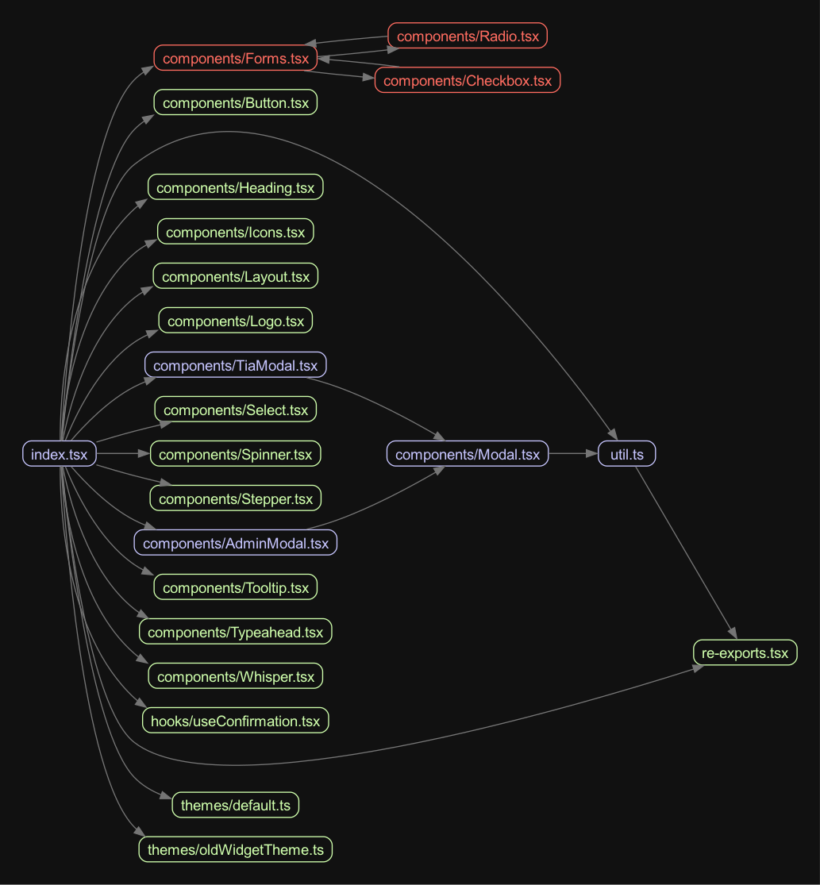

Lately I've been thinking a lot about [architectural complexity](https://swizec.com/blog/forget-complicated-code-focus-on-the-system/) and how better tooling might help.

https://twitter.com/Swizec/status/1690476767151325184

## Quick refresher

- architectural complexity talks about how interconnected your files are
- it lowers productivity 50%
- it increases bugs 3x
- it kinda sorta leads to 10x increase in employee turnover

The easiest way to recognize you're dealing with high architectural complexity is when you've got a bunch of `../../` imports. That means your codebase isn't structured to group related files.

Otherwise known as a [Big Ball of Mud](http://www.laputan.org/mud/). Everything glommed together with no sense of structure.

## Modularizing your code is hard

Teasing apart a big ball of mud is hard.

Splitting your code is the easy part. The hard part is figuring out what you even want to split. What belongs together? What domains are hiding in here? Who are all the actors involved? Who are all the teams that care?

We deal with this a lot at work.

Leadership is [reverse conway-ing](https://swizec.com/blog/what-i-learned-from-team-topologies/) the hell out of this problem, but at ground level we still gotta figure out where the boundaries lie. Not some fuzzy notion of _"Oh yeah there's 3 domains in there"_. No, what **exactly** are the domains? Which file belongs where?

You can't implement something you don't understand.

## Find natural modules in your code

This is where tooling comes in. Maybe. I think we have the individual pieces, someone "just" needs to put them together in a working package.

Here's the idea.

You can use tools like [Madge](https://github.com/pahen/madge) to visualize file dependencies in your code. This works on imports/exports which is good enough for now. You'd need to visualize function calls to get the full picture.

Take our design system library as an example.

### Visualize your dependencies



Any community of files with tight internal connections and loose external coupling is a module candidate. That's your code saying these files belong together. Naturally.

No need to think deep about your domain modeling. Look at what naturally works together.

This becomes difficult to see in a bigger codebase. You get a mess of squiggles and squares with few obvious patterns.

### Get AI to analyze the graph

This sort of human intuition is difficult to toolify. People aren't gonna look at ~~pretty~~ confusing pictures of their codebase as part of a regular workflow.

So I tried seeing what ChatGPT can do. As an experiment. To see if it's even possible.

Use [node-dependency-tree](https://github.com/dependents/node-dependency-tree), the dependency graph builder Madge uses, to get a JSON dump of dependencies in a codebase, paste into ChatGPT, ask to analyze.

You can [see the full conversation, here](https://chat.openai.com/share/11f1fc9b-6873-4919-b085-232f8f399208). Sharing highlights below.

The input data looks like a blob. Human readable with great effort.

```json
{"/Users/Swizec/Documents/tia-ui/src/index.tsx":{"/Users/Swizec/Documents/tia-ui/src/components/Button.tsx":{"/Users/Swizec/Documents/tia-ui/src/index.tsx":{}},"/Users/Swizec/Documents/tia-ui/src/components/Heading.tsx":{"/Users/Swizec/Documents/tia-ui/src/index.tsx":{}},"/Users/Swizec/Documents/tia-ui/src/components/Logo.tsx":
...
```

But the ChatGPT prompt is simple. I wanted to see what this LLM can figure out on its own.

    he following is a dependency graph of files in a codebase in JSON format. Analyze it like a graph and identify communities of tightly connected files with loose connections to other files.

I even typo'd the first word. Wonderful 😂

ChatGPT correctly interpreted the JSON structure:

> The dependencies between the different files seem to be well-defined and clearly denote how different components rely on each other.
> However, this data is represented in a nested dictionary format, and for effective analysis, we will first need to represent it as a graph.
> ~ ChatGPT

Then provided a summary of what's going on:

> There is a core file /Users/Swizec/Documents/tia-ui/src/index.tsx which has connections to a wide range of components, acting as the root node.
> Most of the components are directly dependent on the index file, while a few have more intricate dependencies.

### ChatGPT's analysis of our unstructured-ish library

The analysis ChatGPT came up with purely based on file imports feels spot on. This is how I'd organize the codebase, if I had time to go back and move things around.

> **Community 1: General Components**
> These files directly depend on the index file and seem to be basic components for the user interface
> **Community 2: Form Components**
> These files are related to form handling and interact with each other as well as the index file
> **Community 3: Modal Components**
> These files seem to handle modals and utility functions:
> **Community 4: Blocks Components**
> This community represents some decorative or structural components:
> **Community 5: Miscellaneous**
> There are a few files that don't seem to be directly connected to others:

Not sure about that `util` in Community 3. A more granular dependency graph that understands function calls would help declutter grab-bag files like this.

Keep in mind ChatGPT saw none of the code and zero meta information. Filenames and import structure only.

And it correctly suggested that purpose-built tools exist for this analysis.

> To perform more sophisticated analysis, graph theory tools such as network clustering algorithms could be applied to this structure. A visualization tool would also be helpful in depicting these relationships visually.

## Next steps

I need to play around some more. Analyze results, compare to traditional graph analysis algorithms. Maybe this was a fluke? Maybe it's no better than a stable algo? Who knows!

If that works, the next step would be to get it working on a larger codebase. I struggled with context size.

_Then_ wrap it up in a VSCode extension or something. Make this 1-click useful as a tool. See if it can re-org a codebase maybe 🤔

What do you think? Yay or nay?

Cheers,
~Swizec
