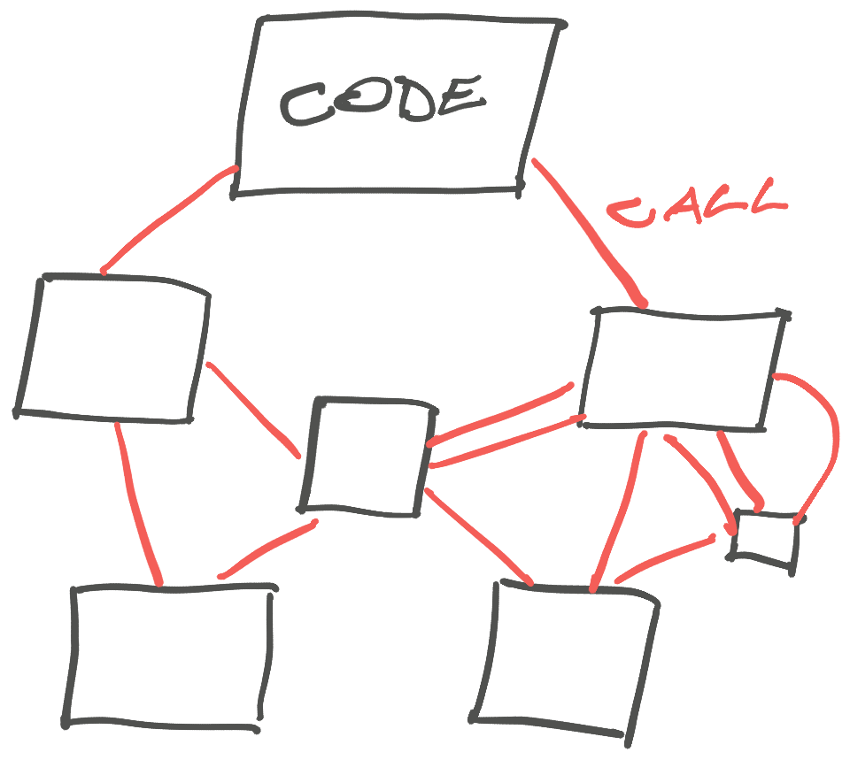
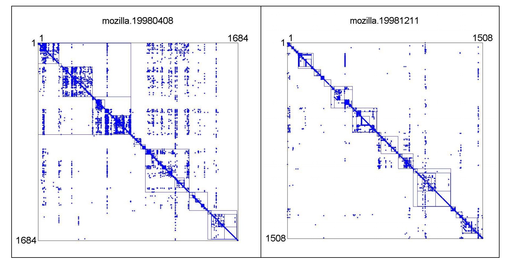
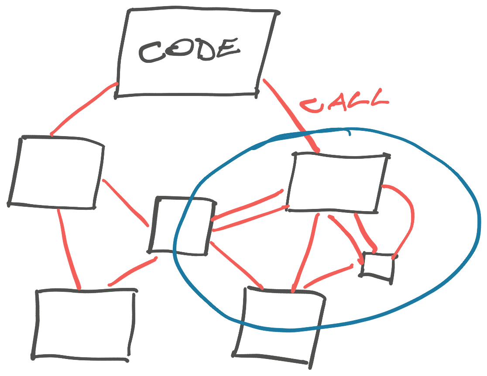

Pulling modules out of a big ball of mud is like grabbing a slice of cheesy pizza. It's kinda separate but also not really.

The trick is to realize this is normal. If you're here, it means the software is working! Fixing this stuff is the job.

## Good architecture emerges

[Big balls of mud](https://swizec.com/blog/big-ball-of-mud-the-worlds-most-popular-software-architecture/) are popular because they work. It's the best way to get code working _before_ you know the right architecture to use. You've got to get your hands dirty and the wrong architecture too early will cause more problems than it solves.

My team built a microservice once where we said _"Okay this is important, we've got to get it right the first time"_.

We designed a layered architecture, started building, and 6 weeks later it was one of the worst codebases I'd ever worked on. The layer separations were in all the wrong places and even the tiniest bug fix involved dozens of files.

That microservice was a pain in our necks for 2 years before we gave up and threw it away. Everyone was afraid to touch that code. The wrong architecture is worse than no architecture.

### The dependency graph

We've talked about how [architecture is like a path in the woods](https://swizec.com/blog/architecture-is-like-a-path-in-the-woods/) and good abstractions follow desire paths laid by the team. But how do you find those paths in the quagmire?

You look at your code as a dependency graph or matrix.

Each box in the graph is code that does something. Each line is a connection between that code and other code.

At the level of a function, boxes are loops, conditionals and other groupings of code that works together. Lines are shared variables, conditionals, and so on.

At the level of a file, boxes are functions or classes, and lines are how they call each other. Inside a class, each method is a box and every shared property or method call is a line.

At the level of a module, boxes are a mix of files, objects, and functions. Depends how you organize your code. Lines are imports, function calls, and any shared variables.

At the level of a codebase, you're looking at imports and exports. At the level of a system, it's about who's calling what API. Just because you're using microservices, [doesn't mean you didn't build a big ball of mud](https://youtu.be/y8OnoxKotPQ).

https://youtu.be/y8OnoxKotPQ

Tooling to generate these visualizations exists, but I haven't had much luck in making it useful. Better to use your imagination and a piece of paper or a whiteboard. Invite others so you can talk about _intent_ more than current implementation. More on that in a bit.

### The dependency matrix

Similar to a dependency graph is a dependency matrix.

Your boxes become rows and columns and your lines turn into dots at their intersections. This lets you see the structure of your code and see how messy it feels. The more uniformly distributed your dots, the bigger the quagmire.

It's like seeing the entropy of your code structure. The more uniform the dots, the less information you gain from the organization of your code. This makes it harder to navigate, understand, and update.

A [2006 study of Mozilla](https://pubsonline.informs.org/doi/abs/10.1287/mnsc.1060.0552), the open-source browser that became Firefox, found that purposefully refactoring code leads to cleaner dependency diagrams and more modularized code. Which sounds obvious but it's nice to see that with effort we _can_ fight entropy.

The ball of mud doesn't need to win!

I have not found any tooling to make these diagrams outside of academia. Although you could use the raw data output from dependency diagram tools to visualize code in this way.

## Look for dependency neighborhoods

The goal of visualizing dependencies is to find neighborhoods. Areas of the visualization with lots of internal connections and few external connections.

Those are your natural modules.

You may not know the name of your module yet, but every tightly connected neighborhood is a module waiting to be found. I like to give them names that match the domain.

It's possible, even likely, that you'll find a module cuts through an existing box. That's where you [DRY'd up some code that deals with separate concerns](https://swizec.com/blog/dry-vs-soc-a-difficult-choice/) whose implementation happened to look similar.

A common example are components and functions with boolean arguments that enable different branches of behavior. You're almost always better off separating those into multiple units.

Even if the implementation looks similar today or they do almost the same thing. Just because it's "editing an invoice", doesn't mean the end user, the billing department, and your finance team have the same needs.

### Let the domain guide you

Finding those boxes that should turn into _two_ boxes is where whiteboards and paper shine. These can be hard (even impossible) to infer from code without understanding the business domain.

Good architecture is invisible. Bad architecture is everybody's problem. The difference, in my experience, comes down to how closely your architecture follows the domain of your business.

The business will always have its own ideas of how concepts connect, what's possible, and where ideas diverge. You can either fight this and make everyone's lives difficult, or you can build your software to match the domain. This is called [domain driven design](https://martinfowler.com/bliki/DomainDrivenDesign.html) – DDD.

https://twitter.com/Swizec/status/1859056258294444157

To get this right, you need to talk to stakeholders, users, and other engineers. Listen carefully to unstated assumptions and ask questions about how they use the system to get work done.

### How to detangle the domain

My favorite tool for detangling business domains is [event storming](https://github.com/SAP/curated-resources-for-domain-driven-design/blob/main/detailedinfo/eventstorming.md). It's a workshop technique designed to build common understanding between engineers and stakeholders.

For small domains you can use it as a guide to ask the right questions. Your collaborators don't even need to realize it's happening. For large domains I've found scheduled time with everyone whiteboarding together works best.

You start with **domain events**. These describe what happened – user signed up, purchase made, etc. Every stakeholder will identify different events. This is important: you're using event storming to uncover things you didn't know about.

You then match those events with **commands**. These are actions that cause an event – sign up, purchase, etc. Again you're looking to uncover unknown or unsupported ways people want to use your system. It's common to find commands that currently take multiple steps as people work around the limitations of your code.

Then you add the **actors**. Who is making these actions? This helps you uncover different types of users your code will need to support. Actors may be **internal or external systems** that react to or trigger events. Sending a welcome email, for example.

Once you have the events, commands, actors, and systems identified, you can draw lines between them to identify **business processes**.

With all that laid out, it becomes pretty obvious where to draw your module boxes. You'll see parts of the system that are tightly connected, belong to the same actors, etc. A common approach is to build a core business logic module with separate interfaces for different actors.

If you get this right, nobody will ever notice. The code is going to feel obvious and simple and users' evolving needs will be easy to adopt :)

Cheers, 
\~Swizec
