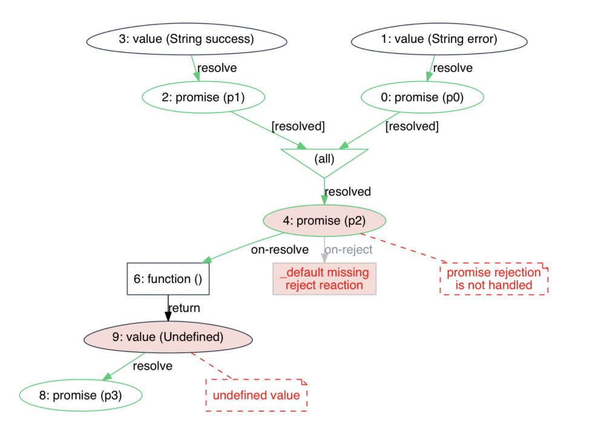
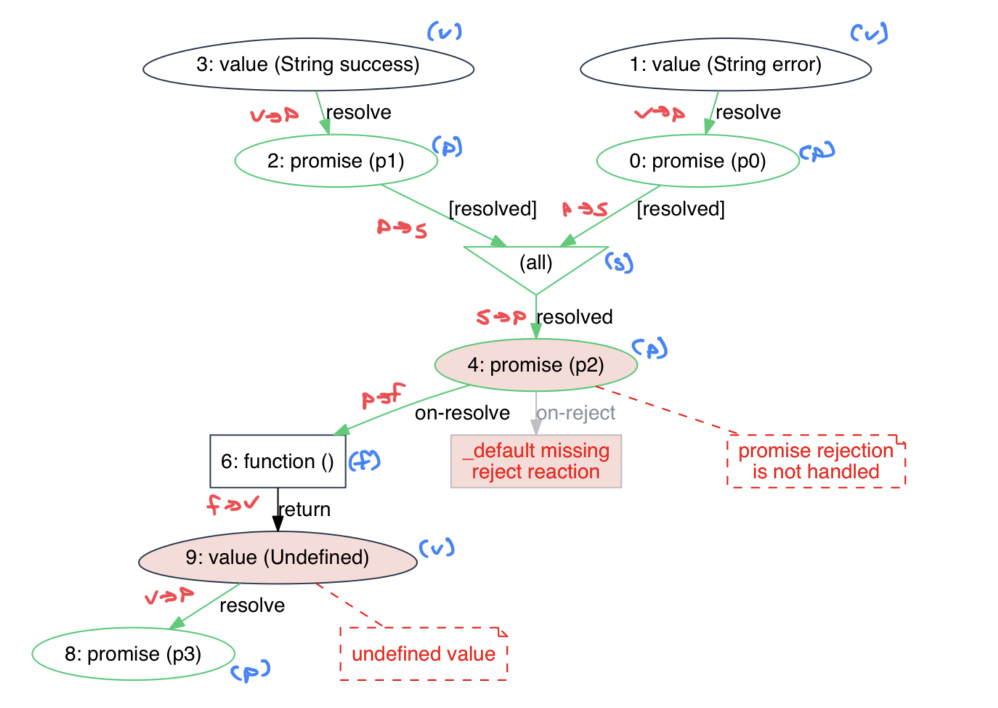
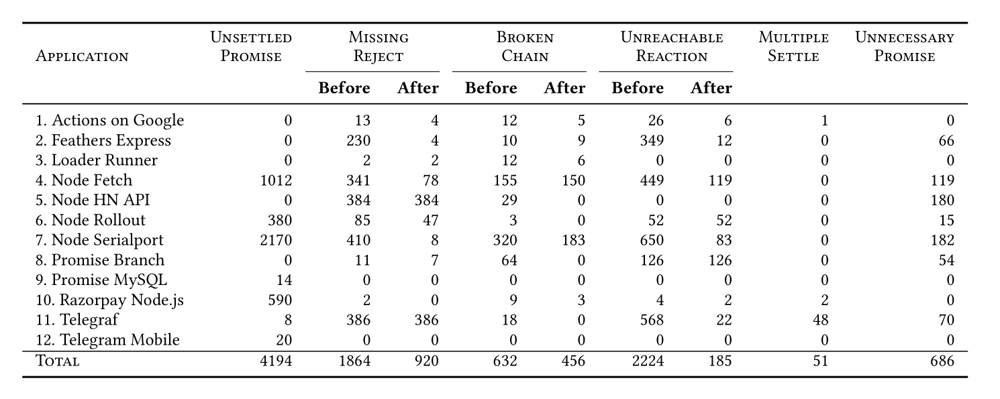

JavaScript is a fantastic server-side language because it's async. That also makes it tricky. 💩

[Async](https://www.youtube.com/watch?v=8aGhZQkoFbQ) means you can write code that doesn't hit the usual thread-safety problems _and_ lets you run multiple tasks in "parallel". Like waiting for a file read without blocking computation.

But subtle bugs in your async code can lead to unresolved promises. Code that never finishes.

We ran into this when our [knex](https://knexjs.org/) database connection pool kept running out of available connections and crashing the service. Normally a connection runs its query and returns to the pool for another query to use.

Something was hogging those connections.

With dozens of programmers banging away at a few million lines of code across several years, maybe unresolved promises are the problem? I decided to investigate.

https://twitter.com/Swizec/status/1450624141070008321

## The halting problem rears its head

Finding unresolved promises is an instance of [the halting problem](https://swizec.com/blog/week-1-turings-on-computable-numbers/) – a provably unsolvable problem.

There is no algorithm you can write that can look at any piece of code and answer _"Will this always finish for every input?"_. You can't do it by hand either.

Google finds a few cases where people talk about unresolved promises. The answer is always _"Don't write fundamentally broken code"_


The typical halting problem solution is to add a time constraint. If a function doesn't resolve within N seconds, we assume it's stuck. It may not be, but we assume it is and kill the program.

This is why connection timeouts exist. You don't want to wait forever, if a server gets stuck. Important [when building distributed systems](https://serverlesshandbook.dev/serverless-architecture-principles).

But killing your server process for every hiccup is not ideal. And besides, adding timeouts to every single promise in your entire codebase is hard at best.

HOWEVER! You can solve the halting problem for a subset of common patterns 🥳

## Patterns for broken promises

In their paper [Finding Broken Promises in Asynchronous JavaScript Programs](https://dl.acm.org/doi/10.1145/3276532), Alimadadi et al highlight common patterns that lead to unresolved promises and share [PromiseKeeper](https://github.com/nuprl/PromiseKeeper), a software that finds potentially unresolved promises using promise graphs.

https://twitter.com/Swizec/status/1450931644995489795

### Review of JavaScript promises

The paper starts with a review of JavaScript promises.

Promises represent an asynchronous computation and can be in 3 states: `pending`, `fulfilled`, and `rejected`. They start as pending.

You can **register reactions** to promises with `.then()`.

```javascript
// immediately resolves with value 17
const promise = Promise.resolve(17)
promise.then(
  function fulfilledReaction(value) {
    console.log({ value })
  },
  function rejectedReaction(error) {
    console.log({ error })
    throw error
  }
)
```

Code in practice omits the 2nd parameter to focus on fulfilled reactions. Common when building **promise chains**:

```javascript
// immediately resolves with value 17
const promise = Promise.resolve(17)
promise.then(value => value + 1)
       .then(value => value + 1)
       .then(function (value) => { console.log(value) })
```

Each call to `.then` creates a new promise, which resolves with the return value of the reaction. Notice that the last call _implicitly_ resolves with `undefined`. Because in JavaScript a function without a return implicitly returns `undefined`.

Important detail 💡

We can add **error handling** to a promise chain using `.catch()`:

```javascript
// immediately resolves with value 17
const promise = Promise.resolve(17)
promise.then( ... )
       .then( ... )
       .then( ... )
       .catch(err => ...)
```

Every promise created by `.then` implicitly defines a default rejection reaction equivalent to `err => throw err`. This means a `.catch()` at the end of a chain can react to errors in any of the above promises.

Relying on default fulfill reactions is less common, but this is valid code:

```javascript
// immediately resolves with value 17
const promise = Promise.resolve(17)
promise
  .then(undefined) // uses default value => value reaction
  .then((value) => console.log(value))
```

I think this happens by accident more than on purpose 🤷‍♀️

You can **link promises** by using a promise to resolve another promise:

```javascript
const p0 = Promise.resolve(17) // immediately resolves
const p1 = Promise.reject("foo") // immediately rejects
p0.then(function (v) {
  return p1
})
```

The state of `p0` is now linked to `p1`. Meaning the unnamed promise created on line 3 gets rejected with `"foo"`.

You see this a lot in code. Often less obvious.

### Pattern 1: Unhandled promise rejections

A common source of trouble are unhandled promise rejections.

This happens when you _implicitly_ reject a promise by throwing an error in your fulfilled reaction.

```javascript
promise.then(function (val) {
  if (val > 5) {
    console.log(val)
  } else {
    throw new Error("Small val")
  }
})
```

Because the fulfill reaction runs in a separate async context, JavaScript doesn't propagate this error to the main thread. The error gets swallowed and you'll never know it happened.

You can fix this with a `.catch()` reaction:

```javascript
promise
  .then(function (val) {
    if (val > 5) {
      console.log(val)
    } else {
      throw new Error("Small val")
    }
  })
  .catch((err) => console.log(err))
```

You now have a chance to handle the error.

**But you didn't re-throw!** If other linked or chained promises rely on this code, the error remains swallowed. Your code keeps running.

Try this in a browser console:

```javascript
const p = Promise.resolve(17)
p.then(function (val) {
  throw new Error("Oops")
  return val + 1
})
  .catch(function (err) {
    console.log(err)
  })
  .then(function (val) {
    console.log(val + 1) // prints NaN
  })
```

You're expecting `17 + 1 = 18` but you get `NaN` thanks to an unexpected error. The implicit promise that `.catch()` creates is implicitly resolved (not rejected) with `undefined`.

Silly example, yes, but imagine how common this pattern becomes in a sprawling codebase where any function may throw for any reason.

### Pattern 2: Unsettled promises

> Every new promise is in the _pending_ state until resolved or rejected. However, not settling a promise results in a _dead_ promise, forever pending, preventing the execution of reactions that depend on the promise being settled.

These are the unresolved promises that are hardest to find. You cannot know from outside whether a promise is slow or dead.

The authors of [Finding Broken Promises in Asynchronous JavaScript Programs](https://dl.acm.org/doi/10.1145/3276532) share an example [issue from node-promise-mysql](https://github.com/CodeFoodPixels/node-promise-mysql/issues/77) where `connection.release()` returns a promise that never resolves.

That example is hard to condense so here is something simpler:

```javascript
const p0 = new Promise((resolve, reject) => null)
const p1 = Promise.resolve(17)
p0.then((result) => p1)
  .then((value) => value + 1)
  .then((value) => console.log(value)) // expecting 18
```

The last promise chains onto `p0`, which neither resolves nor rejects. You can keep this code running forever and it's never going to print a value.

Again, this is a silly example but imagine a sprawling codebase with dozens of programmers. It may not be obvious that a function won't resolve its promise in some cases.

### Pattern 3: Implicit returns and reactions

> promise chains break silently when the developer forgets to explicitly include a return statement

Similar to the error swallowing example I added above. Here's a piece of code Alimadadi et al share from Google Assistant:

```javascript
handleRequest (handler) {
	if (typeof handler === 'function') {
		const promise = handler(this)
		if (promise instanceof Promise) {
			promise.then(result => {
				debug(result)
				return result
			}).catch(reason => {
				this.handleError('function failed')
				this.tell(!reason.message ? ERROR_MESSAGE : reason.message)
				return reason
			})
		}
	}
}
```

The `handleRequest` method uses a Map of developer-provided handlers to asynchronously address Assistant requests. A `handler` can be either a callback or a promise.

If the promise resolves and calls your anonymous handler, this code returns the result. If it rejects, it returns a reason.

_However_, those returns are inside a promise reaction. But the promise isn't returned! The result of reacting to the `handler` promise is lost.

You, as the user of this library, cannot handle the fulfill/reject reactions of promises returned by your own handlers. 💩

## Finding anti-patterns with promise graphs

Alimadadi et al created [PromiseKeeper](https://github.com/nuprl/PromiseKeeper), a piece of software that dynamically analyzes a JavaScript codebase and draws a promise graph.



I wasn't able to get the code running, but here's what they had to say.

### Promise graphs

You can think of your asynchronous code as a graph where nodes (promises, functions, values, synchronizations) are connected by edges (resolve/fulfill, register, link, return/throw).

- **promise nodes** (p) represent each execution of a promise

- **value nodes** (v) represent values that resolve or reject a promise. These may be functions.

- **function nodes** (f) represent every function that's registered as a reaction to a promise

- **synchronization nodes** (s) represent every instance of `Promise.all` or `Promise.race`

- **resolve/reject edges** (v)->(p) show connections from a value node to a promise node. Labeled as `resolve` or `reject`

- **registration edges** (p)->(f) show connections from a promise to a function. Labeled as `onResolve` or `onReject`

- **link edges** (p1)->(p2) show connections between linked promises

- **return/throw edges** (f)->(v) show connections from a function to a value. Labeled as `return` or `throw`

- **synchronization edges** show connections from multiple promises to a single synchronization. Labeled as `resolved`, `rejected`, or `pending` based on how the new promise behaves

Here's an annotated version of the graph above.



### PromiseKeeper for finding anti-patterns

PromiseKeeper aims to construct and visualize promise graphs of your code dynamically while running tests. The dynamic execution context allows it to find anti-patterns that aren't visible by analyzing the code itself.

The anti-patterns it highlights are:

- **missing reject reactions** that lead to swallowed errors
- **attempting to settle a promise multiple times** which happens when you try to resolve or reject a previously settled promise
- **unsettled promises** where a promise neither resolves nor rejects while PromiseKeeper constructs a graph
- **unreachable reactions** where a registered reaction did not execute during PromiseKeeper's dynamic analysis
- **implicit returns and reactions** where it may lead to unexpected behavior in promises further down the chain
- **unnecessary promises** where you explicitly construct a new promise in a function that's already wrapped in a promise

Because PromiseKeeper relies on dynamic code execution, this analysis is only as good as your test coverage. It cannot investigate un-executed code which may lead to false positives.

PromiseKeeper's implementation is based on the [Jalangi instrumentation framework](https://github.com/Samsung/jalangi2). It defines callbacks that hook into the promise lifecycle.

I couldn't get PromiseKeeper to work on my machine, but Alimadadi et al report that subtly broken promises lurk in almost every JavaScript codebase.



Interestingly, the 1012 instances of unsettled promises for Node Fetch happen in just 17 unique locations in the code.

The authors report that 43% of all promises in their experiment were unresolved at the end of execution. It's more likely this indicates incomplete test suites than popular software being completely broken.

## What you can do in practice

Keep common anti-patterns in mind and avoid writing fundamentally broken code. Using async/await makes many of these patterns less likely.

We've had great success by logging unhandled rejections with a full stack trace using this bit of code.

```javascript
// logs a helpful error message when there's
// an unhandled promise rejection
process.on("unhandledRejection", (err, promise) => {
  const stack = err instanceof Error ? err.stack : ""
  const message = err instanceof Error ? err.message : err

  Logger.error("Unhandled promise rejection", {
    message,
    stack,
    promise,
  })
})
```

You can also try Node's [async_hooks](https://nodejs.org/api/async_hooks.html) module to hook into the promise/async lifecycle and attempt to detect long running promises. You could compare start/end times to a max timeout, for example, and log a warning.

My attempt at [using async_hooks to detect long running promises in JavaScript](https://gist.github.com/Swizec/30df527907e3488a546075b3ec691dd9) was fun, but not super useful. You can't get a reference to execution context (only a C pointer). Means you can see that _something_ is slow, but not what. 💩

I'm tempted to try turning PromiseKeeper into a Jest plugin of sorts. Imagine getting one of those promise graphs any time you run tests 😍

Cheers,<br/>
~Swizec
