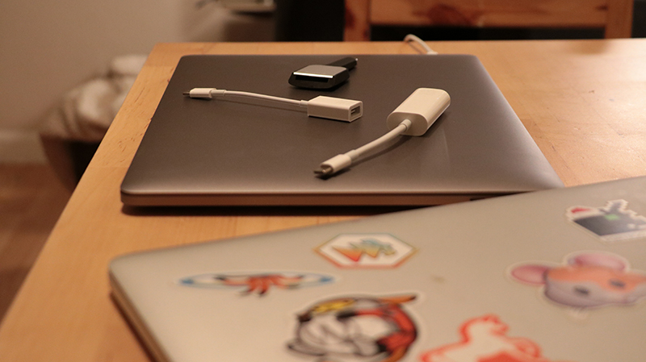

https://www.youtube.com/watch?v=ed2xrQt0Qp4

It&#x27;s that time of the decade! I got a new laptop 🤘🏼

Ordered _during_ WWDC last week, received yesterday, used for the first full workday today. My old laptop has been with me through thick and thin for almost 5 years, but it was time.

Roadtrips, airplanes, bangs and drops, some spills ... Missing some screws, lacking a leg thing, crying for battery service for the past 2 years, so slow at encoding video it was dropping frames.

Rest in peace MacBook Pro mid-2012. Long live MacBook Pro 2017!

https://twitter.com/Swizec/status/874990108813926400

I really wanted to hate the Touchbar. The whole internet said it was stupid, reviewers said it was stupid, it _felt_ stupid just thinking about it.

Yet Apple wouldn&#x27;t sell me a top-spec laptop without the stupid Touchbar. So a Touchbar I paid for.

And holy shit is that thing amazing!

Maybe apps have caught up, maybe everyone just loved hopping on the hate Apple bandwagon, I don&#x27;t know. All I can say is that after a single day with my laptop, I am in love with the Touchbar.

Yes, I never use it for _work_ work.

Yes, my laptop is closed in clamshell mode 80% of the time.

Yep, I&#x27;m using an external clicky keyboard and mouse and big monitor.

Yeah, it feels stupid that you have to look at your keyboard to use the Touchbar.

I want one for my external mechanical keyboard anyway. It&#x27;s that good. Bloody thing is amazing. As much as I hate to admit it, I love it.

So far I&#x27;ve found it most useful for typing emojis, changing and scrobbling songs on Spotify, and opening man pages.

Wait what

Yep, there&#x27;s Terminal integration. A `man page` button shows up that opens the man page for whatever is in your prompt.

https://twitter.com/Swizec/status/875157119447711744

I didn&#x27;t even know man pages were a feature in Terminal until the Touchbar showed me! That&#x27;s what I love about it. As an app designer you could really leverage this thing to help people discover features in your app.

My favorite writing tool uses it for markdown shortcuts. I definitely use keyboard shortcuts for that, but the magic buttons are neat.

Imagine Emacs integration that lists open files in the Touchbar for fast access. Wouldn&#x27;t that be cool? Safari does it for tabs.

No Chrome integration tho ... Google doesn&#x27;t give a shit about the Touchbar 😔

## General Impressions

New laptop and old laptop

Other than the Touchbar, the computer is very ... well you know. It&#x27;s been 5 years since my previous new computer and I&#x27;m surprised by how little progress there has been.

Fancy new laptop. Full Webpack build of our project at work is 30 second faster. That&#x27;s the biggest effect so far. 30 seconds off of compile time.

In general everything feels a little snappier but not enough to put a finger on it. Video encoding is marginally faster and doesn&#x27;t turn on the fans. Boot times are the same. File copying is fast but not holy shit fast. 10 seconds to copy 1.3 gigs ¯\_(ツ)\_/¯

I mean yeah, everything is a little snappier, a bit quicker to respond and run animations. But it just doesn&#x27;t feel like 5 years worth of a difference.

Remember how big a difference there was between a computer in 1996 and a computer in 2001? Those were worlds apart.

This one feels like a spick of polish on top of my old machine. It doesn&#x27;t even have more RAM.

## Things I hate

The dongles. Holy shit the dongles. That stuff needs to go die in a fire.

Yes I get it, USB-C is the future. We&#x27;re all gonna have all the things with USB-C in 5 years. _I&#x27;m gonna have a new laptop by then_ 😡

I didn&#x27;t even notice when Apple killed the CD. Or when they killed the Ethernet port. By the time Apple killed those, nobody was using them anymore.

But USB? All my stuff is USB. Literally everything, I&#x27;m not even joking.

Mouse, keyboard, camera, phone, backup drive, everything USB. Sure I can connect them via my monitor, _but I can&#x27;t even connect my monitor_.

Oh, your monitor is Thunderbolt 2, not USB-C? Tough. You can buy a $50 dongle. A dongle for my dongle 🙄

To add insult to injury, the new charger is incompatible with my monitor&#x27;s charging cable **and** with my existing chargers. Hello zero redundancy!

New Apple chargers come in &quot;brick with USB-C port&quot; form. There&#x27;s a USB-C to USB-C cable that you use to connect your laptop.

Now I have to cary my charger around like a peasant. That shit&#x27;s heavy!

I Guess it&#x27;s time to look for a new monitor. One that charges and connects through the same cable. Those exist, right? Proper docking stations for a modern laptop ... one can hope.

Here&#x27;s to the next 5 years. 🍻

PS: TouchID is a pain in the arse in clamshell mode. Gotta open your laptop, smash your finger on the reader, close laptop every time it locks. Lame.