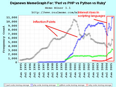

When [Rails](http://rubyonrails.org "Ruby on Rails") first came out, I was still a [PHP](http://www.php.net "PHP") guy. Slaving away at a web agency, pushing out website after website and letting designers have all the fun. At the time I didn't even notice Rails existed. When news of [Ruby](http://www.ruby-lang.org/ "Ruby (programming language)") and Rails finally did reach me, I was fully immersed in [Python](http://www.python.org/ "Python (programming language)") and [Django](http://www.djangoproject.com "Django (Web framework)"). I scoffed at the idea of anything being better. Them silly Ruby people, why on earth would I play with their toys when I can use a _real_ language such as Python? Eventually I started loving the speed and flexibility of Javascript and particularly [node.js](http://nodejs.org/ "Node.js"). Django lay almost forgotten, Rails was that weird thing _those other people_ use. The idea of learning Rails did not cross my mind. In part because node.js was really buzzing at the time (around version 0.3.x I think), in part because by then a lot of the big names in the startup world started abandoning Rails in favour of faster executing environments. What really attracted me to node.js was the blistering speed of execution and the fact it was the new kid on the block. That exciting new thing everyone's looking at. _Of course_ you're going to learn node if you're going to look at a new tech stack. Just like these days you'd probably look at Go or Scala if you were going to learn a completely new way of making web apps.

## A Javascripter starts using Rails

A few weeks ago somebody calls me up and says _"Hey, you seem to have a grasp on automated testing. Want to help us write tests for our Rails app?"_ _"Uh, sure, but I've never even looked at Rails before ..."_ _"No problem, I started the project off with zero Rails experience too. You'll figure it out."_ In stark contrast to how programmers are hired these days, somebody was willing to use a generalist instead of holding out for a specialist. Bloody awesome, if you ask me! And so I was thrown into the dizzying world of Ruby and Rails and a whole new ecosystem of stuff that is completely beyond my comprehension.

## The really cool things

\_\_\_\_

## Things that suck

**\_\_**

## Fin

All in all, I have to say I've grown quite fond of Rails. I love how simple it is to get started as a complete newbie and all the powerful tools are already giving me ideas for what I'm missing in node.js Just a matter of finding some time to start bringing some of the cool concepts into node.js. Right now I doubt I'll be making a full switch to Rails any time soon.

###### Related articles

- [Ruby on Rails Receives the Third Security Patch in Less Than a Month](http://www.cio.com/article/727806/Ruby_on_Rails_Receives_the_Third_Security_Patch_in_Less_Than_a_Month?source=rss_security)
- [Forcing myself to learn RoR](http://blog.daemonl.com/2013/02/forcing-myself-to-learn-ror.html)
- [Node.js Hatred Reveals Significant Dysfunction In The Ruby Culture](http://gilesbowkett.blogspot.com/2013/02/nodejs-hatred-reveals-significant.html)
- [Our First Node.js App: Backbone on the Client and Server](http://nerds.airbnb.com/weve-launched-our-first-nodejs-app-to-product)
- [Why Choose Ruby on Rails](http://thinkinginrails.com/2013/02/why_choose_rails/)

