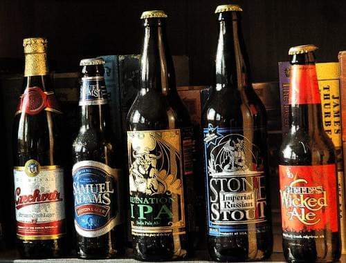

Yesterday I got nerd sniped into solving the FizzBuzz problem without using if sentences.

https://twitter.com/Swizec/status/247344854521245697

Unfortunately, a more careful inspection of the problem specification reveals this solution was incorrect.

> Write a program that prints the numbers from 1 to 100. But for multiples of three print "Fizz" instead of the number and for the multiples of five print "Buzz". For numbers which are multiples of both three and five print "FizzBuzz".

Luckily, that's a very simple fix:

```python
# codegolf version (90 characters):
[{0:"fizzbuzz"}.get(x%(3*5),{0:"fizz"}.get(x%3,{0:"buzz"}.get(x%5,x)))for x in range(101)]

# slightly more readable:
[{0: "fizzbuzz"}.get(x%(3*5),
                     {0: "fizz"}.get(x%3,
                                     {0: "buzz"}.get(x%5, x)))
 for x in range(101)]
```

There you have it, a solution to the fizzbuzz problem that relies on python's interactive command line interpreter thingy to do the printing, so it shave off 4 characters for _print_.

The "trick", if it can be called that, is relying on the native _get_ method to return the correct string or fall back to the default value, which checks for the next string in the if-then-else chain.

I wish never to see code like that in something I have to maintain. Ever :)

## The challenge

Your challenge, should you choose to accept it, is to produce a shorter fizzbuzz solution without using if sentences. I will buy a bottle of beer for the winner.

The best Scala solution so far is 106 characters.

https://twitter.com/HairyFotr/status/247362763188477953

No really, I will send a bottle of beer anywhere in the world if you write a shorter solution. Of course, if feasible, I would prefer to take you out for a beer than use snail mail :)


