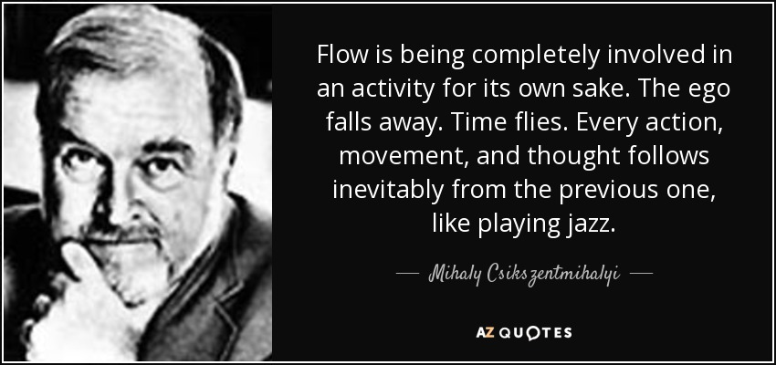

import { ContentUpgrades } from "@swizec/gatsby-theme-course-platform"

Friend, how good are you at your best?

Nobody cares. How good are you at your average? What about your worst?

Everyone's great at their best. When the stars align, the energy is just right, the temperature is perfect, the code hits that sweet spot between easy and challenging, you had the perfect burrito, and your beverage tastes amazing and endless.

Your fingers glide across the keyboard, your brilliance is endless, an aria sounds from the heavens when you run your code.

<ContentUpgrades.SeniorMindset />

## Reality doesn't play fair

\\&lt;record scratch>

That's not how reality works you doodoo!

Reality looks like a scene from a bad sitcom.

You roll into work 10 minutes late because your car broke down, the coffee machine is broken, you spill water on your keyboard, slack pings you every 10 seconds with an oh so very important message, JIRA screams at you about bugs, production is down, your new team member can't get their local environment to run, and the PM is like _"Yo, where's that feature you promised last week?"_

Oh and your computer started an update in the middle of a Zoom call (you were presenting), kicked you out, and now Chrome won't start.

How good's your code now my friend?

_That_'s where you must focus your energy. How good is your performance on a terrible annoying hell of a day?

https://twitter.com/Swizec/status/1381302636373102594

We idolize folks like Jimmy Hendrix, Ayrton Senna, Michael Jordan, and Queen not because they had a few fantastic days here and there. We idolize them _because they were great every time_.

It's your typical performance that defines you. Consistency. [What You Do is Who You Are](https://a16z.com/book/whatyoudo/) as Ben Horowitz would say.

## What does that have to do with flow??

Flow is when you're at your best.

Mihaly Csikszentmihalyi invented/discovered/defined flow. I wrote about it lots in [Why Programmers Work at Night](http://nightowlsbook.com/) back when I thought flow was the only way to code.

But flow is hard to get.

Most days work is ... work. You put one foot in front of the other until you get where you're going.

That's because programming and engineering are two different things.

**Programming is fun**, almost art. Solving hard problems in beautiful ways. Flow is perfect.

**Engineering is work**. Solving hard problems in obvious stupid ways. Flow is unnecessary.

The emphasis is on how will a bunch of distracted people with no skin in the game and zero care for your code maintain this when you're not there to be brilliant?

And remember 👉 they're upset because they were late for work, spilled their coffee, and got pulled in a million directions as soon as they sat down.

If you wrote it in flow, at your most brilliant, they might not even understand your code! _YOU_ won't understand it when you're distracted and upset.

Remember Kernighan's Law: debugging is hard.

https://twitter.com/acemarke/status/1384959487388356612

## What can you do about it?

Not much. Keep going.

When shit's going down, when everything's crap, the best way forward is through.

And [when you code, write down everything](https://swizec.com/blog/when-you-code-write-down-everything). It helps you recover from interruptions.

Cheers, 
~Swizec

PS: remember to read the docs

https://twitter.com/Swizec/status/1381753711836286988
