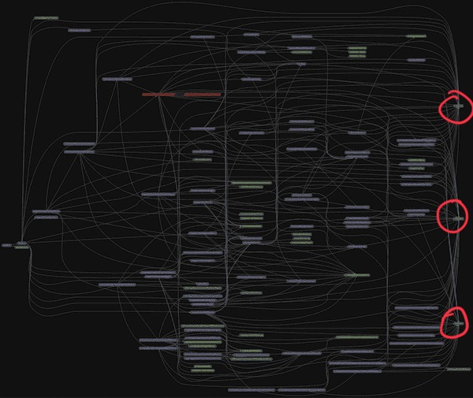

A few readers wrote in with questions after reading [Forget complicated code, focus on the system](https://swizec.com/blog/forget-complicated-code-focus-on-the-system/) earlier this week. Here are my answers.

An anonymous reader writes

> The topic is frequently discussed, but rarely well. The outside research you put in shows and helps to make this insightful, rather than just another rehash.

❤️

Then asks:

## Why are the 2 utility files on the right a code smell?

They're talking about these files from my example of running [Madge](https://github.com/pahen/madge) on a production React app.



The problem with util files is that they're pure architectural complexity. The filename tells you nothing about what's inside and the dependency grows through your code like a weed.

Worse: You'll inevitably find all that DRY was premature. You're falling prey to the [DRY vs SoC](https://swizec.com/blog/dry-vs-soc-a-difficult-choice/) dilemma and choosing to dedupe code that _looks_ the same, but _means_ different things semantically.

When you inevitably need to evolve these utils in different directions for different areas of your code, it's a mess.

## What is a file neighborhood?

[`Neighborhoods`](https://en.wikipedia.org/wiki/Neighbourhood_(graph_theory)) are a concept in graph theory, but really I got mixed up with [`cliques`](https://en.wikipedia.org/wiki/Clique_(graph_theory)).

Neighborhoods describe nodes that are connected. Cliques describe sets of nodes that are _more_ connected than their next neighboring nodes.


Since we're talking about a graph of file connections – file clique/neighborhood. A group of files that are more tightly connected to each other than to the rest of the system.

Great questions anon!

**W. A. ** asks:

## Is there a meaningful difference between architectural complexity as summarized here and the complexity of a supersystem?

> Like a view where the code file relationships have become less relevant and there's multiple services & front ends?

Little difference. You trade in-your-face complexity of a large monolithic codebase for non-deterministic stochastic behaviors of a swarm of cooperating agents.

Draw a graph and you'd see the same. Cliques of files (internals of a service) sparsely connected to each other (API calls).

I'll let this fun video explain why microservices don't save you from architectural complexity:

https://youtu.be/y8OnoxKotPQ

Great question W. A!

Another anon asks:

## when you have architectural complexity ... how do you detect it?

You could use a codebase visualizer, but few people do. The clearest warning sign I've seen are files that start like this:

```javascript
const { ErrorBuilder, CodeError } = require("@asktia/tia-errors");
const insuranceCoverageService = require("../../services/insurance-coverage");
const payerService = require("../../services/insurance-coverage/payer-service");
const clinicInsuranceService = require("../../services/insurance-coverage/clinic-insurance-service");
const { Models, tiaSerialize, modelIsEmpty } = require("../../models");
const eligibilityCheckController = require("./eligibility-check-controller");
const moment = require("moment");
const DrChronoSync = require("../../dr-chrono/dr-chrono-sync");
const mentalHealthSummaryService = require("../../services/insurance-coverage/mh-summary-service");
const {
  EligibilityErrorService,
} = require("../../services/insurance/eligibility-error.service");
```

See all those `{../../}`? That's a sign the code isn't structured to group related files together.

## how do you fix it? how do you prevent it from coming back?

A lot goes into this. I'm writing a whole book!

In essence 👉 you have to structure your code to match the business domain you are modeling. Vertical slices work best. Layers are good for plumbing.

The commonest failure mode is to force arbitrary separation where it doesn't belong.

Thanks anon!

**SD** asks:

## What is transitive dependency?

A dependency with multiple hops.

`{A -> B -> C}`. If C depends on B and B depends on A, then C depends on A.

This is important to get a true picture of your architectural complexity, but few tools take it into account when visualizing code. Alas.

Thanks for the questions, keep 'em comin ❤️

Cheers,<br/>
~Swizec
