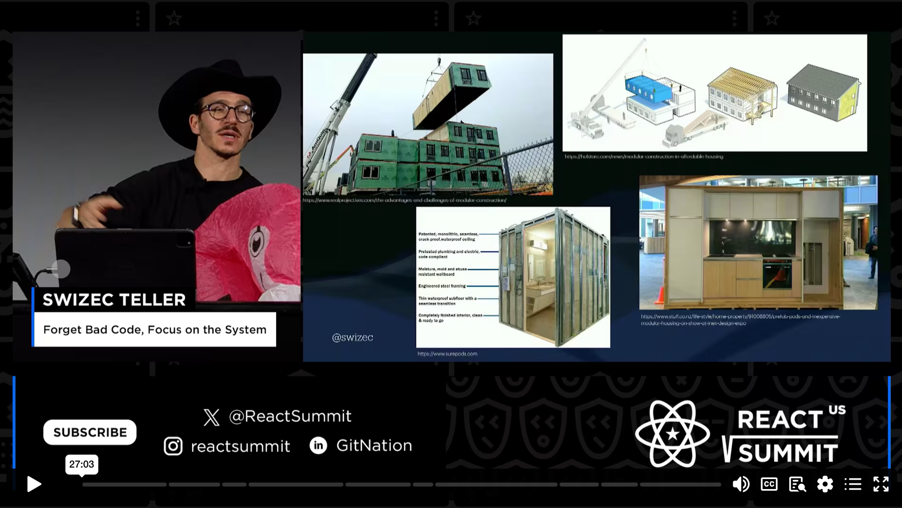
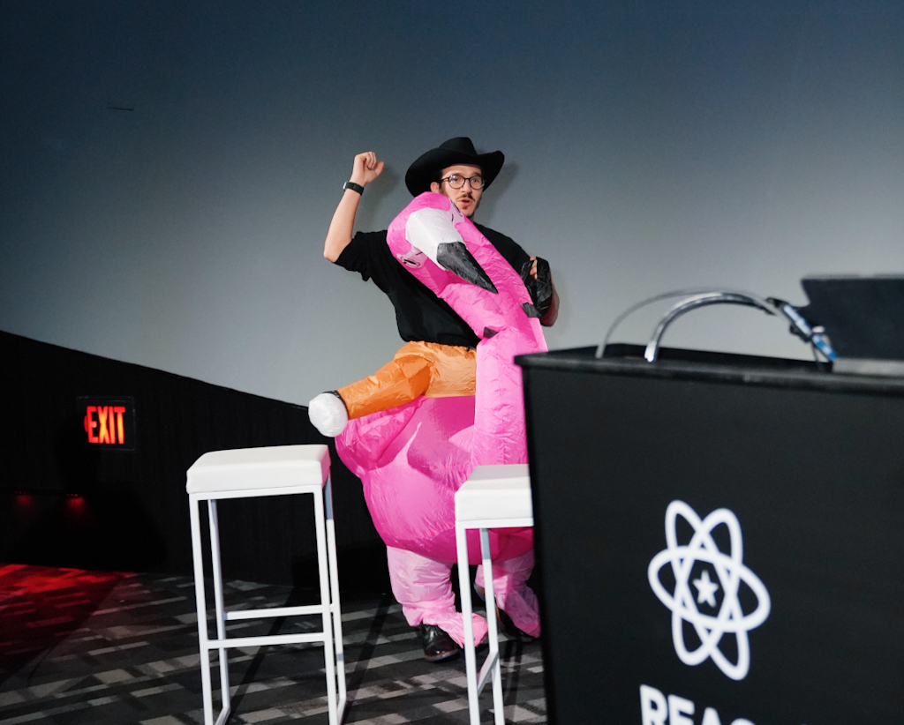

Wanna see me ride a flamingo wearing a cowboy hat? You're in luck! That was my outfit for a deeply technical talk to 700+ people last month 🤘

The talk is about architectural complexity. The flamingo is fun. My goal was to share how structuring your code into self-contained modules makes many debates about code quality feel silly. They just don't matter.

Here's a high level summary generated by the conference AI. It's pretty okay but the talk is better. Lots of visuals.

### Setting Up System and Separating Concerns

You should focus on how you set up your entire system, your architecture. React's JSX and CSS in JS caused similar concerns in the past. Separating concerns by business domain is a different approach.

### Lego Sets and Building Process

The Lego super car from the 90s came in a big box with 1,300 pieces. You would sort the pieces into different boxes. The Saturn 5, my second Lego set, had 1,969 pieces and came in baggies. Building the Saturn 5 rocket was easier and more fun because the pieces were separated by stage, making it easier to find and build.

### Modular Construction and Prefab Units

Modular construction is a new trend where entire pieces of a building are prefabbed and stacked on top of each other like LEGOs. It's cheaper, faster, and more convenient. Prefab bathrooms and kitchens are also available, making the construction process quicker and easier.

### Architectural Complexity and Productivity

The new separation of concerns is button, modal, list, etc., and you have a component that is self-contained and fulfills the function and knows everything it needs to do. The reason people do this or the reason people are excited about this modularity is architectural complexity. High architectural complexity leads to a 50% drop in productivity, a three-time increase in defect density, and a 10x increase in staff turnover. The more time you spent working on more complex files, the less productive you were, and the more likely you were to make a bug.

### Measuring Architectural Complexity

To measure architectural complexity, think of your code as a dependency graph. Elements of your code can be functions, classes, files, or constants. When these elements call each other, lines can be drawn to represent dependencies. However, when lines cross the code base, it increases architectural complexity and makes the code harder to understand. By grouping related elements and creating modules, you can identify natural modules in your code. Experienced engineers already think about code at a higher level, understanding the components rather than individual elements.

### Car Engine as a Module

A car engine, like a module in your code, has a simple API. Air and fuel go in, and exhaust and torque come out. By treating it as a module, you can easily connect it to your code and achieve your desired task.

### Architectural Complexity and Best Practices

Architectural complexity can be identified through a tool that draws a dependency graph. Jumbled code, excessive use of dot, dot, dot slash imports, and circular dependencies indicate architectural complexity. To fix it, organize code by business domain and ensure tightly coupled code lives together. Clean and validate inputs on module boundaries and use prop drilling to pass data. When in doubt, prioritize separating concerns over copy-pasting similar code. Following these practices will help avoid architectural complexity.

I liked the talk. Hope you do too.

\~Swizec
