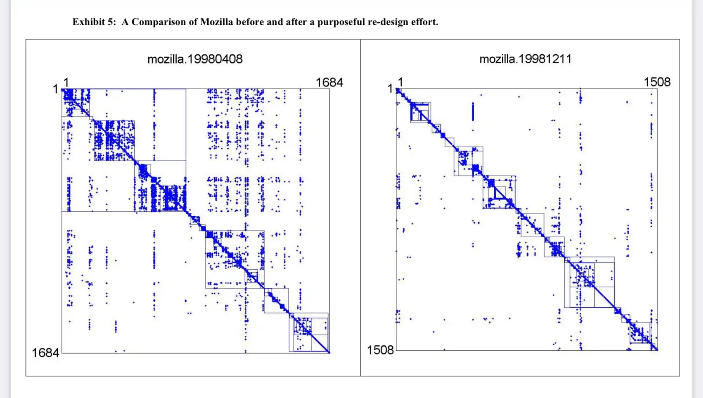

Ever seen code that looks easy to read, but feels hard to understand when you dig into the details? I asked my readers and a bunch of replies came back.

Everyone had a story to share about that time some clean code aficionado smeared logic across a bunch of little functions splatted across dozens of files in five different directories. Hop after abstraction hop before you find the code that _does_ something.

https://twitter.com/Swizec/status/1684219843707371522

This is the tension between two types of complexity.

The in-your-face cyclomatic complexity of complicated code and the subtle architectural complexity that lurks behind intertwined systems with poor isolation of concerns. As an industry we talk plenty about complicated code because it's easy. But it's the complex systems that cause bugs and kill productivity.

Luckily research shows that experienced engineers intuitively understand this and reduce architectural complexity during rewrites. That's what this chapter is about.

## Two types of complexity

We use the word "complexity" to describe two subtly different aspects of a codebase. How complicated a piece of code is to detangle and how complex the whole system is to understand.

- Cyclomatic complexity – how complicated is the code
- Architectural complexity – how complex is the system

Cyclomatic complexity counts independent paths through your code. You can think of it as counting the number of nested indents. Most IDEs offer plugins that annotate your code with this metric.

Architectural complexity counts connections between parts of your code, like imports and function calls. The more connections in and out of a file, the more complex it is. Tools exist to visualize this, but you have to go out of your way to use them.

In [System Design and the Cost of Architectural Complexity](https://swizec.com/blog/two-types-of-complexity-and-their-impact/), Sturtevant finds that architectural complexity is the one you have to watch out for because it causes bugs, loss of productivity, and frustrates developers.

Cyclomatic complexity, by comparison, presents barely a road bump to experienced engineers. But it does frustrate beginners.

### Cyclomatic complexity

Cyclomatic complexity measures how complicated your code feels. It's the one you notice when you look at a function and go _"Wow what a mess?"_.

If you imagine your code as a control flow diagram, cyclomatic complexity counts decision points between alternative paths. Less than 10 means easy, 50+ means untestable.

The hallmark of complicated code is that it looks gnarly, but has clear entry and exit points. You can step through carefully and figure out how the code works for different input values. This is why it isn't as big a deal as it seems.

But much ink has been spilled about complicated code in our industry because it's easy to talk about. Everyone recognizes complicated code when they see it, beginners (who buy most books) care deeply about it, examples fit on a page, and solutions are easy to prescribe.

Write small functions, avoid deeply nested indents, no global variables. All those are good ideas and we'll talk about them in Chapter 6, but taken too far they make _the system_ harder to understand.

What good is a small easy to understand function, if you need to read 20 of them to understand the full solution to a problem? 1 function that reads like a recipe would've been easier.

That's where architectural complexity comes in.

### Architectural complexity

Architectural complexity measures the complexity of your software as a whole. It counts dependencies between areas of a system. More dependencies, more complexity.

A dependency is anything from a function call to a file import. If you're using microservices, API calls between services count and are often the biggest source of tough-to-debug issues.

Architectural complexity is a fairly new metric first proposed in 2013, so not a lot of tooling exists yet. There are codebase visualizers like [Madge](https://github.com/pahen/madge) and UML diagramming tools that can visualize file imports. Most don't go down to the level of function and API calls. They also tend to ignore transitive dependencies.

But tools like Madge _can_ give you useful insights despite their limitations. Here's an example from a large React app.

Clearly there's a lot going on. You can identify a couple utility files on the right, that's a smell. Top left you can see 2 files with a circular dependency, another smell.

If you squint a little, you can see areas where many files depend on each other with few incoming and outgoing dependencies. That tells you there's a module hiding in there trying to break out. This is where you slice during a rewrite.

**NOTE**: Madge isn't ideal for identifying file neighborhoods because it doesn't try to visually group related files. Different layout modes exist, but none that feel quite right for finding neighborhoods.

Academics use DSM diagrams to better visualize this in their papers, but those are hard to generate. Looks like this:

The more you organize your code to make those modules explicit, the easier it is to move your code around.

_Here's a followup post with answers to reader questions 👉 [Followup answers to Forget complicated code, focus on the system](https://swizec.com/blog/followup-answers-to-forget-complicated-code-focus-on-the-system/)_
