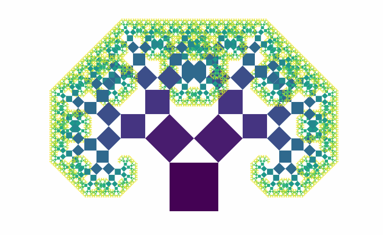
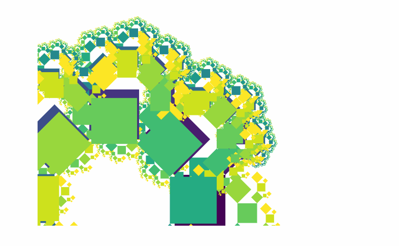
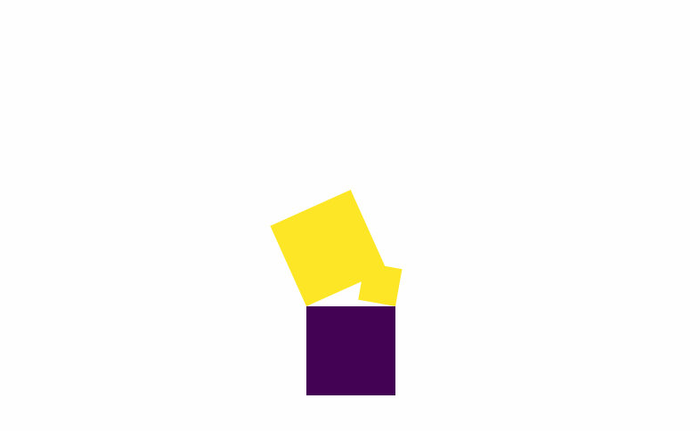

So… this started as an article about why recursion doesn&#x27;t work in React. [It _looks_ like it works](https://swizec.com/blog/simple-mobx-driven-modals/swizec/7166), then you `npm run build`, and it stops working.


Curious, right? Worth looking into, eh?


That&#x27;s not the article you&#x27;re getting. It _started_ as that article, then I spent 3 hours building a Pythagoras tree fractal. It&#x27;s 2:30am, and is my life even real?


Who the hell accidentally spends all night building fractals? Me… I guess.





Pretty, innit? Built with React, and it&#x27;s going to stop working when I `npm run build`. Still don&#x27;t know why. I&#x27;ll figure _that_ out next week.


Here&#x27;s how the [Pythagoras tree](https://en.wikipedia.org/wiki/Pythagoras_tree_(fractal)) works:


> The construction of the Pythagoras tree begins with a square. Upon this square are constructed two squares, each scaled down by a linear factor of ½√2, such that the corners of the squares coincide pairwise. The same procedure is then applied recursively to the two smaller squares, ad infinitum.


?


That becomes four bullet points:


- 1 component called `<Pythagoras >`
- draws rectangle
- calculates props for next 2 rectangles
- `<Pythagoras><Pythagoras>`


Which turns into some 30 lines of code:


```
\import React from 'react';
\import { interpolateViridis } from 'd3-scale';

const Factor = .5*Math.sqrt(2);

const Pythagoras = ({ maxlvl, w, x, y, lvl, left, right }) => {
    if (lvl > maxlvl || w < 1) {
        return null;
    }

    const nextLeft = Factor*w,
          nextRight = Factor*w,
          d = nextLeft + nextRight + w,
          A = 45,
          B = 45;

    let rotate = '';

    if (left) {
        rotate = `rotate(${-A} 0 ${w})`;
    }else if (right) {
        rotate = `rotate(${B} ${w} ${w})`;
    }

    return (
        
            

            

            
        
    );
};


export default Pythagoras;
```


Beautiful. Let me explain.


`interpolateViridis` is a [d3-scale](https://github.com/d3/d3-scale) that gives beautiful colors. Call it with an argument in `[0, 1]` and it returns a color.


`Factor` is the constant linear factor. We use it to calculate the sides of future rectangles.


`d` is the diameter of the triangle formed by the current square and two future squares. More on that later.


`A` and `B` are angles for each future rectangle. Set to 45 degrees statically.


## Then we start drawing.


If we&#x27;re in a `left` rectangle, we set up a left rotation; if `right` then a right rotation. `rotate()` is an SVG transformation that rotates the current coordinate system.


To draw the rectangle, we:


- `translate` to `(x, y`), that means &quot;move there&quot;
- add the rotation
- now our coordinate system is moved and rotate
- draw a rectangle at `(0, 0)`
- add two `<Pythagoras>` with new parameters


And that&#x27;s how you build a fractal in React. It won&#x27;t work in production, but it sure looks pretty on your localhost.


The animation is done in [App.js](https://github.com/Swizec/react-fractals/blob/master/src/App.js) with a timer that updates the `maxlvl` prop every 500ms. Calling the root node of `Pythagoras` looks like this:


```
   
```


Start `lvl` at `0` and set the `maxlvl`. Those are \\important. At `maxlvl` past 12 or 13, it stops working. It takes too much CPU power to ever render.


Yes, I tried. The naive algorithm isn&#x27;t good enough. You could optimize by taking calculations out of recursion and preparing them in advance.


## The part I can&#x27;t figure out


Look at [Andrew Hoyer&#x27;s](http://andrew-hoyer.com/experiments/fractals/) Pythagoras tree. That thing is beautiful and flexible and dances like tree-shaped worm.


?


I can&#x27;t figure out how to calculate those angles and rectangle sizes. I know that using `.5` in the `Factor` is for `45` degree angles.


You can change the ratio by using a `.3` and `.7` factor for each side. Then it stops working with `45` degree angles yeah.





Ok, that was expected. Since you know all the sides, you should be able to apply the [Law of Sines](https://en.wikipedia.org/wiki/Law_of_sines) to calculate the angle.


```
 const nextLeft = .3*Factor*w,
          nextRight = .7*Factor*w,
          d = nextLeft + nextRight + w,
          A = Math.degrees(Math.asin(nextRight/d)),
          B = Math.degrees(Math.asin(nextLeft/d));
```





I can&#x27;t figure it out. I&#x27;m pretty sure I&#x27;m applying the Law of Sines correctly, but the numbers it throws out are wrong.


Halp ?


PS: Here&#x27;s a paper that describes [using Pythagoras trees as data structures](https://pdfs.semanticscholar.org/08dd/831514db573cb9fd2b993a5814007888117a.pdf). Sort of.