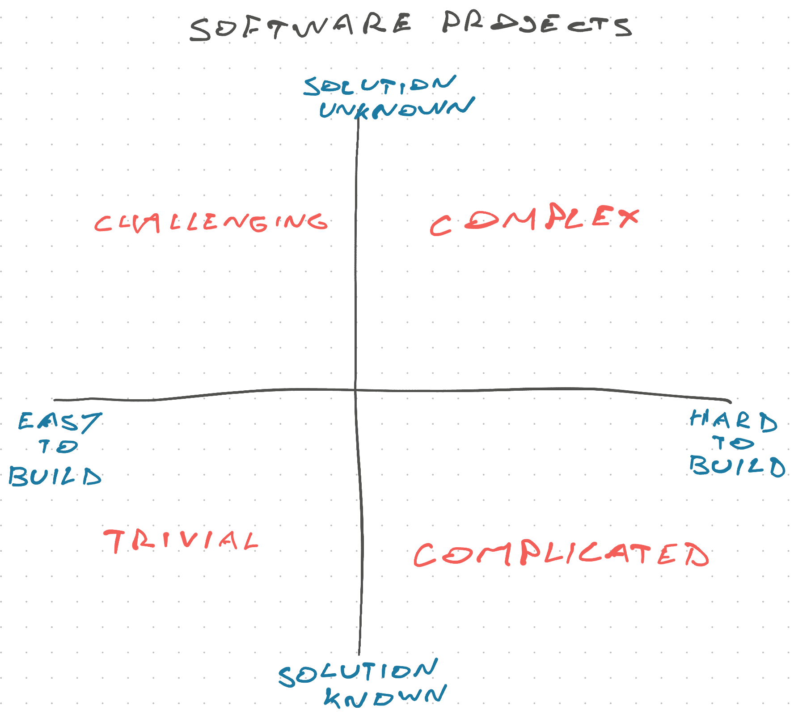

\[name|Friend] I've been trying to capture the difference between complex and complicated software for years and I think I finally got it. You can classify projects into 4 quadrants!

On one axis you have hard vs easy to build. On the other it's solution known vs unknown.

**Trivial** projects are easy to build and you know what you're building. These make perfect freelancing projects. Think brochure website for a restaurant, a self contained data visualization widget. Any tightly scoped project with a clear beginning and end, and no unknowns.

**Challenging** projects are easy to build, but you don't know what the end result looks like. These projects work best with an internal team. Growth engineering is a good example – you're driving an OKR (conversions, retention) and trying different things to optimize. Each individual feature is easy to build, but you can't know in advance what's gonna work.

**Complicated** projects are hard to build, but you know what the end result looks like. These are good agency or internal crack team of experts projects. By default they fall on a platform team of some sort. Think refactoring a creaky codebase to modern standards, upgrading an ancient framework to a new version, or building a tightly scoped feature in an area with no unknowns.

**Complex** projects are hard to build and you don't know what the end result looks like. These require an internal team with skin in the game. This, in my opinion, is the good stuff. Think whole SaaS products, new features in an environment with unknowns, adapting old code to new requirements, ... You need iterative development and a way to measure progress. Everything about these projects is hard.

Planning can help you move projects from complex to complicated or challenging. You can estimate and understand a small-enough slice. This is usually a "story".

Try to avoid stories that both have unknowns _and_ are hard to build. If you're diving into a new area of the codebase or integrating a new vendor, prefer easy-to-build features. If you're building something complicated like a new algorithm, prefer clarifying all unknowns ahead of time.

You cannot use upfront planning to make a complex project trivial. By the time it's ready, you may as well have done the work.

Cheers, 
\~Swizec
