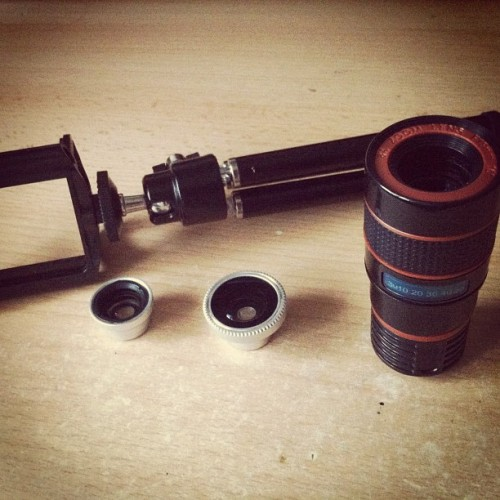

\[caption id=&quot;attachment_4784&quot; align=&quot;alignnone&quot; width=&quot;573&quot; caption=&quot;Zurich river fisheye&quot;]\[/caption] Two weeks ago I ordered a set of [iPhone](http://www.apple.com/iphone "iPhone") lenses on ebay. They looked cheap enough (only 30 euro) and hey, I take plenty of pictures with my phone. Why not add a little extra? And I really wanted the tele-lens. For the same price of that tele-lens from the official seller, you can get: \[caption id=&quot;&quot; align=&quot;alignright&quot; width=&quot;280&quot; caption=&quot;The lens kit&quot;]\[/caption]

- a [macro lens](http://en.wikipedia.org/wiki/Macrophotography "Macrophotography")
- a [fish eye lens](http://en.wikipedia.org/wiki/Fisheye_lens "Fisheye lens")
- \[that same] [telelens](http://en.wikipedia.org/wiki/Telephoto_lens)
- a tripod
- a baggy to hold everything

It&#x27;s one of those deals that&#x27;s almost too good to be legal ... and I did receive everything without perfectly original packaging. But it looked new and unused.

## The verdict

Last week&#x27;s sightseeing in Zurich offered the perfect opportunity to test everything out. I am in love! Despite some failings in practicality this is a really awesome kit and I suggest anyone who&#x27;s bored with their photos but too lazy to get a real camera to go ahead and buy this. The biggest surprise is definitely the fish eye lens. I thought it was going to be useless, I mean didn&#x27;t those mostly die out with the lowering popularity of home made skate movies in the naughties? And the [normal lens](http://en.wikipedia.org/wiki/Normal_lens "Normal lens") is already plenty wide-angled! Well guess what, for taking pictures of rooms - something I do very often - or taking pictures of landmarsk, the fish eye is practically indispensable because it&#x27;s the only way to get everything into the picture.

\[caption id=&quot;attachment_4787&quot; align=&quot;alignleft&quot; width=&quot;300&quot; caption=&quot;Zurich river normal&quot;]\[/caption] \[caption id=&quot;attachment_4784&quot; align=&quot;alignleft&quot; width=&quot;300&quot; caption=&quot;Zurich river fisheye&quot;]\[/caption]

Unfortunately I&#x27;m somewhat disappointed by the tele-lens. It&#x27;s the main reason I even bought the kit, but it turns out to be practically useless. It zooms too much and it&#x27;s almost impossible to get a decent shot of anything. Plus it can&#x27;t even focus on anything closer than 3 meters. The extensive zoom also means taking sharp pictures is near impossible without the tripod, which is very impractical for my point and shoot style of photography. There&#x27;s also a lot more blurring around the edges than I originally anticipated (despite knowing about this problem) However, if you need to highlight anything - this lens is your man!

\[caption id=&quot;attachment_4790&quot; align=&quot;alignleft&quot; width=&quot;300&quot; caption=&quot;A pretty house&quot;]\[/caption] \[caption id=&quot;attachment_4791&quot; align=&quot;alignleft&quot; width=&quot;300&quot; caption=&quot;Telelens can barely get the whole house after I moved back&quot;]\[/caption]

The macro lens is pretty fun as well although I don&#x27;t often take macro photos. Well, to be honest, I&#x27;ve taken about two or three macro photos in my life, but when the urge hits me next - the lens is right there! Ready to step up to the challenge and make things awesome. Bloody fascinating how up close and personal you can shove the lens and still be able to focus though. \[caption id=&quot;attachment_4792&quot; align=&quot;alignnone&quot; width=&quot;321&quot; caption=&quot;A macro tomato plant&quot;]\[/caption] All in all, I have to say I&#x27;m very pleased with the lenses I got. Especially at this price. Not going to win me any photography awards any time soon, but they do open a whole new space of possibilities that simply didn&#x27;t exist before. PS: Zurich&#x27;s got a sort of beach about a 5 minute walk out of city center. If you&#x27;re visiting in the summer, bring a swimsuit. 

###### Related articles

- [iPro Lens System for Apple iPhone 4 &amp; 4S with Cases, Handle, Fisheye &amp; Wide-Angle Lenses](http://www.cellularaddons.com/2012/05/ipro-lens-system-for-apple-iphone-4-4s-with-cases-handle-fisheye-wide-angle-lenses/)

  * * *

- [Gizmon IPad &amp; IPhone Clip-On Lenses](http://blackrockstar.wordpress.com/2012/05/14/gizmon-ipad-iphone-clip-on-lenses/)

  * * *

- [Best iPhone Camera Accessories](http://abcnews.go.com/Technology/iphone-camera-accessories-best-iphone-lenses-flashes-tripods/story?id=16268582)

  * * *

- [Nerd Buy: Olloclip](http://thespendicate.typepad.com/my-blog/2012/05/nerd-buy-olloclip.html)

  * * *

- [Olloclip for iPhone camera lens kit review](http://9to5mac.com/2012/06/20/olloclip-for-iphone-camera-lens-kit-review/)

  * * *

