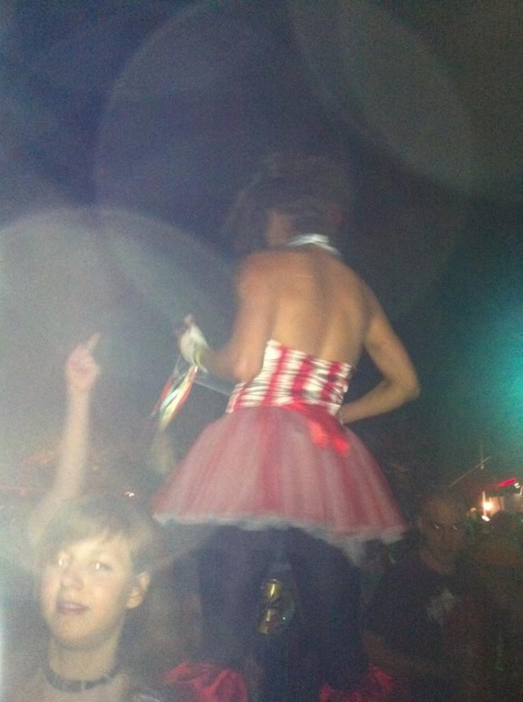
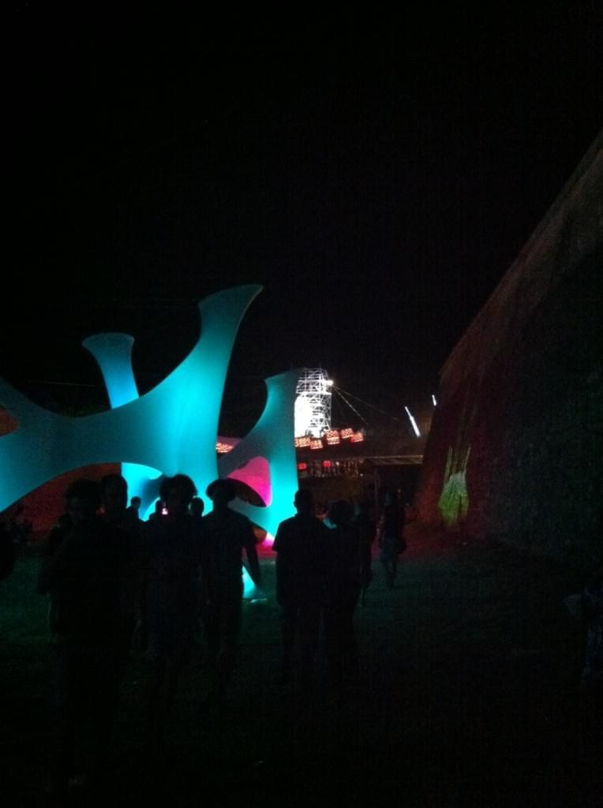
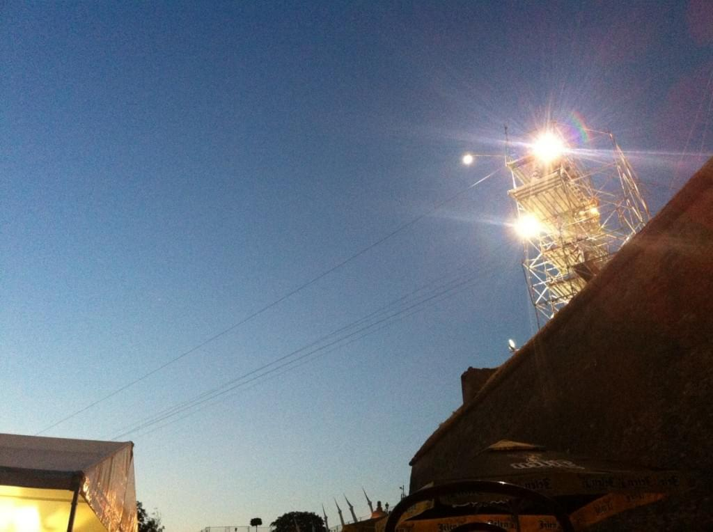
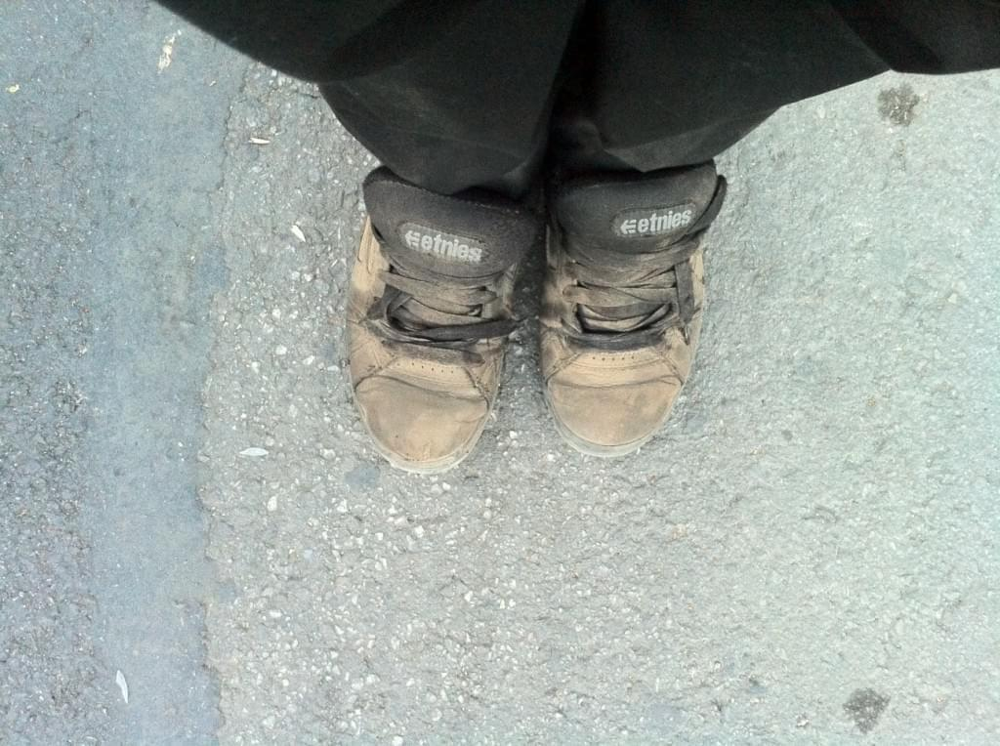

Always know how to get home on your own. Always. \[caption id=&quot;&quot; align=&quot;alignright&quot; width=&quot;428&quot; caption=&quot;@kalkulus enjoying my hat&quot;]\[/caption] Otherwise you might find yourself stuck on a stage full of bad music, milfs and [homeopathic](http://en.wikipedia.org/wiki/Homeopathy "Homeopathy") jack cola. But the worst was really the homeopathic whiskey, look, guys, you have this cool truck branded all over with [Jack Daniel&#x27;s](http://en.wikipedia.org/wiki/Jack_Daniel%27s "Jack Daniel&#x27;s"). I even have to trade my personal data to get in. Might as well serve some bourbon eh ... except you don&#x27;t. Honestly, though, last night had the potential for being super awesome, I was just too tired to actually enjoy it. Zombied through the whole night - could compact all the interesting events into an hour. It started off incredibly well with the beatboxer on the main stage. The feats he could accomplish with his mouth were just brilliant. Then just as [Hatebreed](http://www.hatebreed.com/ "Hatebreed") made it look like the night was going to explode into awesome - great nostalgia for my headbanging days - the whole night just sort of fell apart. The guys met up with some milfy friends who wanted to go to the Jack Daniel&#x27;s stage and when we got there the music simply wasn&#x27;t enough to keep my blood pumping. And just like that, all the tired I had been keeping at bay gushed out in a waterfall of Being Dead (tm). Wanted to dance, but could barely lift my feet off the ground, let alone trying to raise my arms. My body just shut down. The watered down JD didn&#x27;t help either. We eventually made it to the latino stage, which was a bit better with the high beats per minute and energy, but even that didn&#x27;t last long. Just as I was starting to wake up and we got some good company - the Slovenian crew from the previous night - everybody suddenly left. But hey, I had my company, starting to have a good chat when suddenly _&quot;Fuck! I don&#x27;t know how to get home without them!&quot;_ and I just took off like the wind ... ... right into the beanbag chillout zone. Where I awkwardly stared at the sky while a set of A Guy and A Girl lay on each side of me feeling very entertained for some reason. Tonight&#x27;s going to be awesome though, Guns&#x27;n&#x27;roses! Hopefully I won&#x27;t have to talk tomorrow since this is the first gig where I actually know the lyrics and my voice is barely more than a croak as it is. \[caption id=&quot;attachment_4851&quot; align=&quot;alignnone&quot; width=&quot;458&quot; caption=&quot;Girl on stilts!&quot;]\[/caption] \[caption id=&quot;attachment_4852&quot; align=&quot;alignnone&quot; width=&quot;614&quot; caption=&quot;@tamejhna knows how to party&quot;]\[/caption] \[caption id=&quot;attachment_4853&quot; align=&quot;alignnone&quot; width=&quot;458&quot; caption=&quot;Light thingies&quot;]\[/caption] \[caption id=&quot;attachment_4855&quot; align=&quot;alignnone&quot; width=&quot;614&quot; caption=&quot;Zipline against the dawn&quot;]\[/caption] \[caption id=&quot;attachment_4856&quot; align=&quot;alignnone&quot; width=&quot;1024&quot; caption=&quot;I have to clean my shoes every day&quot;]\[/caption]

###### Related articles

- [Geek at a music festival: Day 1](http://swizec.com/blog/geek-at-a-music-festival-day-1/swizec/4825)

  * * *

- [Geek at a music festival: Day 2](http://swizec.com/blog/geek-at-a-music-festival-day-2/swizec/4830)

  * * *

- [Geek at a music festival: Day 3](http://swizec.com/blog/geek-at-a-music-festival-day-3/swizec/4838)

  * * *

