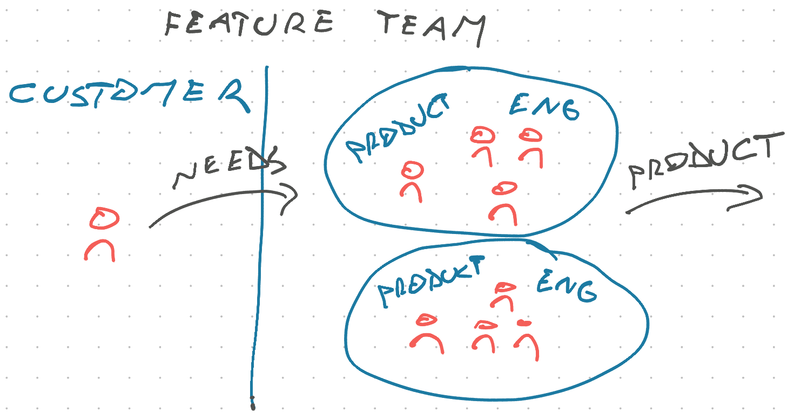

One of my managers used to say that the goal of an engineering team is to _"Get us over the water, not build us a bridge"_.

It's a silly phrase that hides a profound insight into how the most effective engineering teams operate. Working _with_ their product owner/manager, not _for_ them. At the very least engineers should understand how their work solves the customer's problem.

Customer defined broadly. This can be an end user, an internal team, a paying customer, or an executive with a pet project.

The image shows two extremes of a spectrum – a widget factory model compared to an empowered teams model. You're likely somewhere in between. Some days you just gotta get things done because they need doing. Other days you get to think deeply and iterate on a solution.

## Widget factory

In a widget factory engineering teams are told "build a bridge" and they build a bridge. Best solution or not, a bridge is what you'll get.

The "widget factory" term is contentious.

When I mention it among friends of varied backgrounds, many let out a cathartic sigh and say _"yes it sucks so much, never again"_. When I mention it among silicon valley nerds they go _"I thought that was just an old story people say to scare children"_.

The widget factory stems from an old model of software development that thought of coding like manufacturing. Super smart people get in a room together, design the whole system, then hand off tasks to engineers who "just need to code it up".

Engineers get little to no input and may not even understand the problem they're solving. Bland tasks show up, you write the code, ship it off, and someone else makes sure it solves the customer's needs.

I've personally seen this model as an outsourced freelancer. The widget factory feeling is a big part of why I ended my freelancing career and went into product engineering.

The problem with this approach is that it's slow, unrewarding, and leads to products nobody likes. The up-front design takes time and is too abstract to find the issues, the implementation finds problems that are hard to fix without a re-design, and the final product doesn't match the customer's vision because the fuzzy image in their mind didn't translate.

To move fast, you need a tight feedback cycle between the customer, the design, and the implementation. The widget factory struggles at this.

## Feature team

In a feature team model teams are told "get us over that river" and they work with constraints to figure out how. Best strategy or not, across that river you'll get.

You're likely on a team like this! They are the most common in modern companies.

Feature teams improve on the widget factory by bringing product managers into the engineering team. [Cagan](https://www.svpg.com/product-vs-feature-teams/) talks about them as a transition step towards fully empowered teams.

A feature team combines product and engineering, but doesn't give the team autonomy to set its own direction. Customers (defined broadly) express their needs and the team has leeway to find the best solution.

This unlocks tight collaboration and quick feedback cycles between product and engineering. Instead of product and customer iterating in the abstract before talking to engineers, product and engineering iterate together with working code as the guide.

Because engineers understand the problem they're solving, they can recommend innovative solutions that you wouldn't think of without a deep understanding of the system. And engineers can push back on requirements that would be costly to implement.

This feedback is key. Product cannot make good decisions without quality input from engineering.

If option A takes 2 weeks and option B gets you 80% of the value in 2 days, product will want to know. Especially if they wouldn't think of option B on their own.

Likewise product may have an idea that looks fantastic, but when you explain the cost – how long it takes to build or how risky the bugs are because your foundation is a pile of spaghetti – they might say _"Okay not worth it. Let's do this other thing instead"_.

You can't have those conversations in a widget factory.

## Empowered teams

In an empowered teams model, teams are given objectives and full autonomy to execute. Turns out the cows you wanted to pet across the river come to your side every week! No need to cross the river at all.

This is the power of an empowered team. Each team can figure out the best way to get what the customer (defined broadly) needs. Maybe even finding problems to solve that the customer didn't notice they had.

The empowered team builds on the feature team by adding tight collaboration with the customer (defined broadly). The product development process becomes the product development _cycle_.

From an engineering perspective, this can feel similar to the feature team. You work in close partnership with your product owner, make sure they have good inputs to make decisions, and seek ways to fulfill customer needs with a good balance between cost and quality.

But the way you measure success changes.

In a widget factory or feature team, you care about outputs – did the team do the work? Did features get shipped, were meetings attended, did you do the sprint rituals and ceremonies. You do the work and the rest is somebody else's problem.

With empowered teams you [care about outcomes](https://swizec.com/blog/outputs-are-not-outcomes/) – did the team _achieve a result_? Leadership doesn't ask if you shipped features, had meetings, or used the right project management approach. They set business goals and the rest is up to you.

Cheers, 
~Swizec
