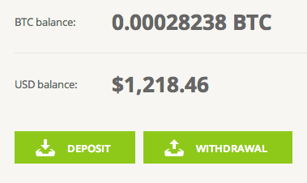

## Getting lucky

Every once in a while I would remember the poor project laying abandoned on my Github account. That I should really get back to it. That I could make a bunch of money if I made a high frequency or even a low frequency [trading algorithm](http://en.wikipedia.org/wiki/Algorithmic_trading "Algorithmic trading") for bitcoins. Even just a semiautomatic system that finds the best buy/sell moment after I tell it to do something would be a great help. Oh the endless possibilities and infinite laziness in actually doing something about them. But time passed. Bitcoin did its thing. And yesterday morning it hit $588 per coin. Wait what? _"Holy crap! I have to sell"_, I thought to myself. I didn't even think about the fact it would continue to grow before it crashes. I didn't think about anything. I just sold. Bam. Some 2.15 bitcoin gone. Some $1200 made. \\o/ Pretty good return on investment if you ask me. Put $270 in, get $1200 out a few months later. 400% return, and I just wish I had put more money in. But the hell if I knew this was going to happen.

## Money isn't money until it's your money

But money's not money until it hits your bank account. As great as Bitstamp is, a bank account it's not. Withdrawing the money was greeted with a lovely _"Ohai thar, we don't believe you're a real human. Please verify your account by sending government issued ID and proof of residence."_ Didn't need that to _take_ my money did you Bitstamp? Now suddenly it's a big deal and I have to jump through hoops. But I understand. Bitstamp is a money instrument. They might have become more stringent in the last couple of months. As they should. I had to do all of this to get a UK credit card from [Skrill](http://www.skrill.com/ "Moneybookers") as well. Sent files through their form. No email confirmation that I sent the info, just account status changing from "UNVERIFIED" to "PENDING". No estimate how long it would take. _sigh_ Bitstamp, you are not being very serious right now. Today I go to check up on my application and bask in the glory of that boldened \\\$1200 figure staring at me from the screen. Nope. Get a scary _"We are fairly certain you are not a real person"_ notice. Right from their cloud hosting too! Bitstamp going through a [DDoS attack](http://en.wikipedia.org/wiki/Denial-of-service_attack "Denial-of-service attack") of some sort. Or just being down. Or they don't like me anymore. They came back online while I was writing this post, but man was that scary. Funny how attached you get to money that isn't even your yet.

