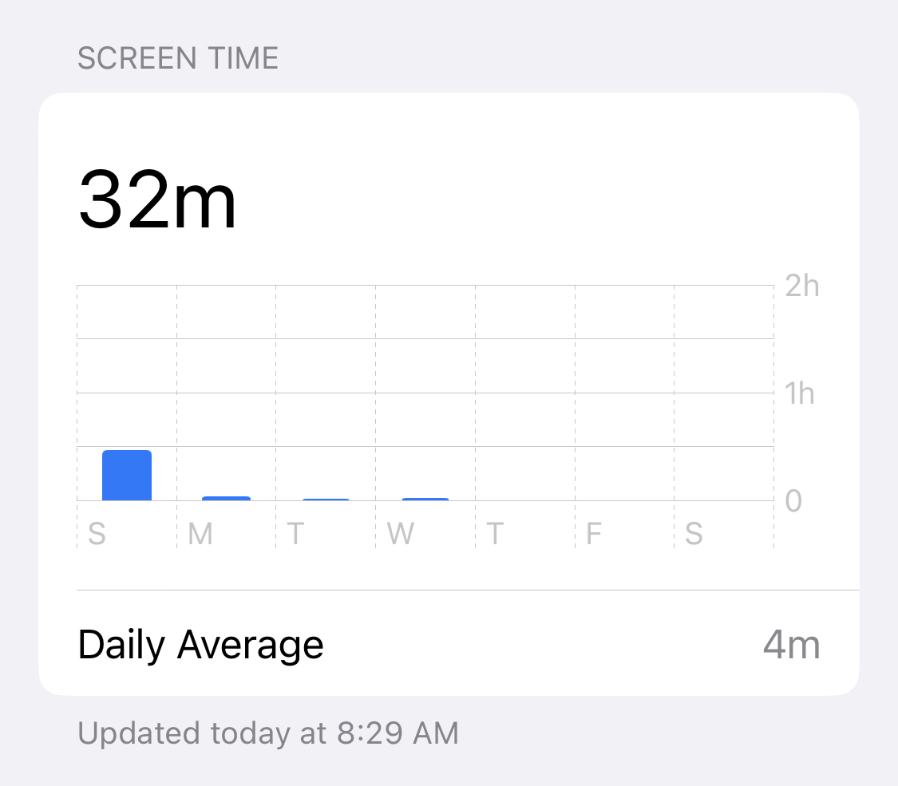

As you've surely heard, ole Musky bought Twitter and the tech community threw a collective shitfit. The atmosphere of ragequitting, hand wringing, aloof defiance, and stubborn nothing-to-see-here gave me time to reflect: Why am _I_ here?

https://twitter.com/Swizec/status/1594458625430282240

I started using Twitter in July 2008. 14 years ago.

Back then I was a college freshman seeking a global IRC chatroom. A place where _everyone_ was approachable, cool to talk to, and troll flame wars were a great way to learn about the world. A masterful jape, a good poke of fun, and you just might experience a life perspective you'd never tried before.

This was before @-mentions, retweets, link shortening, embedded images, videos, threads, and all the rest that makes modern Twitter tick. You get 140 characters of plain text and a feed of everyone you follow. That's it.

Soon it was _the_ place to meet the Slovenian tech community. People came from IRC, private forums, newsgroups, mailing lists, and local hacker spaces.

It was awesome.

## The vibe shifted

In recent years, especially in America, the vibe has shifted.

Twitter went from being that place where people talk about their innermost thoughts and share interesting insights, to a place where politicians stir shit up, professional influencers post golden nuggets, wannabe influencers regurgitate those nuggets into endless threads, and research types share insights before they make it into the next big talk, paper, or library.

Almost everyone presents a polished professional front. The stakes are too high to be a human person. Someone's always ready to jump at your throat for a perceived slight.

You: I like bananas
Professional twit: Yeah a bad person like you _would_ hate oranges wouldn't they

This made Twitter boring. And dangerous.

What's worse, Twitter's design (or environment?) would lull you into accidentally becoming the professional twit. Even when you didn't mean to. When everyone expects to be attacked, everything feels like an attack. 😔

## So why _am_ I here?

I joined twitter for fun, community, and insight. It's been my [open door](https://www.cs.virginia.edu/~robins/YouAndYourResearch.html) for 14 years.

> I notice that if you have the door to your office closed, you get more work done today and tomorrow, and you are more productive than most. But 10 years later somehow you don't know quite know what problems are worth working on; all the hard work you do is sort of tangential in importance. He who works with the door open gets all kinds of interruptions, but he also occasionally gets clues as to what the world is and what might be important.
>
> ~ Richard Hamming, [You and Your Research](https://www.cs.virginia.edu/~robins/YouAndYourResearch.html)

And it was good for building an audience. I think? Maybe?

I still think it's one of the best places online to get a feel for the future of web development. All software engineering maybe. You get to see early drafts, first hunches, and ongoing research that later makes it into ground shaking conference talks, earth shattering blog posts, and fundamental new libraries.

Increasingly I started getting these insights even earlier from in-person conversations. Maybe because Twitter is dangerous and people are hiding their thoughts. 🤷‍♀️

## The clues

The big clues started piling up.

When friends asked, I'd compare Twitter to a cigarette. A habit you can't shake.

When advisors asked, I said Twitter was a grind but something you have to do ... audience or whatever.

When mentees and readers asked, I said don't waste your time on shallow social media. Read books, listen to long-form podcasts, google for articles on specific issues. Twitter and friends are like junk food for the brain. You want depth.

https://twitter.com/Swizec/status/1594494547802828800

The final straw came when I read a Seth Godin blogpost – [Habits are not Needs](https://seths.blog/2022/11/habits-are-not-needs/).

https://twitter.com/Swizec/status/1593101255903416322

Not because of what it said, but because of how it felt. _"You don't need social media"_ struck me like a flashing neon sign.

Those mental highlights are your subconscious trying to speak.

Then I said this in a Slack room of business owners:

> I’d rather just get off social media than migrate to mastodon. If it’s a business thing, it doesn’t have to be me running it. If it’s a fun thing … it hasn’t felt fun in months, maybe years

And I knew it was time to change.

# The experiment

On Monday I stopped opening Twitter.

Set my phone to a 5min/day limit and procrastinated on blocking twitter.com on my computer.

I thought it would be hard but it ... wasn't. It was wonderful even.

Here's my screen time for the week.

I posted 5 tweets through the week and that was it. Didn't care to read replies, didn't care about the timeline, didn't check the number of likes. Okay I did check likes a little 😛

So far this has been a great success.

Days feel endless, I'm not constantly overwhelmed, and it feels like I finally have time to think. But I do spend more time on Imgur for those 21st century cigarette breaks.

A book next to my computer should fix that. Used to read entire novels while video games loaded back in the 90's.

I'll continue through December and see how it feels.

Cheers, 
~Swizec

PS: there's logistics left to figure out, I don't want to _vanish_ from Twitter, but do need to spend less time
