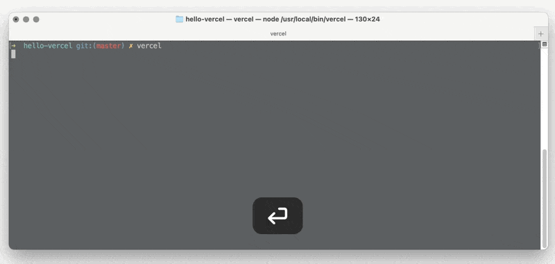
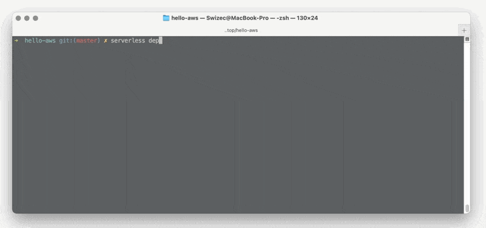

import { ContentUpgrades } from "@swizec/gatsby-theme-course-platform"

Let's get tactical, how _do_ you build a JavaScript function that runs in the cloud serverlessly?

As we said earlier, [the modern backend is a JavaScript function](https://swizec.com/blog/if-you-can-javascript-you-can-backend). _You_ can be a full-stack engineer, no fancy sysadmin skills or kubernetes monstrosities requires ✌️

There's a few ways to start:

1.  Vercel cloud functions
2.  Netlify cloud functions
3.  AWS Lambda

Vercel and Netlify are quick and easy, AWS Lambda gives you more control as you grow. All 3 let you take a function like this:

```javascript
export const handler = async () => {
  return {
    statusCode: 200,
    body: "Hello 👋",
  }
}
```

And turn it into [a publicly accessible URL that says hi](https://z7pc0lqnw9.execute-api.us-east-1.amazonaws.com/dev/hello?name=Friend).

<ContentUpgrades.ServerlessHandbook />


## Vercel

Vercel is among the youngest serverless and JAMStack providers. One of my favs for hosting websites.

Take a project built in a popular web framework like Create-react-app, Gatsby, Vue, Next, Nuxt, et al, run `vercel` and it's live on a URL. I'll never get over how easy they've made it 😍

### Hello

To make a cloud function, you use the `/api` directory.

```javascript
;/api/ehllo.js

module.exports = (req, res) => {
  // .status sets the status code
  // .send writes the response
  return res.status(200).send("Hello 👋")
}
```

Vercel uses Express-like functions. Express is a popular backend framework in the JavaScript world.

`req` is the request object. You'll find params in here, session info, and anything you add in your chain of functions (called middleware).

`res` is the response. You use it to set status codes, write the body, add headers ...

Deploy, and you get a URL.



Append `/api/<your function>` to the URL to call your cloud function. Wakes a server on demand, runs your tiny code, returns the result 👌

### Use Vercel?

Vercel's cloud functions are fantastic for tiny features. When you need to run secure code on the server, make a calculation that would freeze the browser, or call a 3rd party API or database.

Primary use-case is for Next.js server-side rendering and generation. When you call `getServerSideProps`, it's running on one of these cloud functions for you.

Access to and from the full serverless ecosystem is tricky and discouraged.

## Netlify

Netlify invented the word JAMStack and they offer Netlify Functions as their cloud function approach.

Like Vercel, they're great at hosting any project built in a popular web framework. The difference is they're UI first. Not my jam, personally. The GitHub integration works great 👌

### Hai

To make a cloud function, you add a file to to the `/netlify/functions/` directory.

```javascript
exports.handler = async () => {
  return {
    statusCode: 200,
    body: "Hello 👋",
  }
}
```

Netlify acts as a thin wrapper on AWS Lambda and uses the same syntax. Huzzah 🙌

An optional `event` argument gives you access to params, headers, and other info. You return the response as a JavaScript object.

There are no middlewares.

Deploy, and you get a URL.


Append `/.netlify/functions/<your function>` to the URL to call your cloud function. Wakes a server on demand, runs your tiny code, returns the result 👌

### Use Netlify?

Like Vercel, Netlify cloud functions are fantastic for tiny features. Do something secret, hook up a 3rd party API, ...

A nice benefit is that Netlify supports event-driven functions that they trigger for you, and there's periodic background functions.

But that URL looks silly and access to and from the full serverless ecosystem remains hard.

## AWS Lambda

AWS Lambda is the original serverless provider. Often used as a synonym for serverless as a whole.

And as you can imagine, AWS gives zero shits about making this easy for anyone. They're a Java shop targeting Java folk aiming at grizzled backend veterans.

Ask anyone if they enjoy using AWS's native UI tools 😛

Hint: why do you think there's so many alternatives running on AWS?

I like to use the [Serverless Framework](https://www.serverless.com/) to deal with AWS. Great balance between making common features easy and powerful features possible. You can drop down to AWS's native config any time ✌️

Heard great things about [arc.codes](https://arc.codes/), haven't tried yet.

### Aloha

You take the same JavaScript function from Netlify

```javascript
// handler.js
exports.hello = async () => {
  return {
    statusCode: 200,
    body: `Hello 👋`,
  }
}
```

And add a configuration file:

```yaml
# serverless.yml

service: hello-world
provider:
  name: aws
  runtime: nodejs12.x
  stage: dev

functions:
  hello:
    handler: ./handler.hello
    events:
      - http:
          path: hello
          method: GET
          cors: true
```

The `provider` section defines where and how your function runs. Serverless Framework supports more than AWS.

You can use this area for shared config between functions.

The `functions` section defines your AWS Lambda functions. Each comes with a name, a function to call, and the `event` (or many) that trigger it.

The config above creates an API Gateway that listens on a `/dev/hello` path.

Watch



Take the URL, call your cloud function. Wakes a server on demand, runs your tiny code, returns the result 👌

### Use AWS Lambda

It's more work than Vercel or Netlify and you'll never outgrow it. Okay, you might turn into a Fortune100 company one day ...

If you're engineering at a Fortune100, you don't need any of this. There's a department for that 🙃

With AWS you can do _everything_. The whole ecosystem is easy to access and configurable through `serverless.yml`.

You pick this if the backend is at all important to your project my friend.

What would you pick? hit reply

Cheers,<br/>
~Swizec

PS: don't forget, [live Serverless Q&A and new book celebration Monday morning](https://www.youtube.com/watch?v=WC-mEf4K9as); come say Hi
