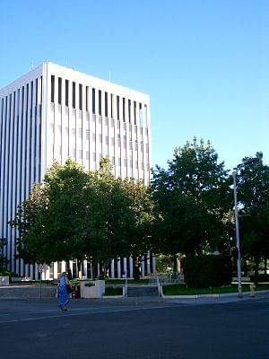
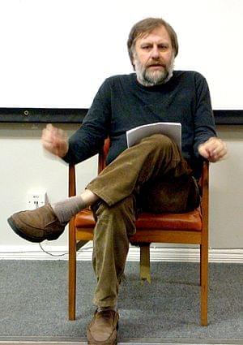

The drink/coffee meetings resulting from my post about coming to [Palo Alto](<http://maps.google.com/maps?ll=37.4291666667,-122.138055556&spn=0.1,0.1&q=37.4291666667,-122.138055556 (Palo%20Alto%2C%20California)&t=h> "Palo Alto, California") have started happening. It&#x27;s great fun meeting new people and getting a feel for the local community and entrepreneurial scene. Certainly a great place to be for meeting cool people and hackers.

\[caption id=&quot;&quot; align=&quot;alignright&quot; width=&quot;300&quot; caption=&quot;Image via Wikipedia&quot;]\[/caption]

Invariably, though, the conversation comes up to a point where they decide to finally notice my thick accent (it&#x27;s actually kind of horrible, I thought I could speak much better than I can) and ask about where I&#x27;m from. A surprising number of people recognize the country. Or pretend to. Hard to tell which, but it doesn&#x27;t really matter. It&#x27;s much different than just four years ago going to [London](<http://maps.google.com/maps?ll=51.5072222222,-0.1275&spn=0.1,0.1&q=51.5072222222,-0.1275 (London)&t=h> "London") and having pretty much everyone ask where the fuck is this [Slovenia](<http://maps.google.com/maps?ll=46.05,14.5&spn=10.0,10.0&q=46.05,14.5 (Slovenia)&t=h> "Slovenia") thing. Maybe there&#x27;s a lot of Slovenians in Palo Alto, or maybe [Americans](<http://maps.google.com/maps?ll=38.8833333333,-77.0166666667&spn=10.0,10.0&q=38.8833333333,-77.0166666667 (United%20States)&t=h> "United States") just don&#x27;t care as much where a particular country might be situated. And the next step in this conversation is predictably: &quot;So that&#x27;s a pretty big step huh, moving all the way over here? How do you like it?&quot; To be honest ... I don&#x27;t really notice a difference. I think this has so far disappointed pretty much everywhere. But seriously, the US is not that different than home. Sure, everything here is like Slovenia on steroids. Everything is huge. There are more people. Going to the store around the corner is a two kilometer bike ride. And something being &quot;right next to the [Bay Bridge](<http://maps.google.com/maps?ll=37.8180555556,-122.346666667&spn=0.01,0.01&q=37.8180555556,-122.346666667 (San%20Francisco%20%E2%80%93%20Oakland%20Bay%20Bridge)&t=h> "San Francisco – Oakland Bay Bridge")&quot; is the whole of [Ljubljana](<http://maps.google.com/maps?ll=46.0555555556,14.5083333333&spn=0.1,0.1&q=46.0555555556,14.5083333333 (Ljubljana)&t=h> "Ljubljana") away from the actual bridge. That&#x27;s to be expected though. The US is a big vast country and land is pretty much worthless. Back in Europe land is practically the hardest thing to come by so naturally everything is a bit smaller. Our cities also tend to be much more centralized due to historical reasons that just didn&#x27;t exist here (think wars with pitchforks and swords). Maybe I live in a strange bubble full of entrepreneurs back home, but aside from being a couple of sizes bigger the scene here doesn&#x27;t seem much different than in Ljubljana. Here you can talk to a random person in a bar on [University Street](<http://maps.google.com/maps?ll=45.503518,-73.570496&spn=1.0,1.0&q=45.503518,-73.570496 (University%20Street)&t=h> "University Street") and they will tell you they&#x27;re an entrepreneur. They might even pitch into your conversation if they hear something awesome. This is something we don&#x27;t have at home. But go to the right bar, and you do. In Ljubljana there is a bar that a lot of the tech entrepreneurs visit somewhat regularly. In California Palo Alto _is_ that bar. See, just a bit bigger. :)

\[caption id=&quot;&quot; align=&quot;alignleft&quot; width=&quot;300&quot; caption=&quot;Image via Wikipedia&quot;]\[/caption]

Really the biggest culture shock I did notice revolves around food and such things. People here are just simply bonkers. Everything, fucking _everything_ has all these magical labels about what is or isn&#x27;t in there. And everything is just so fake and horrible ... seriously, we even found flour that promised to be at least 20% made of flour! Seriously. And all the propaganda! Marmelade markets itself as having zero calories from fat ... meat markets itself as zero calories from sugars ... My mind is blown literally every time I try to figure out what I&#x27;m actually eating. Luckily we found a store barely 20 kilometers from the house that sells nice, normal, balkan food. Oh and a surprising amount of people I meet are really into Slavoj Žižek ... I find that somewhat odd.

