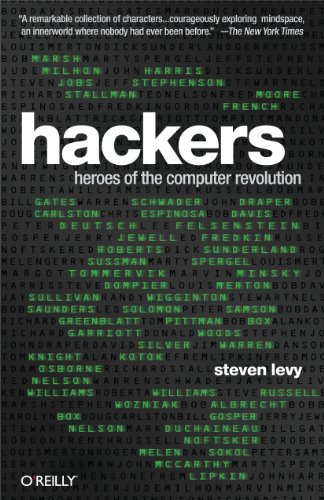

Wednesday was my last day at the dayjob. Today I'm starting a new one. Silicon Valley moves fast.

I took those 3 days to ride my Street Twin into Death Valley, finish a fantastic book on Hackers, and think about life, career, and everything. It was great and far too short.

You know that feeling you get when you break free of routine, free of expectation, free of everything. When you can just _be_?

Like Forest Gump when he started running and then he kept running. Hit the ocean, turn around, run.

That's how this felt.

Hop on the bike and go. Then keep going. When you think you're done ... keep going some more.

The two riding days were long. 560 miles each. 12 hours on the bike.

I was tired. But good tired. The kind of tired that says _"Today was an epic adventure"_

You know, the opposite of the tired you get from a long day of work.

## Hacking

It reminded me of hacking.

Those good old days where you could sit down at the computer, pick an idea, and hack away. For hours. Days. Even months.

No strings attached. No goal in mind. Just a good old hack. Pure fun. Solve a problem to scratch an itch. To find a better way. To make a program that's beautiful.

You'd rush through dinner then hop back on the code. Half-ass your homework and write more code. Sleep through class to write more code at night.

Code became serious. A tool. Your passion an industry. Your hobby full of people who don't get it. People who just want a good job.

## Engineering

Steven Levy wrote a great book about this – [Hackers: Heroes of the computer revolution](https://en.wikipedia.org/wiki/Hackers:_Heroes_of_the_Computer_Revolution).

I listened to the 2010 edition on audio during my ride.

In it, Levy talks about the early days of computing. The 60's and the 70's. How it all started in an MIT lab where there was a computer and an anarchist group of computer hackers.

Those first youngsters who realized _"Hey wait a minute, computing is **fun**! How can we do cool things when the serious folk aren't looking?"_

So they built everything.

The first operating systems, the first assemblers, the first video games, the first sharing systems, the first bulletin boards, the first everything. They defined computing.

And they shared it all. For free. Because why hide your code when someone else might make it even better?

Then the next generation came and they built everything for the personal computer. And then the internet. And then the web.

Each next generation became a bit more closed. A bit more serious. A bit more commercial.

ARPA funding dried up so hackers went into business. Selling chips and kits and computers. Business was booming and code was free.

Then code became valuable. And people stopped sharing.

Why give your game away for free, if you can sell it through a publisher, collect 30% royalties, and make millions in your 20's? Why share your secrets, if they let you do a trick nobody else can do?

## The myth of the hacker

Slowly one by one the hackers got old, got serious, got outcompeted by teams of solid reliable engineers.

Those publishers that promised 30% royalties, they realized 20% works just as well. Maybe even 0% + salary.

Because what self-respecting engineer wants to work for royalties? A stable job is where it's at.

Punch into work, write some code, go back home to your wife and kids. Leave work at work.

And slowly the hacker spirit faded.

Coding is work now. It's reliable. It's predictable. It brings results. On time, in budget.

The Suits understood this. The _business_ hackers.

You can't build a company on a lone hacking genius that might produce the next big hit tomorrow ... or get bogged down in some weird little detail and deliver by Christmas.

You can't market around that. You can't plan. You can't budget. You can't do shit.

So the suits killed The Hacker.

And they created The Engineer.

And that makes me sad. But I understand. Or maybe I'm just old and don't have time to hack.

Cheers,  
~Swizec

PS: in a 2010 follow-up interview with Gates (featured in the book), he said that computer hacking is dead. The real hackers are in biotech. That industry is still young, still exciting, still fun.
