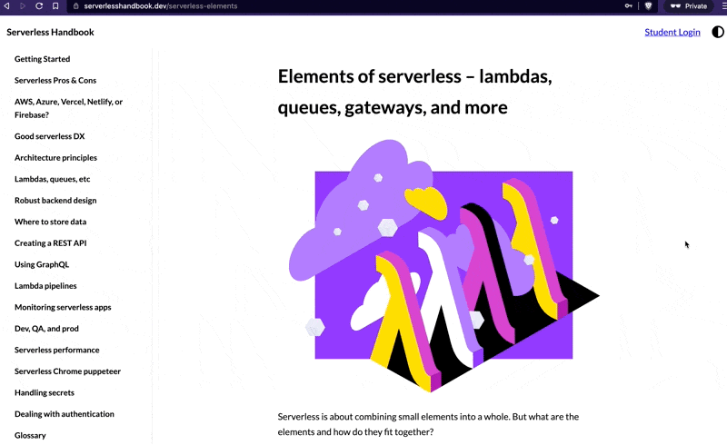
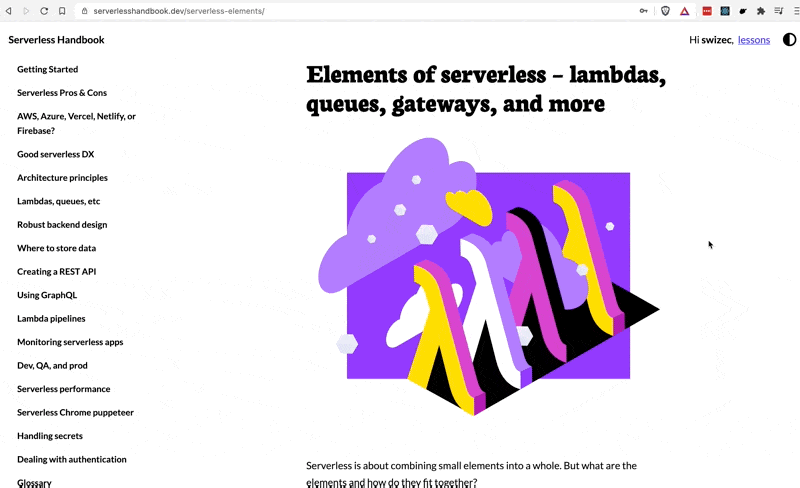
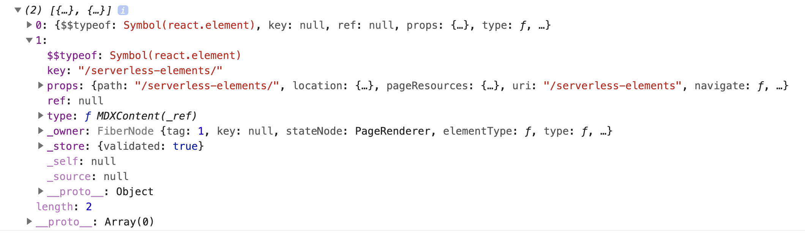
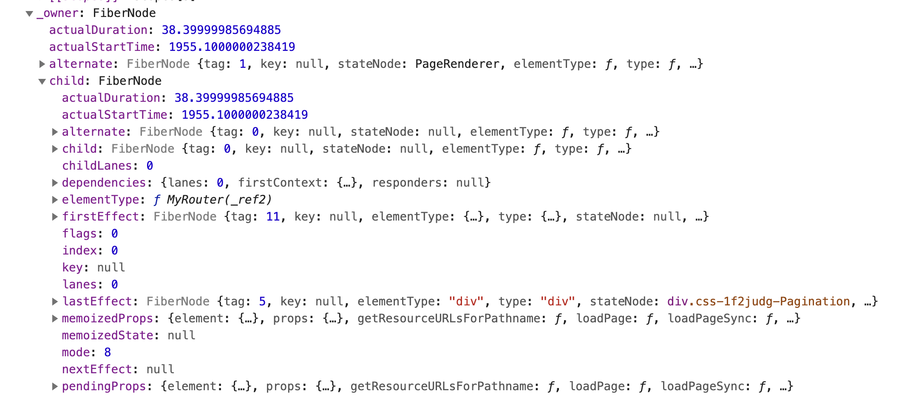
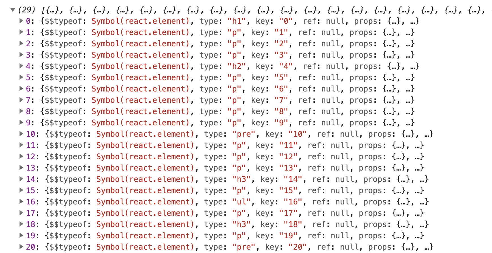

This is hold my beer level of hackery. It didn't work but we learned lots in the process.

_CodeWithSwiz is a weekly live show. Like a podcast with video and fun hacking. Focused on experiments and open source. [Join live most Tuesday mornings](https://youtube.com/swizecteller)_

https://www.youtube.com/watch?v=GBi13DrceUg

## The problem

On [ServerlessHandbook.dev](https://serverlesshandbook.dev) there is a paywall. Every visitor can read the first 30% of every chapter. To read more you have to buy the book or unlock specific chapters with an email.

This works.



But it doesn't look good. Content's not styled.

You're supposed to see this:



## Current working solution

You get unstyled content [because of how the paywall works](https://swizec.com/blog/a-fun-security-bug-with-static-rendering-codewithswiz-31/).

```javascript
// rendering the main content
{
  contentUnlocked ? (
    <main id="content">{props.children}</main>
  ) : (
    <main id="content">
      <SnipContent>{props.children}</SnipContent>
    </main>
  )
}
```

If content unlocked, show content. If content locked, snip.

The snipping is a hack:

```javascript
export function SnipContent({ children }) {
  const html = ReactDOMServer.renderToString(children).split(
    '<div id="lock"></div>'
  )[0]

  return <div dangerouslySetInnerHTML={{ __html: html }} />
}
```

Take the children, render to a string, split by the lock, take first part, render back out as HTML.

When this happens, we throw out all the styling machinery. ThemeUI doesn't see these components, doesn't add CSS classes.

Wrapping in ThemeUI's root wrapper doesn't work either. It's a CSS-in-JS library and doesn't add global tag-based styling. Needs to see the details.

## Attempt 1: Hack React's AST

We have those ThemeUI classes – they're in the `children` prop!



The `children` prop is a portion of React's AST. An [abstract syntax tree](https://en.wikipedia.org/wiki/Abstract_syntax_tree) that represents the data structure of your React app. React uses this to run DOM events, deal with effects, and render.

Our content hides in the `type: MDXContent` node. We weren't able to dig into that.

For a brief moment it looked like we might be able to hack [React's Fiber implementation](https://github.com/acdlite/react-fiber-architecture), but that was too much. If I understand correctly, fibers are _the_ syntax tree that React uses, but they're based on functions calling functions. Not a hackable data structure.



## Attempt 2: Render to HTML, parse back to JSX

Next idea 👉 what if we render to HTML, snip the content, parse back to JSX, and pass _that_ back to the main rendering machine?

```javascript
import parseToReact from "html-react-parser"

// ...

const html = ReactDOMServer.renderToString(children).split(
  '<div id="lock"></div>'
)[0]

const snippedChildren = parseToReact(html)

console.log(snippedChildren)

return snippedChildren
```

[html-react-parser](https://github.com/remarkablemark/html-react-parser) is a library that takes any HTML and parses it to a JSX string.

And it worked! We got an understandable data structure of our content 🥳



You can look at that and understand what's going on! React components have normal types, there's props, it all makes sense.

Except it doesn't style. ThemeUI doesn't run through these, doesn't add CSS props, doesn't do squat. 🥲

## Attempt 3: Render as MDX

What if you took the HTML or the parsed JSX and shoved that in a MDX renderer yourself?

```javascript
import { MDXProvider } from "@mdx-js/react"
import { MDXRenderer } from "gatsby-plugin-mdx"

// ...

return (
  <MDXProvider>
    <MDXRenderer>
      {snippedChildren} // or {html}
    </MDXRenderer>
  </MDXProvider>
)
```

Cryptic error from the bowels of Gatsby. Something undefined.

`MDXProvider` specifies components for MDX. Where the styling and any custom machinery hooks into.

`MDXRenderer` takes a compiled MDX source and renders it as React.

And that's the rub 👉 **compiled MDX source**. We don't have that. We have random HTML or React components. MDX chokes and dies.

You _could_ compile with `mdx(data)` from the `@mdx-js/mdx` package, but that depends on Node.js libraries that don't work inside React components. You have to guarantee running on the server.

Including the full MDX runtime in your client code would work ... and destroy your Lighthouse scores. It's a big pile of code.


## What I feared: The real solution

We're going to need a real solution – an MDX/Remark plugin that knows how to grab the snipped content from our data source. 💩

Next time!

Cheers,<br/>
~Swizec
