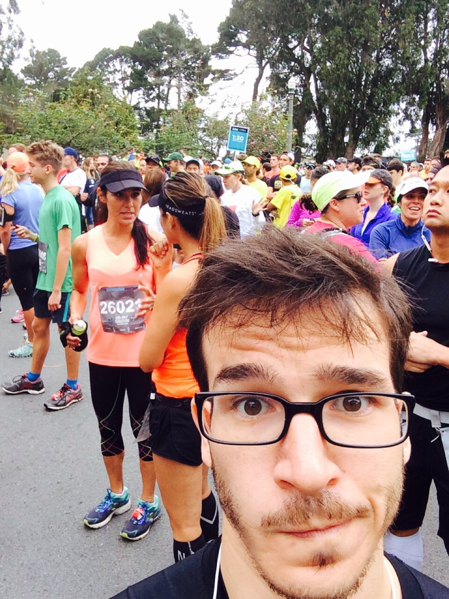
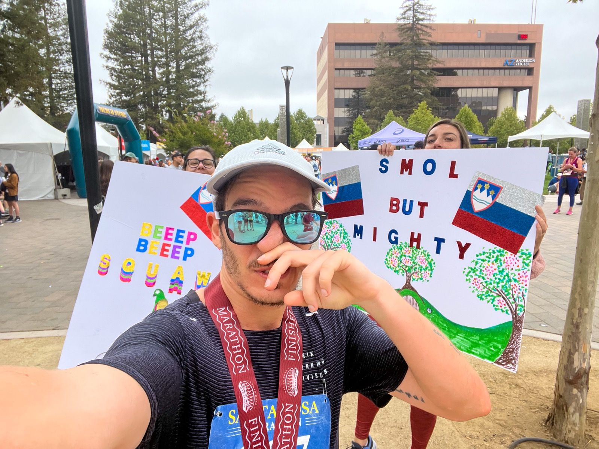
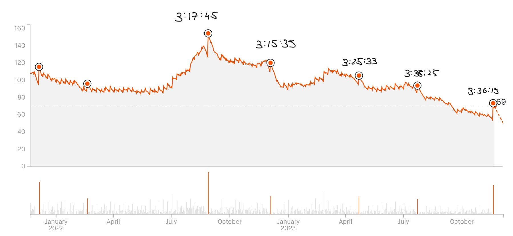
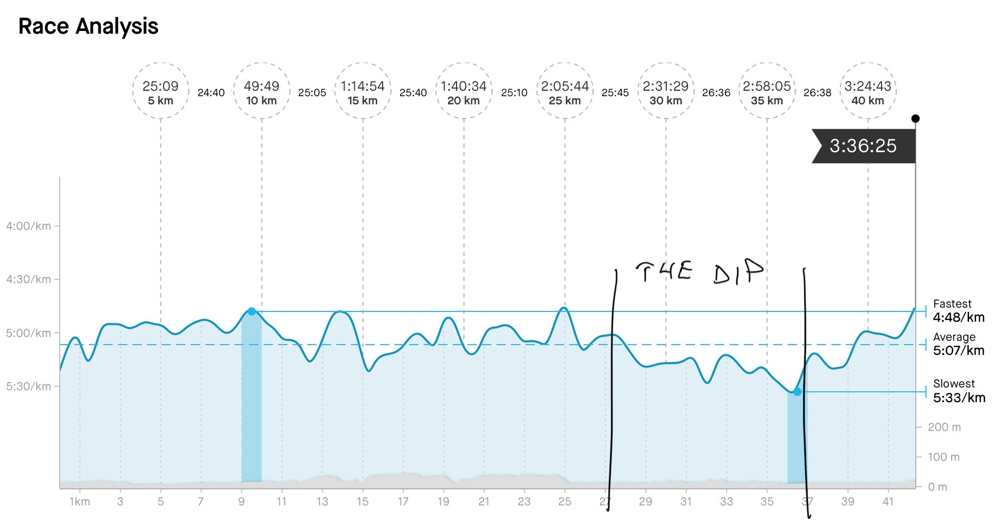

On Sunday I ran the Philadelphia marathon. That's not the interesting part. This is: I got a decent result with the least training I've ever done 🤨

3:36:19 – that's not my personal best and that's okay. How I _finished_ the marathon is the exciting part. Alas the hard work I put in training this year ruined me legs and destroyed the chance of a personal best.

Confused about the messaging here? Yeah me too. Sports are not like code, you don't get a compiler error that says _"You're missing a comma right here you dumbass"_.

## A little back story

I started running back in 2012 because ... hell who even knows anymore. Probably because living with room-mates sucks and you need an excuse to get out of the house.

In 2014 I started running consistently and realized hey this relaxes your brain good. Pairs great with coding.

My [first half marathon](https://www.strava.com/activities/354621607/overview) came in 2015 – 1:50:35.

For comparison: This Sunday I ran a full marathon at a faster average pace than that half marathon. Plus I'm 8 years older and way better looking. 😛

The year after that I got into marathons and eventually decided to qualify for Boston. That means running a marathon in the 3 hour range. A ridiculous amount of speed.

## How hard work ruined my legs

Boston always felt like a joke goal. No way Swiz can run that fast, but it's something to aim for. Then in 2021/22 I thought _"You know ... but maybe?"_ and gave it my all.

Holy shit look at that – [3:17:45 in the Santa Rosa marathon](https://www.strava.com/activities/7716038628/overview) and it felt like sprinting the whole time. Sure there was blood squirting out my shoes but wow that's 9min faster than my previous best!

A few months later I ran a 3:15:39 in Sacramento. All right this is getting fast looks like I've cracked the formula. Sign up for a bunch of marathons in 2023 and crank up the training.

But there was a dragon hiding in the data. Look at my fitness graph from Strava. An estimate of your "shape" based on some mysterious formula and your training data.

The more I train, the less shape I'm in. And my race times got way worse too. That's strange, running a lot before a marathon used to work 🤨

## How doing less made me faster

I've run 4062km this year. An average of 88km per week. 12km per day.

No wonder my legs are shot 😅

When my partner hired a running coach for my birthday, the first thing he said was _"Oooookay we need to cut your training in half. Good job building a great base, but I thought you wanted to go faster?"_

Matt had a point. I was training tired all the time (mentally and physically), which meant I couldn't push hard and run fast. When you don't run fast, you teach your legs to go slow.

In a marathon, you hit a point about 3/4ths into the race where you mentally begin to struggle. You've just run a lot and it starts to get hard, but the end is nowhere near. You think there's no way I can keep this up and your legs retreat into their familiar pace.

You want _that_ to be your target pace. Mine ... wasn't. Because I spent all year training my legs to be slow 💩

See what happened in the last 5km? That's all Matt. My strongest marathon finish _ever_. First time in my life that I was passing people left and right and speeding up like I didn't just run a whole marathon.

That last 5k was 25:43. Comparable to when 5k is all I'm doing 🤘

The trick? Sprinting. Lots of sprinting. Honest hardcore balls to the wall intervals on the track. You can't go fast unless you force yourself to go fast.

## The point?

[A little bit of slope beats a lot of y-intercept](https://swizec.com/blog/reader-question-how-to-grow-10-years-into-your-career/). But you can't grind mindlessly on steady state work. You have to rest then push hard. Rest then push hard.

Growth comes in cycles. Recover, push, recover.

Cheers, 
\~Swizec

PS: Brad Stulberg and Steve Magness talk about this lesson at length in [Peak Performance](https://swizec.com/blog/the-passion-paradox/), my favorite book on burnout
