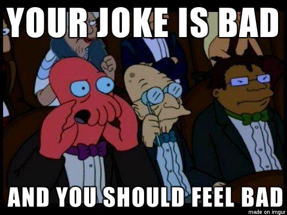

You know how sometimes a friend says, _&quot;Hey, that thing you did is really cool. I enjoyed it,”_ and you&#x27;re like, _&quot;Yeah, it&#x27;s okay, I guess,”_ as you shuffle your feet and think about all the things you could&#x27;ve done to make it better?

Then a stranger on the internet gives you an upvote or writes a nice comment, and you&#x27;re like, _&quot;FUCK YES I AM THE GOD OF CREATIVITY! FIST PUMP&quot;_.

Why does that happen?

For starters, strangers aren&#x27;t your friends. They don&#x27;t give a shit about you. Impressing a stranger feels like a bigger achievement because the rules of etiquette on the internet lean more towards trolling than they do towards being a decent human being.

Friends like you, and they try to be nice. Even good friends, the kind who gives you quote unquote constructive feedback, they&#x27;re still nice about it. A friend will never say, _&quot;This is shit. You&#x27;re shit. Everything about you is shit.”_

No, a friend will say something like _&quot;That&#x27;s interesting&quot;_ or _&quot;I don&#x27;t hate it&quot;_, or they&#x27;ll give you a shit sandwich like _&quot;I really like what you did with the thing, but maybe you could try this and this and that and this, but I do like that one tiny part&quot;_.

When a friend says something is cool, it&#x27;s easy to think of all the ways that it&#x27;s not. You might even start explaining to them all the ways in which the thing you did is not, in fact, cool but is flawed beyond repair.

That&#x27;s called being bad at taking compliments. You&#x27;re taking away your friend&#x27;s reward for being nice. The correct response is _&quot;Thank you.”_

People on the internet follow no such rules. They will shout the first thing that pops to mind. Your ideas are bad and you should feel bad. Boooo.

So when a stranger takes the time to say something nice about a thing you did, it feels special. It feels like a bigger achievement than impressing your friends and family. Your friends and family are always impressed, but a _stranger_ **on the internet**? Holy shit, you just might be the shit.

But why?

Simon Sinek has a good answer. I&#x27;ve watched this talk-rant thing five times already, and it keeps getting better. The degree to which he perfectly describes me, and maybe you, is uncanny.

Sinek&#x27;s theory is that us millennials are addicted to the internet en masse. Just like our parents had ubiquitous cigarettes and their parents had ubiquitous alcohol. We have ubiquitous social media.

You know how in Mad Men people used to drink at the office, at business meetings, and at their desk? Or how office photos from the 70s and 80s show everyone smoking at their desks and in meetings?

Disgusting, right?

20 years from now, people will say the same of photos from the aughts and 2010&#x27;s. What? People used to bring their phone into meetings and put it on their desk? People checked notifications at work? Savages.

According to Sinek, the problem is that we grew up with this stuff. During adolescence, a trying time in any human&#x27;s life, when we were supposed to have learned to rely on our friends, we instead learned to rely on the internet.

Life got you down? Bitch about it on Facebook. Someone will commiserate.

Need help with a decision? Ask your 5,000 followers on Instagram. One of them will know.

In my time, it was &quot;Ask 50,000 people on your favorite internet forum&quot; or &quot;Reach out to people on the other side of the world with MSN Messenger&quot;. Same thing.

It&#x27;s safer to ask online. Don&#x27;t like the answer? Room turning against you? Esc. Close chat window, and they&#x27;re gone.

You can&#x27;t do that in person. In person, you have to actually deal with shit. What a nuisance.

And so you learn during your formative years to turn to the internet for everything. Emotional support, problem solving, entertainment, everything. You can find it all online.

Once it&#x27;s hardwired in your brain, it&#x27;s hard to turn back. You&#x27;re in the same predicament as an alcoholic who&#x27;s learned to turn to the bottle for everything.

Except with the internet, you can make a good argument that it _does_ help. It _does_ provide all those services. A bottle just makes you numb and ruins your body. The internet really is a treasure trove of knowledge and access to interesting people.

Is there a solution? I don&#x27;t know. Is there even a problem? Hard to say. But you should watch that talk by Simon Sinek. It&#x27;s amazing.