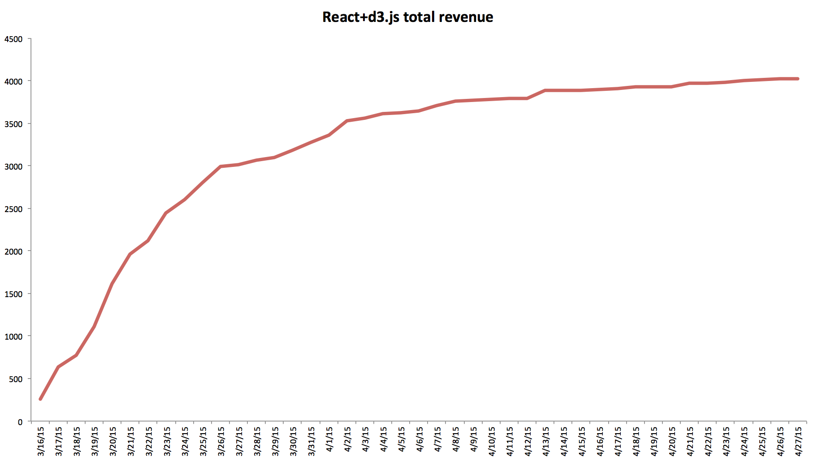
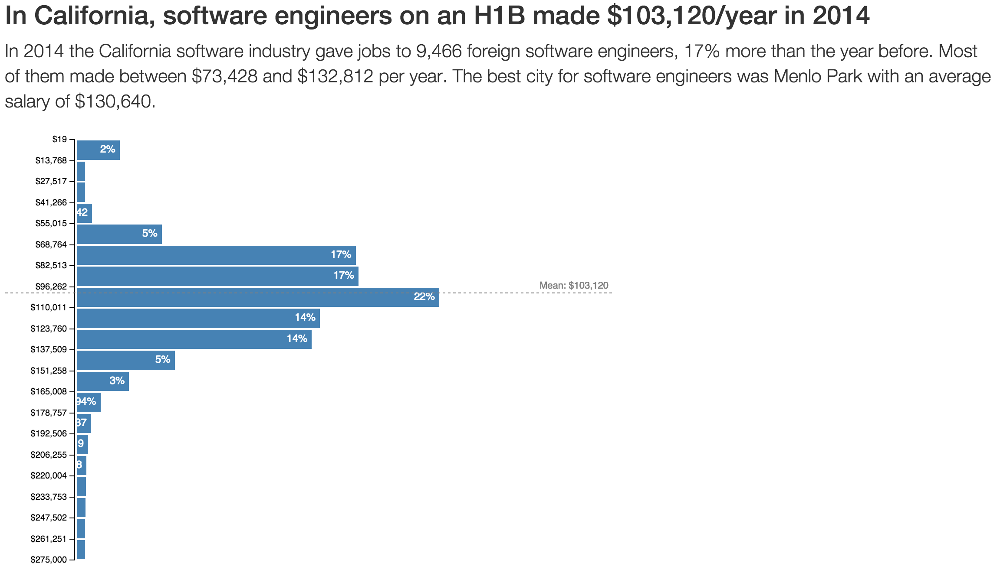
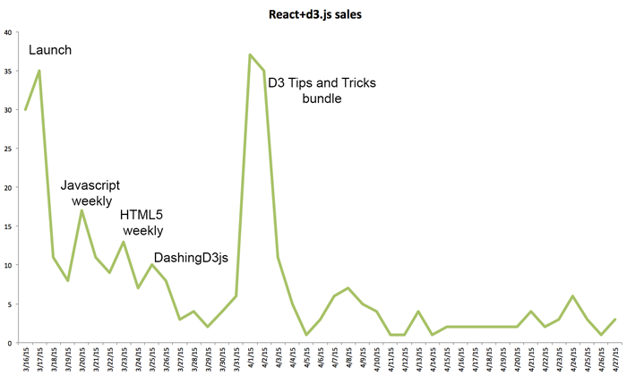

**\_\_\_\_**

## Some things that worked before launch

\_\_

## Some things that worked after launch

## Some things that failed

My biggest fail was asking those early supporters whose email addresses I had to upvote my Show HN post. This worked great with some 18 upvotes in the first twenty minutes. But it worked too well. The post got flagged into oblivion and sank further with every upvote. One subscriber even complained that it's really not kosher of me to ask for upvotes. And he's right. And the post must have gotten as many flags as it did upvotes. That was a fail on my part. Should have trusted the book to make it on its own merits. Considering how much traffic Hacker News produces, this mistake cost me \\\\\\\$10,000++. Oops. Another silly mistake was giving early readers a bigger discount than I intended to. I promised 25% and gave 50% because I had assumed Leanpub's pay-what-you-want sliders work with coupons as well. They don't. Oops. But happier readers so that's okay. A really really huge fail on my part was providing a crappy video with the Premium package. It was supposed to be a sexy hour-long screencast showing how everything fits together. But I ran out of time and launched before it was done. I promised to get it done in a week or so. Then I got sick for a week. Then I found out I suck at video editing. Then [Packt](http://www.packtpub.com "Packt") blindsided me with a tight deadline on a d3.js video course that's about to launch. A month later and still no good video. But production is starting again and this time around I have an awesome freelancer to do the editing for me. But I launched and I learned my lesson. Delegate the things you suck at! Somewhat of a fail but not too bad was launching a better landing page the day after launch launch. It's not too bad, but I think it converts better and it would just be more consistent. Especially with the whole attempt at HN publicity and such. But at least all those mailing lists got the better landing page so that's good. Another fail was that I didn't write those guestposts I had arranged. Four people promised to publish my guest post about React and d3.js on their website. This would be awesome for publicity and driving traffic to the book. But things happened and I haven't gotten around to writing them. I'll write them now and hope everyone's still willing to publish. Next time, I will have those opportunities arranged before launch _and_ write the posts before launch as well. That way a bigger press push can happen on launch. And I think I didn't tweak the tiered pricing well enough. The incentive to pick a higher tier package isn't big enough. Something to think about.

## Things left to try

All in all this has been a great experiment. My initial line in the sand for success was \\\\\\\$1,000 in revenue. The book made 4x more. \\o/ The second line in the sand, reaching 10k before end of April didn't happen. Mostly because I was too busy with the Packt deadline on that video course project. A few things I'm going to try so I can get the 10k milestone in May:

- set up a drip campaign for the book
- a system to check-in with readers a week or two after buying to get feedback and ensure they liked it (happy readers tell their friends)
- play with advertising

But the biggest experiment to try is seeing if I can turn this into a system. Learn a tech, write about tech, launch book, once a month or every two months. Produce enough income to live off of. That's the ultimate experiment right there.
