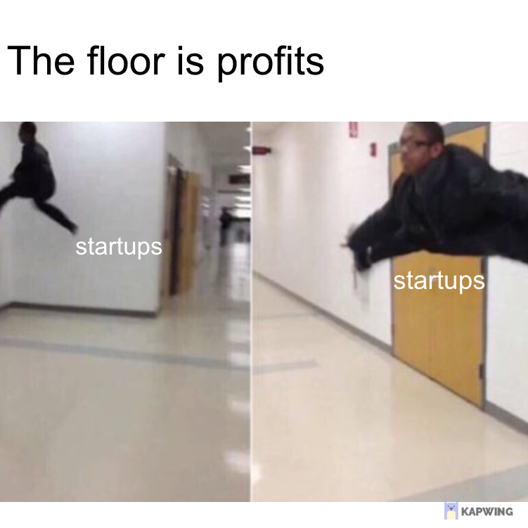
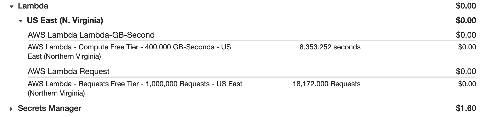

import { ContentUpgrades } from "@swizec/gatsby-theme-course-platform"

Friend, ever seen this meme about the bloat of VC-backed startups?

It's a running joke in the industry. Startup gets funded, startup shovels money into the AWS furnace, Bezos gets rich.

Graybeard sysadmins chuckle.

_"Lulz only five bazillion users?? I could run that from my PC in the basement. These people ... &lt;eyeroll>"_

But it's not always like that. Today, I wanted to talk about _my_ AWS bill. A whopping $12 per month. 😛

https://twitter.com/Swizec/status/1367503207803609090

## Serverless cost optimization

> Value your time

That's what an AWS billing expert had to say about optimizing for cost. If your bill is less than $10k/mo, it's not worth optimizing.

🤯

He's right. How much is your time worth? What about your focus?

Would you rather build your project, launch-and-forget, then get back to work ... ooooor spend 20 minutes every other week because your server's down again? I'm sure _you_ like to fret every moment of every day about the alarm that says _"Shit's on fire, user can't do the thing"_

<ContentUpgrades.ServerlessHandbook />

That's advanced for a side-project. Usually it's a user that complains on twitter. You had no idea your app's been down for 3 days 😅

## Problems 👉 solved

I like the launch-and-forget approach.

`yarn deploy`, wait 3 minutes, ✅

Here's what my $12 AWS bill solves:

- enabling purchases
- layouting emails
- reader feedback

Set them up, never thought about it again. It just works.

### Gumroad hook

You can do a lot with Zapier integrations, a no-code glue platform, but you can't connect your payments provider to your custom platform.

For that you need [the most impactful JavaScript function I ever wrote](https://swizec.com/blog/a-javascript-function-that-makes-dollar40000+year). It creates a new user for every purchase.

Here's what it does:

1.  User makes a purchase
2.  Gumroad sends POST request to a URL
3.  AWS Gateway routes the request
4.  AWS Lambda wakes up a new server
5.  Server runs 20 lines of JavaScript
6.  Calls API on Auth0
7.  Creates user, if needed
8.  Gives permission to access purchased course

Took 2 hours to build, never had an outage. Processed ~$50k in revenue, touched only to add new products ✌️

### Newsletter layouting

As impactful as that was, it's not my favorite. My favorite is [the newsletter layouting tool](https://techletter.app) that builds these emails.

I love markdown. Email software hates markdown. Email clients hate embeds.

What do you do? Hire an editor for $500/mo. $6000/year right there. For years.

I loved my editor and he hated this part of his gig.

Get a text file from Swiz, take a bunch of images, upload to Imgur, put into ConvertKit and into Wordpress. Hit 3 buttons. 🤮

So I replaced him with a $1/year piece of JavaScript and he got a more rewarding job at a big company.

A tool that eats Markdown, converts embeds into screenshots, uploads to S3, searches Giphy for gifs, creates HTML.

All powered by a [screenshot lambda](https://github.com/Swizec/lambda-screenshot-as-a-service) that admittedly took lots of tinkering and updates. It even creates thumbnails for my blog 😁

But you can throw _anything_ at it!

Up to 1000 embeds in parallel, all good. Embed breaks the code? No worries, running on a separate server from all others. Chrome hangs? Pfft, start a new one!

Resilience managed by AWS Lambda. I never need to think about it 😇

### Reader feedback

You'll see these under every email, article, and course chapter I create. There's a few variations and they all lead to the same place 👉 a serverless GraphQL API.

The API wakes up a smol server, saves your feedback to a DynamoDB table, and says thanks.

Best thing I ever did for my business. So many thoughtful comments 😍

One of these days I'll rebuild the frontend to look nicer, but the serverless backend is rock solid. Bit of Apollo, dash of custom code, and voila.

## _You_ can do this

Friend, my point is that running server code on the web has become ridiculously cheap _and_ easy.

My $12 bill runs all of the above, the biggest cost is serving images from S3 – $5 for hosting, $3 for bandwidth. The smarts running on AWS Lambda are _way_ below the free tier.

18,000 requests per month is pretty cool 🚀

To be fair, I offload frontend web traffic to Netlify and Vercel. A whopping $25/mo ...

What do you think, got a problem you could solve with a small JavaScript function running in the cloud? Hit reply

Cheers, 
~Swizec

PS: yes you could run all this from your basement for free, but it's no worth your time 😉
