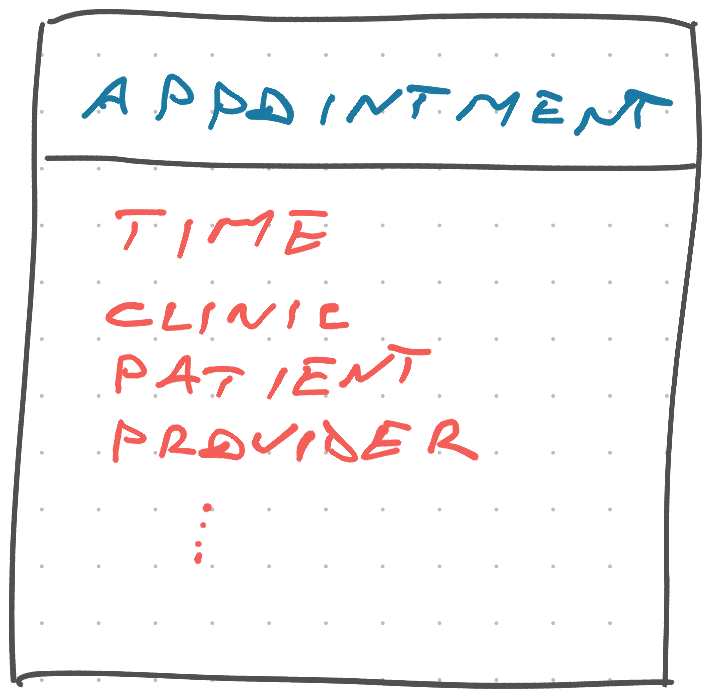
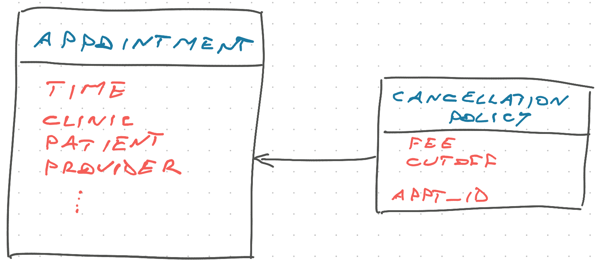
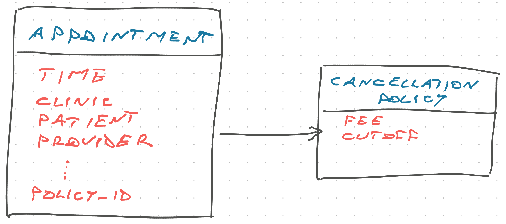

When your code feels hard, 9 times out of 10, the problem is with your data model.

I'll never forget the interview question that wrecked my brain and felt almost unsolvable with my approach (set matching), then a friend showed me it's a graph problem and the solution was obvious – a basic for loop 🤯

And when this happens in production code, it's much harder to spot. We re-learned this lesson a few weeks ago.

## Data modeling, it matters

Our system has an Appointment model. It connects a time and place with a patient, healthcare provider, and a bunch of meta data.

The full model has almost 20 columns/properties. Conceptually overloaded, needs cleaning up, but a convenient place to add onto. Much of our system relies on this.

Appointments have cancellation policies – if you cancel less than 48 hours before the appointment, there's a fee you have to pay. This keeps the system fair.

Until a few weeks ago, the policy was a hardcoded constant in our code. No need to get fancy because it's always the same.

But a new concept arose: We want to be less strict with certain appointments and allow cancelling up to 24 hours before. Time to move cancellation policies into the database!

How would you model that? 🤔

## We tried the obvious first

The obvious answer was our first try – every appointment has a cancellation policy.

This works. You get a new cancellation policy table that points to your appointments and defines their policy. You can read the data with a SQL JOIN or using an ORM.

Your table will have a bunch of rows that all look the same, but that's okay. Disk space is cheap.

But how do you _guarantee_ that every appointment has a cancellation policy? It needs one or your code won't work.

We googled and found hack after hack. You can write a `CHECK` constraint with a custom PgSQL function. Or a database trigger that checks and throws an error. Or write a bunch of application code to check by hand and lose the guarantee, if someone adds data manually.

https://twitter.com/Swizec/status/1574532565473501186

## This is too hard, something's wrong

The lack of easy solutions and sparse search results could mean only one thing: We were on the wrong track. Something's wrong.

We looked at our data model again. Every appointment has a cancellation policy, obvious ...

... and then it clicked! Every appointment _belongs to_ a cancellation policy 💡

With that tiny arrow change we got:

- unique rows in our table, _many_ rows turned into 2
- easy consistency guarantees
- ability to operationalize policies with a UI dropdown

Semantically turning the table into "type of cancellation policy" means you need fewer rows, can use it to populate UI dropdowns, and need to change just 1 row in your database to update policies.

Best part: Guaranteeing every appointment has a policy is as easy as `policy_id NOT NULL REFERENCES cancellation_policy`. Your database handles the rest 🤘

## Fundamentals matter

One tiny little change made everything easier. That's why I say forget the framework wars, focus on the fundamentals.

https://twitter.com/Swizec/status/1573010740180664321

And the best way to learn is to build lots of things. Books help but experience wins.

Cheers, 
~Swizec

PS: this falls under the umbrella of tacit knowledge. Even if you read all the theory about [relational data models](https://swizec.com/blog/notes-on-a-relational-model-of-data-for-large-shared-data-banks/) it won't click until you get your hands dirty.
