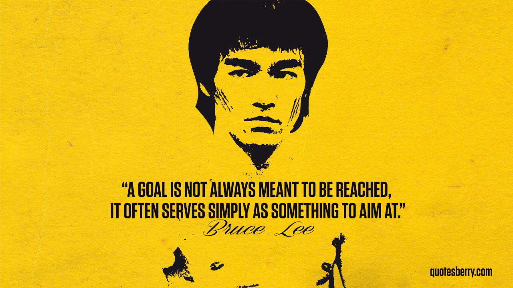
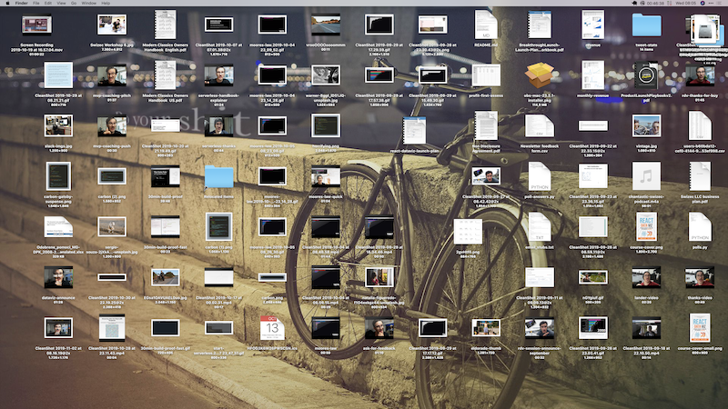
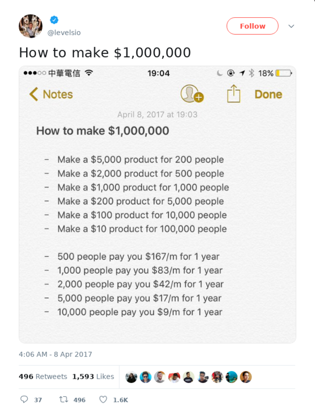

Yesterday I asked what you could do with an extra $1,000/month and got a bunch of cool replies. Everything from _"Give it to my wife, obviously"_ to \_"You know that $75k average looks pretty damn good in my country ..."\_

You're right, it does. Where I'm from – Slovenia – $75k means you make as much as the president.

Where I'm at now – San Francisco – the number is closer to $320k. Global averages are funny like that. ¯*(ツ)*/¯

Today I wanted to talk about this 👇

> So... what do I need to do to make an extra $1,000/month?

Thanks Brad, great question! ❤️

## Solve a problem, my friend

Your best bet is to solve a problem. Doesn't have to be big. It's _better_, if the problem is small.

Like John Gall once said about systems

> A complex system that works is invariably found to have evolved from a simple system that worked.

Same is true for business. Every good business starts by solving _one very specific_ problem.

Blue Bottle offered a good coffee roast. Google found your website. Netflix _sent_ DVDs. Amazon had every book in stock. Lyft showed how long you'll wait. Tesla had an electric car that's exciting. IBM processed _a_ census in weeks instead of years.

Huge now. Started small.

You don't have to aim that high, my friend. Aiming that high is scary snd difficult no matter what Bruce Lee says.

## Aim small

Solve a small problem, my friend. Don’t worry about how big it gets. You can’t make $10,000 without first making $1,000.

Think about a time you spent $5 on an app. What was it?

I once paid $19 for an app that hides desktop icons. Because my desktop is where temporary files go to die.

The app makes me look good in public.

Or there’s an app with a $5 subscription that tracks business restaurant spending. I could just put receipts in a box.

But when I'm doing taxes, a folder of photos will be soooo much easier.

I even have an app to track my food. $9/month even tho I could use a spreadsheet. Just because the app comes with a food database and a nice form.

Hell, I once bought $10 of cable organizers just because I was tired of digging my phone charger from under the couch every day.

Tiny little annoyances. You might not even think they’re worth solving.

But they go away and it's like a fog lifts off your day. You can breathe, my friend.

How often do _you_ get annoyed by a tiny little thing? Think others do too?

## Tiny annoyances make the best \\\\\\$1,000/month businesses

Here’s why

1.  They’re annoying
2.  Too small for the big companies to go after
3.  Everyone feels them
4.  The internet is a big place

Number 2 is important. _Nobody else will solve your problem_. **You** have to do it.

Then charge a small fee.

Because as Pieter Levels once said, there's only so many ways to make a million dollars.

$1,000 is even easier.

What's something that annoys you, my friend, that you'd pay $5 to solve. Do you think there's 200 others in the whole wide world who'd do the same?

I think there are.

Cheers,

~Swizec

PS: Indie Hackers has a cool list of crazy ideas making $1,000/month, [check it out](https://www.indiehackers.com/products?maxRevenue=1000&minRevenue=1000)
