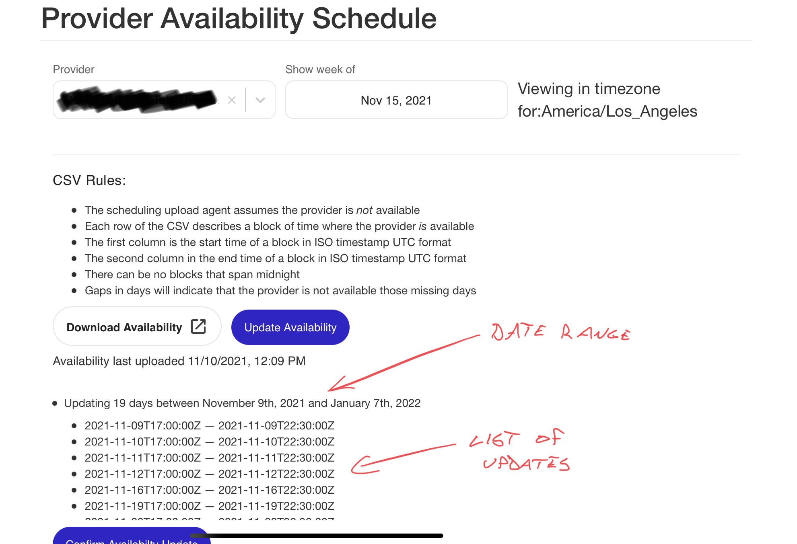

Defensive coding is an important [lesson from Pragmatic Programmer](https://swizec.com/blog/my-favorite-lessons-from-pragmatic-programmer/), although not my favorite. It says that you should validate your inputs. Don't trust anyone!

This is a good principle.

Your _software_ should validate inputs. A client may have bugs, an API could spazz out, a database or hard drive can get corrupt, a user might do something silly. Hell, sometimes clients and users are downright malicious trying to break your code.

But on a team with lots of moving pieces and [little big-picture understanding](https://swizec.com/blog/complex-vs.-complicated/), defensively coding all the things leads to bload. Does every function in a chain _really_ need to validate its inputs?


## How defensive coding goes wrong

We once built an API that ran _29,000 database queries for every request_. Thanks to defensive coding and what looked like clear sensible separation of concerns.

https://twitter.com/Swizec/status/1459269595403939840

That example can't fit in a post you'll read. Too much background info and context required.

Here's an example from a different part of that project 👉 we built a UI that sorts the same array 5 times 🤨



Designed by engineer 💪

The UI lets you update and manage a person's schedule. You bulk upload a new list of availabilities via CSV, verify the update, and see the result in a calendar component off-screen after saving.

Because we work as a team, each portion was built by someone else. Because we have good engineers, they all thought _"Oh wait, I gotta validate my inputs!"_

You end up with a date range function that looks like this:

```javascript
function getDateRange(dates) {
  const sorted = dates.sort();
  return `Updating between ${sorted[0]} and ${sorted[sorted.length - 1]}`;
}
```

A component that lists updates like this:

```javascript
function DateList({ dates }) {
  const sorted = dates.sort();

  return (
    <ol>
      {sorted.map((date) => (
        <li>{date}</li>
      ))}
    </ol>
  );
}
```

A calendar that lists events like this:

```javascript
import groupBy from "lodash.groupby";

function Calendar({ events }) {
  const sorted = events.sort();
  // groups preserve sort order internally
  const byDay = groupBy(sorted, (event) => event.day);

  return; // render UI
}
```

And a few others here and there.

### What's going on?

Every engineer is following the _Validate Your Inputs_ principle. When they need a sorted array and aren't sure if it's sorted – sort all the things!

This makes sense when you think of each piece of code as a unit. Which they do because that's what they're currently working on and thinking about.

Everything outside your function becomes The Untrusted Outside and you code accordingly.

Repeat across time and engineers and you create a bloated codebase that spends half its time validating and re-validating the same data. 💩

This tendency can lead to [swallowed promises](https://swizec.com/blog/finding-unresolved-promises-in-javascript/) when functions handle their own errors instead of propagating them back up the stack.

## Solution: Validate the edges, trust the insides

The solution is to more carefully design your units and _agree on where the edges are_.

Where does new data enter your system? Validate there.

- API request
- user input
- database or file read
- URL params

Validate inputs at those entry points and the rest of your code can assume they're valid. A type system can help you communicate that to other engineers.

Cheers,<br/>
~Swizec

PS: better unit definitions help with testing too! You can [avoid the cult of TDD](https://swizec.com/blog/25-lessons-from-25-years-of-coding/) by testing the interfaces, not the implementation ✌️
