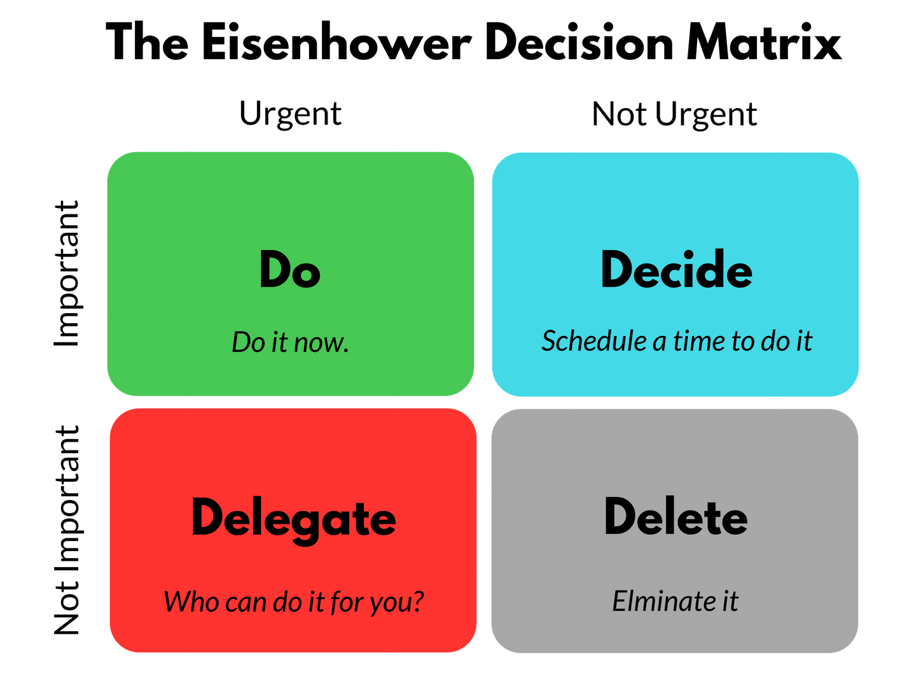

How do you choose what to work on first? As an [empowered engineer](https://swizec.com/blog/get-us-over-the-water-not-build-us-a-bridge/) that's a key skill.

This comes up a lot in 1on1's with juniors.

They're bombarded with random asks and struggle to focus. Your job as a lead is to say _"Hey, I get it, focus on the current sprint, throw new stuff on the backlog. If someone gives you trouble, send them to me. If it feels like a fire, ping me and we'll figure it out."_

_PS: you can [read and share this online](https://swizec.com/blog/how-do-you-prioritize/)_

But how do _you_ decide? Maybe a product manager decides for you. That's nice when you're on a team, but as you grow towards senior+ you lose that protection. You're expected to work on (and coordinate) long-term initiatives on your own.

Now what?

I like the [Eisenhower matrix](https://en.wikipedia.org/wiki/Time_management#The_Eisenhower_Method).

**Do** the urgent and important immediately. This is like a production fire. You gotta drop everything.

**Delegate** the urgent and not important. This can be to yourself later when you have "take care of things" time. I do this a lot.

**Make space** for the important but not urgent. All your long-term projects fall in this area. These are the easiest to let slip.

**Drop** all the balls that don't need juggling. As the fantastic [Four Thousand Weeks](https://www.oliverburkeman.com/books) argues: You have to do less.

This sounds easy and obvious. The part nobody tells you is that it's _hard_.

https://twitter.com/Swizec/status/1884627985459978434

Each of those Urgent asks has a person with a frowny face attached and they know your slack handle. You have to say No right in their face. This sucks.

The best solution I've found is to turn No into _Not Yet_. This lands better. Especially when paired with an approximate When.

Another good strategy is to ask [z not y](https://en.wikipedia.org/wiki/XY_problem) questions and dig deeper into what's going on. With luck, there's an Important problem hiding in there and you can solve a bunch of Urgent asks by doing 1 Important thing.

Cheers,
\~Swizec
