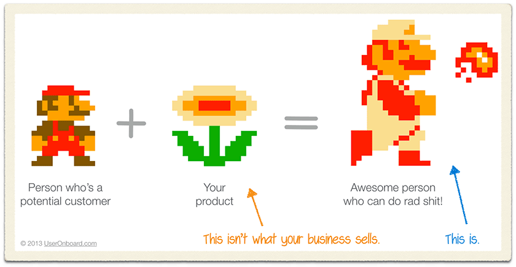
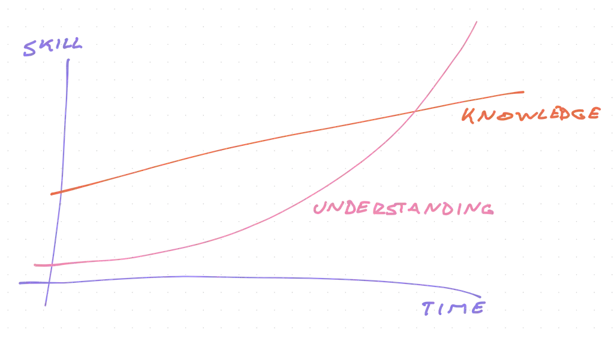

Course creators are always telling you to learn this or that but how does any of it help _your_ goals? That's the missing piece 🤔

Courses come out of 2 places: passion and opportunity.

Person stumbles into a technology, gets excited by the possibilities, tells everyone. _"Wow this thing is amazing look what I can do!"_

They found a flower and it gave them superpowers. But the flower was hard to eat.

You need to cook it right. Cut off the stem, avoid the poisonous seed, boil the leaves, and flambé the petals. Then you gotta freeze for 2 hours before warming up in the microwave.

That's opportunity. Help folks avoid the poisonous seed and the months of research.

A new course is born. 👼

## When to buy a course

You buy the course when you want the super power.

Lots of engineers cherish the discovery process. Pick a technology and _figure it out_. It's fun and rewarding. Bang your head against the wall until it breaks.

You end up with lots of knowledge.

Little details you've figured out, patterns you've uncovered, and massive gaping holes you don't even know you're missing. The typical self-taught challenge.

We see this a lot at my dayjob when interviewing experienced engineers.

_"You know SQL right, use it all the time?"_

_"Oh yeah lots, our entire database is SQL and I fetch data like at least once a week"_

_"Okay how would you design a schema for a user table?"_

Oops, candidate "knows SQL" in that they know where to find mystic incantations in their codebase and cobble them together into something new.

Knowledge, no understanding.

## How to leverage a course

A good course helps you in 3 ways:

1.  Skip the long research process
2.  A guide through unknown terrain
3.  Understand, don't just know

You get the super power faster _and_ you avoid the bad parts. When you're done, you understand the material.

Understanding compounds over time, knowledge doesn't.

Once you understand cooking, you can look in the fridge and whip up a meal. Bit of this, bit of that, everyone's happy.

Or you can follow recipes and get stuck when there's a bug or your ingredients don't match ...

Same with code: When you understand the rules, you can use the recipe as a guideline. No need to memorize. But if there's a bug, something doesn't quite fit, you got dis. 💪

## Can courses make you money and supercharge your career?

No. Not on their own. You have to _use_ them.

Technology is ever evolving and you have to stay sharp. Yes there's still demand for COBOL programmers, but you don't wanna be stuck in a stack.

Use your understanding to jump ship. The more you understand, the easier new tech feels. _"Oh Thingabob in NextJS is just Bobathing in Gatsby, d'oh"_

You can learn new things fast.

That's what employers and clients pay you for my friend. Solving _new_ problems.

You don't wanna be a factory worker churning widgets until the day you die, you want to design the factory.

https://twitter.com/Swizec/status/1283475726432264192

You're solving new problems, building assets, saving and creating money. When _you_ build something, it's used for months and years.

That's your job as an engineer. You create the flower for others' superpower.

Cheers, 
~Swizec

PS: [the Standout Developer Bundle](https://learnetto.com/blackfriday) is on sale until Monday
