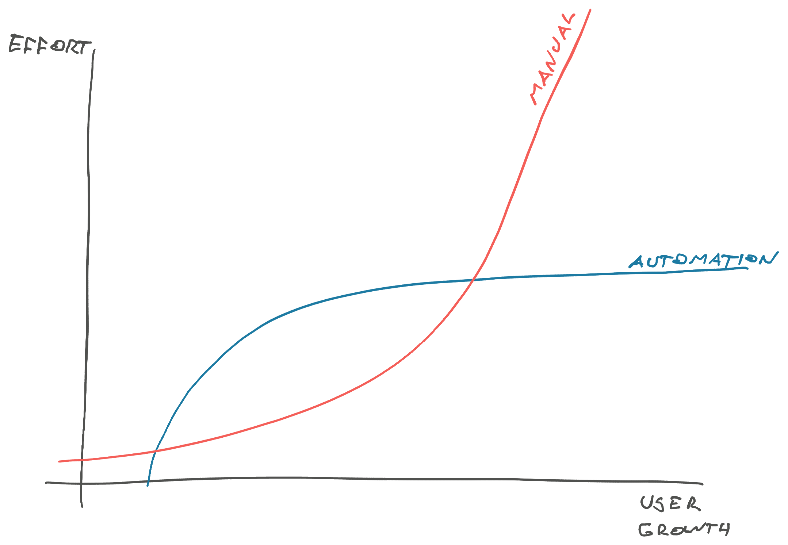

The key to 10x results is to remove 9x of the work. That's where software engineers shine.

You're building systems and tools to help companies grow without drowning in work. This fuels your equity, career capital, and reputation.

_PS: you can [read and share this online](https://swizec.com/blog/how-good-engineering-unlocks-fast-scaling/)_

## Manual expertise doesn't scale

Use your frustration as a guide.

Every process starts as an unstructured mess. You hardcode info, edit things directly in the database, fly by the seat of your pants, and use First Principles Thinking to figure out what to do each time.

This is great! It lets you iterate, try different approaches, and move fast. Fantastic when you're early in a product's lifetime. You focus on customer value instead of scalable repeatability 💪

But as you grow, the approach that used to be fast begins to slow you down. Nobody except you can do the thing. You can't take a vacation, the one-off task happens more and more, and you never have time to focus. You sit down to write important code and let small fires burn but people keep throwing tennis balls at you: _"Heyyy can you do that thing for us? The thing only you know how to do? You're so good at it, nobody else can figure it out"_

😩

Whether it's deploys, updating product info, fixing a bad database situation, or helping to fix a bug. Your ego loves the attention, but you've become a blocker. It's time to code yourself out of the job. [Let go of your legos](https://www.scalingfastbook.com/sample-chapter/delegate-decisions).

## How to automate anything

Here's the algorithm I like to use:

1. Do the work
2. Write it down
3. Make a script
4. Build the tool

### 1. Do the work

Try to do the work manually at first. This forces you to figure out every step and make sure you know what's involved. Doesn't have to be you personally, _someone_ does the work manually.

If N is too large to do by hand, try to do a couple examples. The clarity you get from doing the work is well worth the effort.

### 2. Write it down

While you're doing the work, write down the steps you're taking.

For rare tasks, this helps you remember what to do. Notes make the work go faster and feel less distracting.

Write the steps as a checklist and try to follow the list every time. Checklists have been shown to [reduce surgical process mistakes](https://www.ncbi.nlm.nih.gov/pmc/articles/PMC3963558/) by up to 40 percentage points. They're popular anywhere safety matters.

This document is called an SOP – standard operating procedure – or runbook. Once the steps are written down, anyone can run the process because the knowledge isn't stuck in your head. This is a good way to share your legos.

With an SOP, even surprisingly frequent tasks can be no big deal. You can mindlessly go through the steps when you need a break from braining too hard.

PS: aim to attach an SOP to every production alert or warning. More on observability in [my new book](https://scalingfastbook.com).

### 3. Make the script

Update the SOP every time you go through. Encourage others to contribute. If any step changes or lacks detail, make it better.

When the SOP stops changing, you're ready to **turn the document into code**. You now know what needs to happen and when. You've documented or dealt with every exception that comes up.

Feeling frustrated that you're doing the same thing so often is a great indicator that it's worth automating. For many tasks, you can build a script that engineers can run.

### 4. Build the tool

For tasks you want to offload away from engineering and empower other users to self-serve, build a tool. You can start with a script then wrap the script in a nice UI.

At Tia, for example, we went _years_ with engineers "manually" (via migrations) managing bookable appointment types in the database. One day I'd had enough and added a new form to our admin tool that let everyone add appointment types.

This saved engineering an estimated month of work every year and empowered the business operations team to iterate on their own without waiting for engineers. They loved it.

Over time, that page evolved into a full CMS and became part of our business processes. Now it gets occasional tweaks and updates as new needs arise. That's the ongoing maintenance part of the cycle.

At Plasmidsaurus we recently shipped a product CMS and it's been great. Product managers and operations folk can update any info whenever they need without a deploy. No engineering required 🚀

More on scaling fast tomorrow.

Cheers, 
\~Swizec

PS: my new book [Scaling Fast: Software Engineering Through the Hockeystick](https://scalingfastbook.com) is out now with a special launch discount
