You're building an app. It needs data from a server. What do you do?

Oh, you make a `fetch()` request. Easy.

[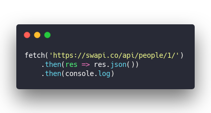](https://carbon.now.sh/?bg=rgba(255,255,255,1)&t=seti&l=javascript&ds=true&wc=true&wa=true&pv=48px&ph=32px&ln=false&code=fetch('https%3A%2F%2Fswapi.co%2Fapi%2Fpeople%2F1%2F')%0A%09.then(res%20%3D%3E%20res.json())%0A%09.then(console.log))

And you get eeeevery piece of info about Luke Skywalker.

[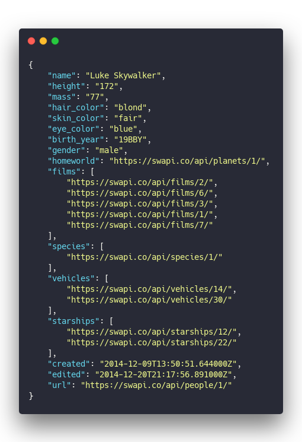](https://carbon.now.sh/?bg=rgba(255,255,255,1)&t=seti&l=json&ds=true&wc=true&wa=true&pv=48px&ph=32px&ln=false&code=%7B%0A%09%22name%22%3A%20%22Luke%20Skywalker%22%2C%0A%09%22height%22%3A%20%22172%22%2C%0A%09%22mass%22%3A%20%2277%22%2C%0A%09%22hair_color%22%3A%20%22blond%22%2C%0A%09%22skin_color%22%3A%20%22fair%22%2C%0A%09%22eye_color%22%3A%20%22blue%22%2C%0A%09%22birth_year%22%3A%20%2219BBY%22%2C%0A%09%22gender%22%3A%20%22male%22%2C%0A%09%22homeworld%22%3A%20%22https%3A%2F%2Fswapi.co%2Fapi%2Fplanets%2F1%2F%22%2C%0A%09%22films%22%3A%20%5B%0A%09%09%22https%3A%2F%2Fswapi.co%2Fapi%2Ffilms%2F2%2F%22%2C%0A%09%09%22https%3A%2F%2Fswapi.co%2Fapi%2Ffilms%2F6%2F%22%2C%0A%09%09%22https%3A%2F%2Fswapi.co%2Fapi%2Ffilms%2F3%2F%22%2C%0A%09%09%22https%3A%2F%2Fswapi.co%2Fapi%2Ffilms%2F1%2F%22%2C%0A%09%09%22https%3A%2F%2Fswapi.co%2Fapi%2Ffilms%2F7%2F%22%0A%09%5D%2C%0A%09%22species%22%3A%20%5B%0A%09%09%22https%3A%2F%2Fswapi.co%2Fapi%2Fspecies%2F1%2F%22%0A%09%5D%2C%0A%09%22vehicles%22%3A%20%5B%0A%09%09%22https%3A%2F%2Fswapi.co%2Fapi%2Fvehicles%2F14%2F%22%2C%0A%09%09%22https%3A%2F%2Fswapi.co%2Fapi%2Fvehicles%2F30%2F%22%0A%09%5D%2C%0A%09%22starships%22%3A%20%5B%0A%09%09%22https%3A%2F%2Fswapi.co%2Fapi%2Fstarships%2F12%2F%22%2C%0A%09%09%22https%3A%2F%2Fswapi.co%2Fapi%2Fstarships%2F22%2F%22%0A%09%5D%2C%0A%09%22created%22%3A%20%222014-12-09T13%3A50%3A51.644000Z%22%2C%0A%09%22edited%22%3A%20%222014-12-20T21%3A17%3A56.891000Z%22%2C%0A%09%22url%22%3A%20%22https%3A%2F%2Fswapi.co%2Fapi%2Fpeople%2F1%2F%22%0A%7D)

Well that's annoying ... all you wanted was his name and hair color. Why's the API sending you all this crap? 🤦‍♂️

And what's this about Luke's species being `1`? What the heck is `1`?

Okay, another fetch request.

[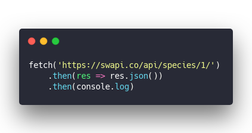](https://carbon.now.sh/?bg=rgba(255,255,255,1)&t=seti&l=javascript&ds=true&wc=true&wa=true&pv=48px&ph=32px&ln=false&code=fetch('https%3A%2F%2Fswapi.co%2Fapi%2Fspecies%2F1%2F')%0A%09.then(res%20%3D%3E%20res.json())%0A%09.then(console.log))

You get a bunch of data about humans. Great.

[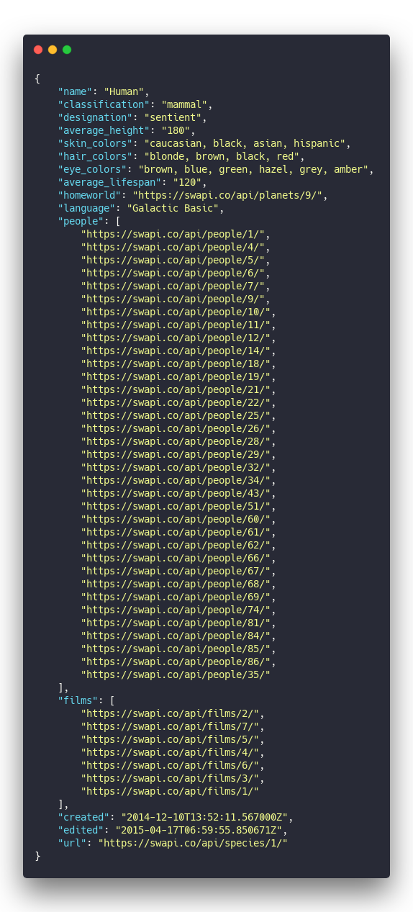](https://carbon.now.sh/?bg=rgba(255,255,255,1)&t=seti&l=json&ds=true&wc=true&wa=true&pv=48px&ph=32px&ln=false&code=%7B%0A%09%22name%22%3A%20%22Human%22%2C%0A%09%22classification%22%3A%20%22mammal%22%2C%0A%09%22designation%22%3A%20%22sentient%22%2C%0A%09%22average_height%22%3A%20%22180%22%2C%0A%09%22skin_colors%22%3A%20%22caucasian%2C%20black%2C%20asian%2C%20hispanic%22%2C%0A%09%22hair_colors%22%3A%20%22blonde%2C%20brown%2C%20black%2C%20red%22%2C%0A%09%22eye_colors%22%3A%20%22brown%2C%20blue%2C%20green%2C%20hazel%2C%20grey%2C%20amber%22%2C%0A%09%22average_lifespan%22%3A%20%22120%22%2C%0A%09%22homeworld%22%3A%20%22https%3A%2F%2Fswapi.co%2Fapi%2Fplanets%2F9%2F%22%2C%0A%09%22language%22%3A%20%22Galactic%20Basic%22%2C%0A%09%22people%22%3A%20%5B%0A%09%09%22https%3A%2F%2Fswapi.co%2Fapi%2Fpeople%2F1%2F%22%2C%0A%09%09%22https%3A%2F%2Fswapi.co%2Fapi%2Fpeople%2F4%2F%22%2C%0A%09%09%22https%3A%2F%2Fswapi.co%2Fapi%2Fpeople%2F5%2F%22%2C%0A%09%09%22https%3A%2F%2Fswapi.co%2Fapi%2Fpeople%2F6%2F%22%2C%0A%09%09%22https%3A%2F%2Fswapi.co%2Fapi%2Fpeople%2F7%2F%22%2C%0A%09%09%22https%3A%2F%2Fswapi.co%2Fapi%2Fpeople%2F9%2F%22%2C%0A%09%09%22https%3A%2F%2Fswapi.co%2Fapi%2Fpeople%2F10%2F%22%2C%0A%09%09%22https%3A%2F%2Fswapi.co%2Fapi%2Fpeople%2F11%2F%22%2C%0A%09%09%22https%3A%2F%2Fswapi.co%2Fapi%2Fpeople%2F12%2F%22%2C%0A%09%09%22https%3A%2F%2Fswapi.co%2Fapi%2Fpeople%2F14%2F%22%2C%0A%09%09%22https%3A%2F%2Fswapi.co%2Fapi%2Fpeople%2F18%2F%22%2C%0A%09%09%22https%3A%2F%2Fswapi.co%2Fapi%2Fpeople%2F19%2F%22%2C%0A%09%09%22https%3A%2F%2Fswapi.co%2Fapi%2Fpeople%2F21%2F%22%2C%0A%09%09%22https%3A%2F%2Fswapi.co%2Fapi%2Fpeople%2F22%2F%22%2C%0A%09%09%22https%3A%2F%2Fswapi.co%2Fapi%2Fpeople%2F25%2F%22%2C%0A%09%09%22https%3A%2F%2Fswapi.co%2Fapi%2Fpeople%2F26%2F%22%2C%0A%09%09%22https%3A%2F%2Fswapi.co%2Fapi%2Fpeople%2F28%2F%22%2C%0A%09%09%22https%3A%2F%2Fswapi.co%2Fapi%2Fpeople%2F29%2F%22%2C%0A%09%09%22https%3A%2F%2Fswapi.co%2Fapi%2Fpeople%2F32%2F%22%2C%0A%09%09%22https%3A%2F%2Fswapi.co%2Fapi%2Fpeople%2F34%2F%22%2C%0A%09%09%22https%3A%2F%2Fswapi.co%2Fapi%2Fpeople%2F43%2F%22%2C%0A%09%09%22https%3A%2F%2Fswapi.co%2Fapi%2Fpeople%2F51%2F%22%2C%0A%09%09%22https%3A%2F%2Fswapi.co%2Fapi%2Fpeople%2F60%2F%22%2C%0A%09%09%22https%3A%2F%2Fswapi.co%2Fapi%2Fpeople%2F61%2F%22%2C%0A%09%09%22https%3A%2F%2Fswapi.co%2Fapi%2Fpeople%2F62%2F%22%2C%0A%09%09%22https%3A%2F%2Fswapi.co%2Fapi%2Fpeople%2F66%2F%22%2C%0A%09%09%22https%3A%2F%2Fswapi.co%2Fapi%2Fpeople%2F67%2F%22%2C%0A%09%09%22https%3A%2F%2Fswapi.co%2Fapi%2Fpeople%2F68%2F%22%2C%0A%09%09%22https%3A%2F%2Fswapi.co%2Fapi%2Fpeople%2F69%2F%22%2C%0A%09%09%22https%3A%2F%2Fswapi.co%2Fapi%2Fpeople%2F74%2F%22%2C%0A%09%09%22https%3A%2F%2Fswapi.co%2Fapi%2Fpeople%2F81%2F%22%2C%0A%09%09%22https%3A%2F%2Fswapi.co%2Fapi%2Fpeople%2F84%2F%22%2C%0A%09%09%22https%3A%2F%2Fswapi.co%2Fapi%2Fpeople%2F85%2F%22%2C%0A%09%09%22https%3A%2F%2Fswapi.co%2Fapi%2Fpeople%2F86%2F%22%2C%0A%09%09%22https%3A%2F%2Fswapi.co%2Fapi%2Fpeople%2F35%2F%22%0A%09%5D%2C%0A%09%22films%22%3A%20%5B%0A%09%09%22https%3A%2F%2Fswapi.co%2Fapi%2Ffilms%2F2%2F%22%2C%0A%09%09%22https%3A%2F%2Fswapi.co%2Fapi%2Ffilms%2F7%2F%22%2C%0A%09%09%22https%3A%2F%2Fswapi.co%2Fapi%2Ffilms%2F5%2F%22%2C%0A%09%09%22https%3A%2F%2Fswapi.co%2Fapi%2Ffilms%2F4%2F%22%2C%0A%09%09%22https%3A%2F%2Fswapi.co%2Fapi%2Ffilms%2F6%2F%22%2C%0A%09%09%22https%3A%2F%2Fswapi.co%2Fapi%2Ffilms%2F3%2F%22%2C%0A%09%09%22https%3A%2F%2Fswapi.co%2Fapi%2Ffilms%2F1%2F%22%0A%09%5D%2C%0A%09%22created%22%3A%20%222014-12-10T13%3A52%3A11.567000Z%22%2C%0A%09%22edited%22%3A%20%222015-04-17T06%3A59%3A55.850671Z%22%2C%0A%09%22url%22%3A%20%22https%3A%2F%2Fswapi.co%2Fapi%2Fspecies%2F1%2F%22%0A%7D)

That's a lot of data just to get the word `"Human"` out of the [Star Wars API](https://swapi.co/), my friend.

What about all of Luke's starships? There's just 2 and yet that's 2 more API requests ...

[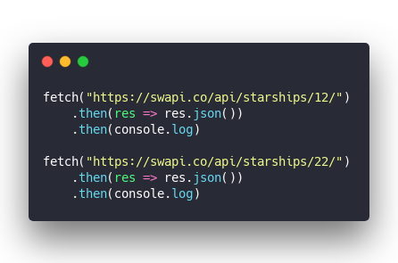](https://carbon.now.sh/?bg=rgba(255,255,255,1)&t=seti&l=javascript&ds=true&wc=true&wa=true&pv=48px&ph=32px&ln=false&code=fetch(%22https%3A%2F%2Fswapi.co%2Fapi%2Fstarships%2F12%2F%22)%0A%09.then(res%20%3D%3E%20res.json())%0A%09.then(console.log)%0A%09%0Afetch(%22https%3A%2F%2Fswapi.co%2Fapi%2Fstarships%2F22%2F%22)%0A%09.then(res%20%3D%3E%20res.json())%0A%09.then(console.log))

I don't even wanna know how much data those dump out ...

You've just made _**4** API requests and transferred a shitload of data_ to find out that Luke Skywalker is human, has blond hair, and flies an X-Wing and an Imperial Shuttle.

And guess what, you didn't cache anything. How often do you think this data changes? Once a year? Twice?

🤦‍♂️

## GraphQL to the rescue

Here's what that same process looks like with GraphQL.

[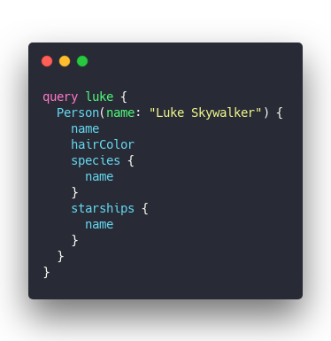](https://carbon.now.sh/?bg=rgba(255,255,255,1)&t=seti&l=graphql&ds=true&wc=true&wa=true&pv=48px&ph=32px&ln=false&code=query%20luke%20%7B%0A%20%20Person(name%3A%20%22Luke%20Skywalker%22)%20%7B%0A%20%20%20%20name%0A%20%20%20%20hairColor%0A%20%20%20%20species%20%7B%0A%20%20%20%20%20%20name%0A%20%20%20%20%7D%0A%20%20%20%20starships%20%7B%0A%20%20%20%20%20%20name%0A%20%20%20%20%7D%0A%20%20%7D%0A%7D)

And the API returns exactly what you wanted with a single request.

[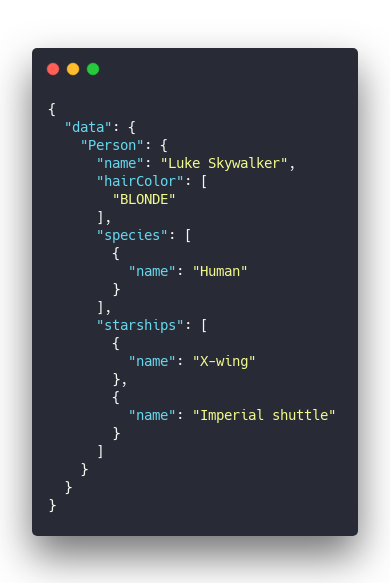](https://carbon.now.sh/?bg=rgba(255,255,255,1)&t=seti&l=json&ds=true&wc=true&wa=true&pv=48px&ph=32px&ln=false&code=%7B%0A%20%20%22data%22%3A%20%7B%0A%20%20%20%20%22Person%22%3A%20%7B%0A%20%20%20%20%20%20%22name%22%3A%20%22Luke%20Skywalker%22%2C%0A%20%20%20%20%20%20%22hairColor%22%3A%20%5B%0A%20%20%20%20%20%20%20%20%22BLONDE%22%0A%20%20%20%20%20%20%5D%2C%0A%20%20%20%20%20%20%22species%22%3A%20%5B%0A%20%20%20%20%20%20%20%20%7B%0A%20%20%20%20%20%20%20%20%20%20%22name%22%3A%20%22Human%22%0A%20%20%20%20%20%20%20%20%7D%0A%20%20%20%20%20%20%5D%2C%0A%20%20%20%20%20%20%22starships%22%3A%20%5B%0A%20%20%20%20%20%20%20%20%7B%0A%20%20%20%20%20%20%20%20%20%20%22name%22%3A%20%22X-wing%22%0A%20%20%20%20%20%20%20%20%7D%2C%0A%20%20%20%20%20%20%20%20%7B%0A%20%20%20%20%20%20%20%20%20%20%22name%22%3A%20%22Imperial%20shuttle%22%0A%20%20%20%20%20%20%20%20%7D%0A%20%20%20%20%20%20%5D%0A%20%20%20%20%7D%0A%20%20%7D%0A%7D)

Wait what 😲

An API mechanism that gives you total flexibility on the frontend, slashes API requests to almost nothing, _and doesn't transfer a bunch of data you don't need?_

That's amazing!

You write a query, specify what you want, send to an endpoint, and GraphQL figures out the rest. Want different params? Just say so. Want multiple models? Got it. Wanna go deep? You can.

All without making any changes on the server. Within reason.

Many GraphQL libraries also add caching so you don't make the same calls too often. Some even consolidate queries so making 10 requests real fast gets wrapped into a single API call. 😲

I fell in love the moment it clicked.

You can [try it out on graph.cool's public playground](https://swapi.graph.cool/)

## GraphQL even better with hooks

You don't need much to make a basic GraphQL client. Something like this:

[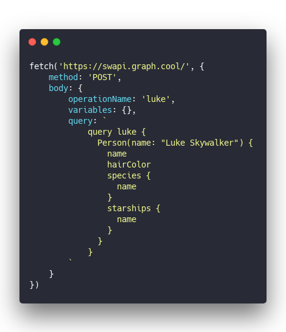](https://carbon.now.sh/?bg=rgba(255,255,255,1)&t=seti&l=javascript&ds=true&wc=true&wa=true&pv=48px&ph=32px&ln=false&code=fetch('https%3A%2F%2Fswapi.graph.cool%2F'%2C%20%7B%0A%09method%3A%20'POST'%2C%0A%09body%3A%20%7B%0A%09%09operationName%3A%20'luke'%2C%0A%09%09variables%3A%20%7B%7D%2C%0A%09%09query%3A%20%60%0A%09%09%09query%20luke%20%7B%0A%09%09%09%20%20Person(name%3A%20%22Luke%20Skywalker%22)%20%7B%0A%09%09%09%20%20%20%20name%0A%09%09%09%20%20%20%20hairColor%0A%09%09%09%20%20%20%20species%20%7B%0A%09%09%09%20%20%20%20%20%20name%0A%09%09%09%20%20%20%20%7D%0A%09%09%09%20%20%20%20starships%20%7B%0A%09%09%09%20%20%20%20%20%20name%0A%09%09%09%20%20%20%20%7D%0A%09%09%09%20%20%7D%0A%09%09%09%7D%0A%09%09%60%0A%09%7D%0A%7D))

Better than before but eh ...

Where GraphQL really shines, my friend, is with React hooks. I like to use `@apollo/react-hooks`.

You get a pattern like this:

[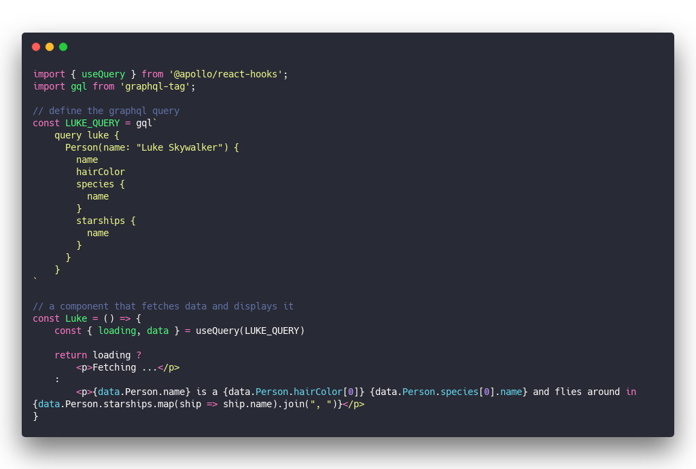](https://carbon.now.sh/?bg=rgba(255,255,255,1)&t=seti&l=javascript&ds=true&wc=true&wa=true&pv=48px&ph=32px&ln=false&code=\import%20%7B%20useQuery%20%7D%20from%20'%40apollo%2Freact-hooks'%3B%0A\import%20gql%20from%20'graphql-tag'%3B%0A%0A%2F%2F%20define%20the%20graphql%20query%0Aconst%20LUKE_QUERY%20%3D%20gql%60%0A%09query%20luke%20%7B%0A%09%20%20Person(name%3A%20%22Luke%20Skywalker%22)%20%7B%0A%09%20%20%20%20name%0A%09%20%20%20%20hairColor%0A%09%20%20%20%20species%20%7B%0A%09%20%20%20%20%20%20name%0A%09%20%20%20%20%7D%0A%09%20%20%20%20starships%20%7B%0A%09%20%20%20%20%20%20name%0A%09%20%20%20%20%7D%0A%09%20%20%7D%0A%09%7D%0A%60%0A%0A%2F%2F%20a%20component%20that%20fetches%20data%20and%20displays%20it%0Aconst%20Luke%20%3D%20()%20%3D%3E%20%7B%0A%09const%20%7B%20loading%2C%20data%20%7D%20%3D%20useQuery(LUKE_QUERY)%0A%09%0A%09return%20loading%20%3F%20%0A%09%09%3Cp%3EFetching%20...%3C%2Fp%3E%20%0A%09%3A%20%0A%09%09%3Cp%3E%7Bdata.Person.name%7D%20is%20a%20%7Bdata.Person.hairColor%5B0%5D%7D%20%7Bdata.Person.species%5B0%5D.name%7D%20and%20flies%20around%20in%20%7Bdata.Person.starships.map(ship%20%3D%3E%20ship.name).join(%22%2C%20%22)%7D%3C%2Fp%3E%0A%7D)

Render `<Luke />` and it first says `Fetching ...` then changes into `Luke Skywalker is a BLONDE Human and flies around in X-wing, Imperial shuttle`.

Not the perfectest English but that's way better than cobbling together 4 API requests, my friend.

You could even make your component accept a search parameter.

[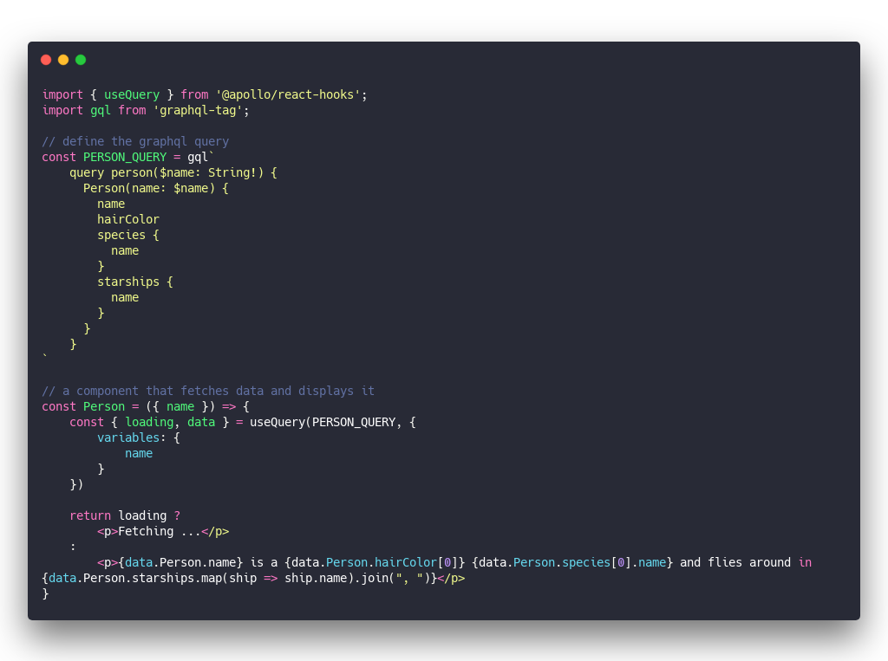](https://carbon.now.sh/?bg=rgba(255,255,255,1)&t=seti&l=javascript&ds=true&wc=true&wa=true&pv=48px&ph=32px&ln=false&code=\import%20%7B%20useQuery%20%7D%20from%20'%40apollo%2Freact-hooks'%3B%0A\import%20gql%20from%20'graphql-tag'%3B%0A%0A%2F%2F%20define%20the%20graphql%20query%0Aconst%20PERSON_QUERY%20%3D%20gql%60%0A%09query%20person(%24name%3A%20String!)%20%7B%0A%09%20%20Person(name%3A%20%24name)%20%7B%0A%09%20%20%20%20name%0A%09%20%20%20%20hairColor%0A%09%20%20%20%20species%20%7B%0A%09%20%20%20%20%20%20name%0A%09%20%20%20%20%7D%0A%09%20%20%20%20starships%20%7B%0A%09%20%20%20%20%20%20name%0A%09%20%20%20%20%7D%0A%09%20%20%7D%0A%09%7D%0A%60%0A%0A%2F%2F%20a%20component%20that%20fetches%20data%20and%20displays%20it%0Aconst%20Person%20%3D%20(%7B%20name%20%7D)%20%3D%3E%20%7B%0A%09const%20%7B%20loading%2C%20data%20%7D%20%3D%20useQuery(PERSON_QUERY%2C%20%7B%0A%09%09variables%3A%20%7B%0A%09%09%09name%0A%09%09%7D%0A%09%7D)%0A%09%0A%09return%20loading%20%3F%20%0A%09%09%3Cp%3EFetching%20...%3C%2Fp%3E%20%0A%09%3A%20%0A%09%09%3Cp%3E%7Bdata.Person.name%7D%20is%20a%20%7Bdata.Person.hairColor%5B0%5D%7D%20%7Bdata.Person.species%5B0%5D.name%7D%20and%20flies%20around%20in%20%7Bdata.Person.starships.map(ship%20%3D%3E%20ship.name).join(%22%2C%20%22)%7D%3C%2Fp%3E%0A%7D)

Now you can use `<Person name="luke skywalker" />` to show data about Luke, and `<Person name="chewbacca" />` to learn about Chewie.

All without changing a bunch of Redux state, coordinating a bazillion API requests, dealing with smart components, dumb components, presentational components, data stores, caching, configuration, permissions, anything. It just works.

🤯

## The edge first architecture

What GraphQL enables and hooks facilitate is the Edge First Architecture on the frontend. You can think of it sort of as [edge computing](https://en.wikipedia.org/wiki/Edge_computing) applied to your components.

The past few years of React common sense taught us to put everything in a global store. Almost everything. Anything that multiple components might need.

You get a unidirectional data flow, easy to understand state transitions, and a total mess of an impenetrable state tree as your app grows. Things slow down, debugging gets hard, and help you god if you can't keep the entire app in your head. I'm looking at you sagas 😒

With edge first, we turn that upside-down. _The edge does the work_

Look at the `<Person />` component.

[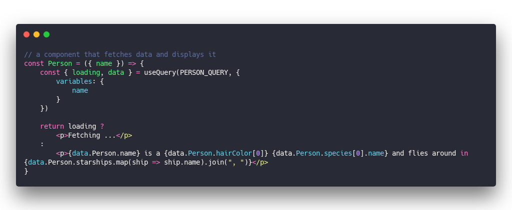](https://carbon.now.sh/?bg=rgba(255,255,255,1)&t=seti&l=javascript&ds=true&wc=true&wa=true&pv=48px&ph=32px&ln=false&code=%2F%2F%20a%20component%20that%20fetches%20data%20and%20displays%20it%0Aconst%20Person%20%3D%20(%7B%20name%20%7D)%20%3D%3E%20%7B%0A%09const%20%7B%20loading%2C%20data%20%7D%20%3D%20useQuery(PERSON_QUERY%2C%20%7B%0A%09%09variables%3A%20%7B%0A%09%09%09name%0A%09%09%7D%0A%09%7D)%0A%09%0A%09return%20loading%20%3F%20%0A%09%09%3Cp%3EFetching%20...%3C%2Fp%3E%20%0A%09%3A%20%0A%09%09%3Cp%3E%7Bdata.Person.name%7D%20is%20a%20%7Bdata.Person.hairColor%5B0%5D%7D%20%7Bdata.Person.species%5B0%5D.name%7D%20and%20flies%20around%20in%20%7Bdata.Person.starships.map(ship%20%3D%3E%20ship.name).join(%22%2C%20%22)%7D%3C%2Fp%3E%0A%7D)

It's doing all the work. Fetches its own data, deals with loading states, maybe errors, displays the result when ready.

You can put this _anywhere_ in your app and it Just Works™. No props to pass in, no hooking into global state, no coordination.

Self-contained. Beautiful.

### But what about performance, Swizec?

You're getting all the benefits you used to. They're just hidden deep inside the hooks machinery of your GraphQL library.

That `useQuery` hook looks like it just runs a fetch request, sure. And it does.

But `useQuery` also talks to a global context, coordinates similar API requests, adds a caching layer, and ensures that even if you render `<Person name="luke skywalker" />` twice in a row, performance doesn't suffer.

Which is more than you've ever ensured with a global store and a lot of hard work isn't it, my friend? Sure is more than I have 😇

* * *

Honestly GraphQL revolutionized how I think about the frontend and the Edge First Architecture is the free-est I've ever felt building great webapps fast.

What do you think? hit reply

Cheers, ~Swizec

PS: GraphQL supports _writing_ as well, using a `mutation`. You can even subscribe to changes live.

PPS: GraphQL makes backends easier too. Rather than implementing a billion endpoints, you create 1 endpoint and write small resolver functions for individual queries.