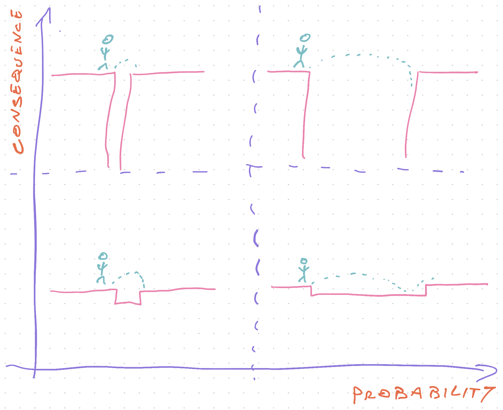

Earlier this week we talked about [why engineers hack the process](https://swizec.com/blog/why-great-engineers-hack-the-process/). Today I wanna talk about how.

The Process is like an organization's immune system against the incompetent, the lazy, and the too busy to pay attention. Safety rails to make sure everyone does at least sort of good work no matter what.

We can't trust you to run tests? Fine, no merging without a green test suite.

We can't trust you to dev test your code? Fine, not done without independent sign-off.

Can't trust you to think through your solution before coding? Fine, no starting without an engineering kickoff.

Can't even trust you to read the spec? Fine, no coding without a detailed time estimate verified and agreed upon by five independent parties.

But you're a great engineer. Never incompetent, rarely lazy, and always too busy to pay attention ... wait a minute 🤔

## Hacking The Process

So how do you hack The Process when it gets in the way?

**trust**

First you have to build trust. Without trust you won't have the leeway to hack the process.

Trust is best built by not fucking up.

Think of trust like karma points on Reddit. Say something useful, get a point. Say something dumb, lose a point.

Deliver a project on time. +2 points. Find an edge case in the spec and talk to the PM. +5 points. Refactor a tricky piece of code and improve everyone's lives. +10 points.

Kill production because of a typo. -20 points.

Take ownership, fix the typo, and explain how you'll ensure a typo never gets into production again. +10 points.

Oh and you just added to The Process. oops.

**responsibility**

Second, you need to take responsibility.

When something goes wrong and you followed The Process, your ass is covered. Process is the ultimate cover-your-ass strategy.

_"Oh but I was just following the process. You should fix that if you want to fix this sort of mistake"_

Weak move my friend. -5 trust points, but I get it.

/me throws another step onto The Process

When you hack the process, it's all on you. Everything works out? You're a hero.

Production goes down, customer gets double-charged, investor sees a blank page instead of an app demo 👉 your ass is grass.

**And you gotta _own_ it.** Take full responsibility. You hacked the process and it didn't work out. Own it, apologize, fix the mistake, explain the incentives, move on.

But without ownership, you'll never be trusted to hack the process ever again.

**judgement**

The last step is good judgement.

You're about to hack The Process. Is it worth the risk?

Think of risk like jumping over a canyon. You have to balance probability and consequence.

Let me explain with a crude comic of a stick figure jumping over a canyon 👇

Good judgement means you can tell the difference between these situations.

Hacking The Process when probability of failure is low and consequences are nil? Go for it.

Hacking The Process when probability of failure is high and consequences are dire? Please reconsider.

## So how

Ok so you've got the trust, responsibility, and judgement to hack The Process. Now what?

Now you find opportunities to hack the process, my friend.

Start simple like disabling a merge check or two when it gets in the way of deploying a well-tested branch to production in a timely manner. Re-enable after you're done.

Drop a step or five from the feature development checklist when it feels unnecessary. Does your feature actually benefit from QA or will automated tests do a better job? Does what you're doing even need automated tests? Do _you_ need a detailed checklist estimate to think through a feature?

Just don't be late. _"Multiply your gut estimate by 3.14"_ is a rule of thumb I've heard a lot.

You can graduate from there to completely subverting The Process.

Something broken? Just fix it. Don't wait for a spec.

Glaring hole in the spec? Propose a solution, tell the PM, let them add to the spec.

Better yet, _implement_ the solution and show your PM a screenshot. They'll be happy as heck.

**Everyone loves it when you have their back.**

As long as implementing a quick solution doesn't take you 5 days and blows your estimate to shreds. Make that the next project instead :)

And most of all: **_use your hacks to improve The Process_**

Every improvement starts as an experiment. _YOU_ can make life better for everyone my friend.

Happy hacking.

~Swizec
