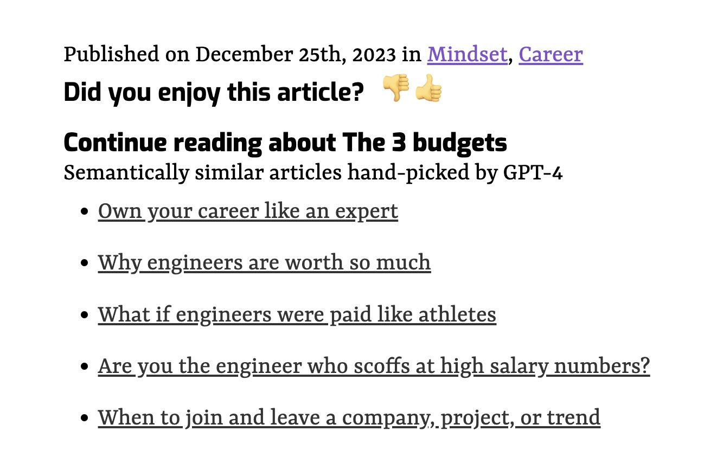
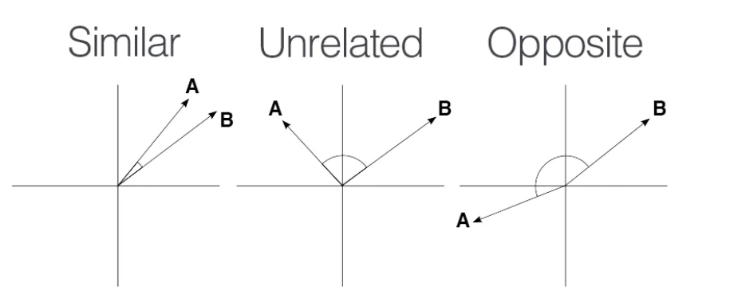

A feature I've been wanting for months finally shipped on swizec.com. Related articles! 🥳 Here's how it works.

The goal of this feature is to help readers navigate the 1788+ pieces of content on my blog. 15 years of writing adds up, my information architecture is a mess, and there's plenty of old embarrassing stuff on there too.

Using [a recent article](https://swizec.com/blog/the-3-budgets/) as a vibe check, the feature seems to work fine.



Yep the articles talks about career stuff and where the money comes from. Vibe check passes!

3 pieces of tech have to work together to make this work. That's why it took so long. I had the first _"yep this is gonna work"_ demos in my terminal back in April 😅

1. Database that supports vector similarity search
2. Continually index your content
3. Fetch and render related articles

## Database that supports vector similarity search

You can think of related articles in two ways: A recommendation system, or a semantic search. [Semantic search](https://swizec.com/blog/build-semantic-search-in-an-afternoon-yep/) is easy to build these days so that's what I did.

Each article acts as a search query. We send it to the database and ask _"Hey, got anything similar to this?"_. That similarity comes from the [cosine distance](https://en.wikipedia.org/wiki/Cosine_similarity) between embedding vectors.

[](https://medium.com/@milana.shxanukova15/cosine-distance-and-cosine-similarity-a5da0e4d9ded)

After trying lots of vector databases, Postgres with the [pgvector](https://github.com/pgvector/pgvector) extension is my fav. Works great for small datasets, fits all the tooling you're used to, and it's easy to query.

You get the 5 nearest articles to a `url` with a query like this:

```sql
select url, title, published_date
from article_embeddings
where url <> ${url}
order by embedding <-> (
	select embedding from article_embeddings where url = ${url} limit 1
) asc, published_date desc
limit 5
```

That `<->` operator comes from pgvector. It's the cosine distance. Using SQL lets us order articles by distance _and_ `published_date` so we can prioritize recent articles.

I'm using Vercel's white-labeled [Neon](https://neon.tech) database to make this works. The database is serverless in that it wakes up on demand and there's no ongoing cost.

The white-labeling makes it easy to integrate into multiple Vercel projects with a single click. My lazy ass likes that.

## Continually index your content

For similarity search to work, you need to keep that database fed. Every article needs an embedding vector.

I struggled for a while to find a good way of doing this. It's the sort of thing that makes productizing a neat demo difficult.

In the end, I landed on a [Bun](https://bun.sh) script that I run with `yarn index-articles` after adding an article. This works because my blog uses a [file-based Gatsby](https://www.gatsbyjs.com/plugins/gatsby-plugin-mdx) setup.

You can see [the full script on GitHub](https://github.com/Swizec/swizec.com/blob/master/bin/index-articles.ts).

The script iterates over all articles on my blog, checks if they're new, and asks OpenAI for the embedding. Then it stores the embedding in my database.

```typescript
async function indexArticle(path: string, lastIndexed: Date) {
  console.log(`Processing ${path}`)

  const file = Bun.file(path)
  const { data: frontmatter, content } = matter(await file.text())
  const url = "/" + path.split("/pages/")[1].replace("index.mdx", "")

  if (new Date(frontmatter.published) < lastIndexed) {
    return
  }

  const { rowCount } =
    await sql`SELECT url FROM article_embeddings WHERE url=${url} LIMIT 1`

  if (rowCount > 0) {
    return
  }

  try {
    const res = await openai.embeddings.create({
      input: content,
      model: "text-embedding-ada-002",
    })

    const embedding = res.data[0].embedding
    await sql`INSERT INTO article_embeddings VALUES (
            ${url}, 
            ${frontmatter.title}, 
            ${frontmatter.published}, 
            ${JSON.stringify(embedding)}
        )`
  } catch (e) {
    console.error(e)
  }
}
```

Storing metadata like urls and titles next to your vectors is I think the killer feature of pgvector. Having to faff with a vector database separate from your business data makes life difficult. Lots of un-necessary application logic.

## Fetch and render related articles

With articles indexed and the database easy to search, it's time to display related articles on every page.

You'd think that was easy, but Gatsby made it hard. The site uses static builds – that's why it's fast – which means you have to make the data available at build time. Gatsby went hard into GraphQL, which means you can't just run a SQL query.

I ended up building a custom source plugin that feeds related articles into `pageContext`. You can [see the source on GitHub](https://github.com/Swizec/swizec.com/blob/master/plugins/gatsby-source-related-articles/gatsby-node.mjs)

### Sourcing the data

The plugin hooks into the `sourceNodes` lifecycle and creates GraphQL nodes with a list of related articles for every article. Yes this is slow.

```javascript
export const sourceNodes = async (gatsbyApi) => {
	// connect to DB

  try {
    const { rows: articles } =
      await client.sql`select url from article_embeddings`

    for (const { url } of articles) {
      // fetch related articles with SQL query

      gatsbyApi.actions.createNode({
        id: gatsbyApi.createNodeId(`relatedArticles-${url}`),
        ...data,
        internal: {
          type: `RelatedArticles`,
          contentDigest: gatsbyApi.createContentDigest(data),
        },
      })

      gatsbyApi.cache.set(`relatedArticles-${url}`, rows)
    }
	}
	// error handling and close DB connection
}
```

This uses the N+1 query approach, which is a known code-smell. I think in this case it's better than a complicated self-join because Postgres isn't great at graph operations.

### Injecting page context

I then use the `onCreatePage` event to inject related articles into page context. Unfortunately we can't use GraphQL queries here for performance reasons. Gatsby devs say it cannot be done.

We can use Gatsby's internal build cache instead. I got the idea from a comment on a GitHub issue but can't find it anymore. Thanks stranger.

```javascript
export const onCreatePage = async ({ page, cache, actions }) => {
  const url = page.path
  const relatedArticles = await cache.get(`relatedArticles-${url}`)

  if (relatedArticles) {
    actions.deletePage(page)
    actions.createPage({
      ...page,
      context: {
        ...page.context,
        relatedArticles,
      },
    })
  }
}
```

### The rendering

Once you have the data where you need it, rendering is easy. The page footer gets code like this:

```javascript
{
  props.pageContext.relatedArticles ? (
    <RelatedArticles
      articles={props.pageContext.relatedArticles}
      title={props.pageContext.frontmatter.title}
    />
  ) : null
}
```

And the RelatedArticle components renders links in a loop.

## But does it _work_ work?

I have no idea. That's my next step – figuring out how to evaluate this and add useful tweaks to the query or the embeddings.

The vibe check passes and the demo looks neat. But if you try to navigate the knowledge graph, those links quickly fall apart and make no sense.

That's the problem with AI. It demos well and productizes poorly.

\~Swizec
