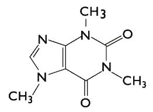

- 

  Image via [Wikipedia](http://commons.wikipedia.org/wiki/Image:Caffeine_molecule.png)

Hello, my name is Swizec and I drink [caffeine](http://en.wikipedia.org/wiki/Caffeine "Caffeine"). Lots of caffeine.

"We love you Swizec, welcome to caffeinistas anonymous .."

Yeah no, it didn't go quite like that, but it was close. At some point in my life I discovered that caffeine was awesome, not because it helped you stay up longer and wake up earlier, gawd it makes waking up hard doesn't it? It was because when I'm on caffeine I can think quicker and I like thinking quickly seeming as how I always stumble upon occasions when
