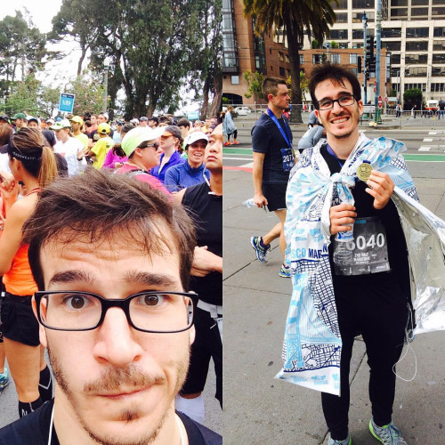

\_\_

## The run

\_\_\_\_

## The result

\_\_

1.  You can achieve this result with modest training
2.  Achieving a better result is _hard_

Five people my age achieved a result in the 1:50:xx range. The next worst is 1:52:xx with 3 people. The next best, 1:49:xx, has 7 people. But 1:48:xx has only 1. And 1:47:xx has only 3. After that, there are at most 2 people per minute, with most results being several minutes apart. This indicates that something breaks around 1:50:xx. I don't know _what_ breaks, but the data indicates that only those who are really good can go much faster than 1:50:xx. Maybe this is the point of diminishing returns for half marathon training.

## The training

\_\_

## The stupid idea

Now here's what I didn't count on: the full marathon I want to run is on October 25th. My longest run so far has been 23km. A marathon is 42km. Somehow I have to add 19 more kilometers to my longest run. And if nothing comes up I have 12 weekends to do it in. So from now on, I have to add 2km to my long run every weekend. This gives me one full marathon of practice before the race. And I want to run the race in under four hours. I'm gonna die.
