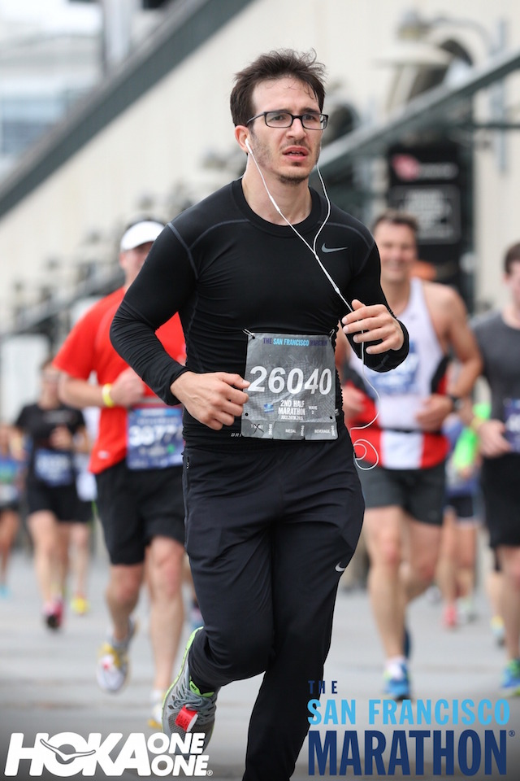

\[caption id=&quot;&quot; align=&quot;alignnone&quot; width=&quot;500&quot;] Before and after pic\[/caption] Nine months after saying _&quot;Fuck it, next year I&#x27;m running a marathon&quot;_, I ran my first race event. Half of the [San Francisco Marathon](http://www.thesfmarathon.com/ "San Francisco Marathon") this Sunday. I ran the 2nd half of the full marathon. Started at 8:17am at the far end of [Golden Gate Park](<http://maps.google.com/maps?ll=37.7697222222,-122.476944444&amp;spn=0.01,0.01&amp;q=37.7697222222,-122.476944444 (Golden%20Gate%20Park)&amp;t=h> "Golden Gate Park"), near some sort of lake, and finished by the [Ferry Building](<http://maps.google.com/maps?ll=37.7955555556,-122.392222222&amp;spn=0.01,0.01&amp;q=37.7955555556,-122.392222222 (San%20Francisco%20Ferry%20Building)&amp;t=h> "San Francisco Ferry Building") at 10:07am. An hour and fifty minutes later. And twelve seconds. 1:50:12 Ten minutes faster than my best training run. Faster than 84% of everybody else that day. Faster than 67% of people in my age group. But only within 52% of what a guy my age could achieve in theory. That&#x27;s because the world record for a [half marathon](http://en.wikipedia.org/wiki/Half_marathon "Half marathon") is just 57 minutes and I am nowhere near an elite runner.

## The run

Running my first half marathon was as joyful as it was magical. I frolicked and the birds sang and sparrows flew and my mind was clear and the [runner&#x27;s high](http://en.wikipedia.org/wiki/Endorphins "Endorphins") was high and the endorphins were pumping and a big fat grin covered my face. Ha, I wish. \[caption id=&quot;&quot; align=&quot;alignnone&quot; width=&quot;640&quot;] This is how much I enjoyed myself\[/caption] It was miserable. Running is miserable. Everything about running is miserable. Anyone who says otherwise is either lying or fooling themselves. Or they&#x27;re one of those people who run in full makeup and never break a sweat and smile for pictures. I hate those people. Running _sucks_. You have to get up early, you&#x27;re cold, you&#x27;re bored out of your mind, your legs hurt, your feet hurt, your lungs hurt, your abs hurt, and you know exactly how Spotify&#x27;s random function works. And you&#x27;re cold and you&#x27;re hot and you&#x27;re dehydrated and you want to watch the world burn and everything sucks. And to top it off, it burns all your gym gainz away so you have to work double hard just to keep up. BUT! It&#x27;s the best way in the world to get alone time. And it gives you time to think. And it forces you to think. And when you&#x27;re done you&#x27;re _so happy_ that you don&#x27;t have to keep going. You know that feeling where you&#x27;re suffering and you&#x27;re suffering and everything is shit until suddenly it isn&#x27;t shit anymore? When you&#x27;re doing like the hardest thing ever and then you&#x27;re done and it&#x27;s like the world is a new place? Running is like that. The best part is when you get to stop. At least that&#x27;s what running to train is like. Running to race is ... hard. You&#x27;ve just spent a few days resting because you&#x27;re not an idiot. You can train when your legs are sore, but you can&#x27;t race with sore legs. You have to be rested. And because you&#x27;re rested, you run fast. Faster than ever before. And because there&#x27;s people around you, you run even faster. Faster than ever before. And because you&#x27;re about to crap out and die, because you&#x27;re running faster than ever before. You run faster still so it would be over quicker. Faster than ever before. My normal long run pace is 5:11/km. But I stop at stoplights and such, so the pace ends up slower - around 5:40/km. My race running pace was 4:50/km. But I crapped out and had to walk. So the pace became 5:14/km. Eesh. At the finish line, there was no joy, no elation, no endorphin rush. There was just pain, breathing, and cold.

## The result

\[caption id=&quot;&quot; align=&quot;alignnone&quot; width=&quot;704&quot;] This is my official result\[/caption] There you have it, my new personal best for a half marathon across San Francisco hills. In the top 16% overall, top 25% for men, and top 33% for men my age. It _feels_ like a good result. It&#x27;s a huge improvement over my training runs. But it bugs me that it&#x27;s not a top result. You know? Age is still working for me, not against me. Especially in running. I&#x27;ve got the mental fortitude to do these stupid things, while still having the physical advantages of youth. Even the data says so. For my age, results skew towards faster runs.  Which means that even though I&#x27;m in the top third of my age group, my result falls exactly where most results cluster. This implies two things:

1. You can achieve this result with modest training
2. Achieving a better result is _hard_

Five people my age achieved a result in the 1:50:xx range. The next worst is 1:52:xx with 3 people. The next best, 1:49:xx, has 7 people. But 1:48:xx has only 1. And 1:47:xx has only 3. After that, there are at most 2 people per minute, with most results being several minutes apart. This indicates that something breaks around 1:50:xx. I don&#x27;t know _what_ breaks, but the data indicates that only those who are really good can go much faster than 1:50:xx. Maybe this is the point of diminishing returns for half marathon training.

## The training

My training philosophy is simple - run a lot. I started running regularly in April 2014 because a lull in boxing activity left me with too much energy and I couldn&#x27;t sleep. So I ran every day. For four kilometers. \[caption id=&quot;&quot; align=&quot;alignnone&quot; width=&quot;702&quot;] Training log pt1\[/caption] And that was that. I ran. When I started it took me almost 24 minutes to run four kilometers, and a whopping 54 minutes to run nine kilometers. A 10k was far out and I would have died. The first time I did run a 10k - in June 2014, it took me 1 hour and 2 minutes. At that pace, a half marathon would take 2 hours and 36 minutes. 46 minutes longer than it took on Sunday. But running had become a staple and I kept running my short weekday runs and my long Sunday runs. Six times a week at first, then four times, and in the end I settled at three runs per week. A short run of 8km on Wednesday and Friday, and a long run of 21km on Sunday. That&#x27;s right, for the past several months I have been running a half marathon every week. I figured if I&#x27;m training for a half marathon, I might as well run many half marathons. It worked because by race time, I was mentally prepared and I knew what it takes. Sure the quicker pace caught me a bit off guard, but I knew how to mentally keep myself going and I knew that I wouldn&#x27;t drop dead before the finish line. And because I had run many practice half marathons I knew how much I had to eat before the run, I knew that while I don&#x27;t _have to_ drink during the run to make it through, my time is better if I do drink a bit. And I knew what hurts when you start and what hurts when you stop. Hint, it&#x27;s the butt and legs that protest the most in the beginning, and it&#x27;s your abs that are killing you when you&#x27;re done. I don&#x27;t know why. To make sure I knew how to run fast, some of my short runs would be fartleks. A 4km fast-paced run one way, then a 4km fast run interspersed with 500 meter sprints on the way back. Yes it kills you. Yes you need it anyway. And that was really it. I ran a lot and I made sure I was mentally prepared for what was coming.  Well okay, I&#x27;ve been slacking lately ...

## The stupid idea

Now here&#x27;s what I didn&#x27;t count on: the full marathon I want to run is on October 25th. My longest run so far has been 23km. A marathon is 42km. Somehow I have to add 19 more kilometers to my longest run. And if nothing comes up I have 12 weekends to do it in. So from now on, I have to add 2km to my long run every weekend. This gives me one full marathon of practice before the race. And I want to run the race in under four hours. I&#x27;m gonna die.