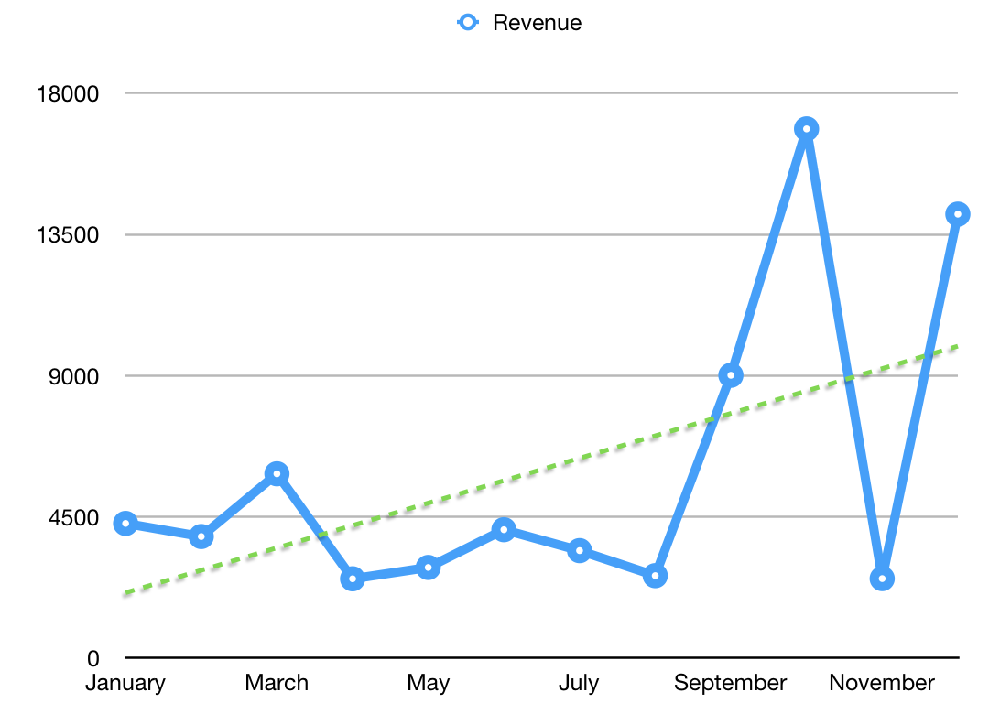

\[caption id=&quot;attachment_8012&quot; align=&quot;alignnone&quot; width=&quot;1024&quot;] Ship every day\[/caption]

https://twitter.com/Swizec/status/948112227860492288

2017 was bonkers. It started with an almost finished rewrite of [React+D3v4](https://swizec.com/reactd3js/) and a realization that I had [6x&#x27;d my income in 4 years](https://swizec.com/blog/learned-6x-income-4-years/swizec/7340).

## 💥 Start with a bang 💪

\[caption id=&quot;attachment_8014&quot; align=&quot;alignnone&quot; width=&quot;1092&quot;] Month-by-month sidehustle revenue 2017\[/caption]

Then I got busy with the sponsored [Shoutem React Native school](http://reactnative.school) project and everything else slowed down. Creating a new React Native app every other week is hard.

So it took me 7 months of tweaking and updating [React+D3v4](https://swizec.com/reactd3js/) before it was ready. During this time, I also experimented with 1-on-1 coaching, tried [selling React &amp; D3 workshops to consumers](https://swizec.com/blog/boutique-react-d3v4-workshop/swizec/7519), and [started vlogging](https://www.youtube.com/SwizecTeller).

Vlogging is fun, great for brand building. People comment about it a lot in real life, but they don&#x27;t press the magic Like button as much. ¯\_(ツ)\_/¯

Overall, the business was on life support. I flirted with the idea of giving up and living a normie life almost daily. It just seems so much easier.

You go to work, you build what you&#x27;re told, you offload your stress, do overtime when the boss likes it, and collect your fat paycheck. Being a Silicon Valley startup employee is easy.

But it&#x27;s not as fun.

It&#x27;s like my friend said, _&quot;If you quit your sidehustle, you&#x27;re just gonna start a new one. Do you really think you can sit still and focus on One Thing?&quot;_

No.

Business picked up again in September. [React+D3v4](https://swizec.com/reactd3js) launched to little excitement and tiny fanfare. Preorders were great, but there&#x27;s only so long you can keep people excited. When your product is 7 months late or more… heh 😅

React+D3v4 did [make $6.5k during launch](https://swizec.com/blog/9013-september-sidehustle-report-why-the-react-d3v4-launch/swizec/7837), so yay. Best sidehustle month in history. 💪

https://twitter.com/Swizec/status/915738664818245632

Until October. October made me crap my pants.

A workshop deal from Real World React fell in my lap and I [taught the StubHub SF team about React and Redux](https://swizec.com/blog/teaching-stubhub-react-redux/swizec/7860). I also turned 30 and ran [a birthday promotion that made almost $6k in 1 day](https://swizec.com/blog/16661-october-sidehustle-report/swizec/7883).

Life was good. I was flying high. Then November was bad, then December was good again. [Another StubHub workshop](https://swizec.com/blog/teaching-backend-devs-react-redux-stubhub-boston/swizec/7952). This time in Boston.

## Breakdown

For the curious, here&#x27;s how the year breaks down.

**Total revenue: $72,167**

Product sales: $37,240

Packt royalties: $2,188

Workshops: $19,684

React Native School: $10,793

**Time investment: 864 hours**

An average of 16 hours per week, making a respectable but not great $83/h.

**Total cost/investment: ~$43,000**

Creating a measly post-cost pre-tax income of $33/hour.

Better than minimum wage ($13/h) but talk to any engineer in Silicon Valley and they will tell you that number is just sad. I might as well give up now.

But where&#x27;s the fun in that?

## What I wanna do and build in 2018

Ultimately the goal for 2018 is to maintain this trajectory 👇

\[caption id=&quot;attachment_8021&quot; align=&quot;aligncenter&quot; width=&quot;1068&quot;] Sidehustle growth trajectory\[/caption]

That means I gotta 2x my revenue. A cool $144,000. Preferably without 3x-ing the cost or worse.

Why?

Because freedom, that&#x27;s why. Money is freedom.

The more 💰 you have, the more you can do whatever you want. Something cool tickle your intellect? Wanna lock yourself in your room for 2 weeks and hack on something cool?

Can&#x27;t do that if you got bills to pay and nothing to pay them with.

And I really want to do that.

So how am I going to get there? I don&#x27;t know yet to be honest. It&#x27;s daunting.

Hitting $70k was largely a matter of luck. There was no systematic process. No step-by-step plan I followed to get there. I just did things and hoped for the best.

\[caption id=&quot;attachment_8010&quot; align=&quot;alignnone&quot; width=&quot;500&quot;] We have a plan\[/caption]

### What I wanna build

My strategic plan is a lot like that. I&#x27;m going to Do Things and then Stuff Will Happen. I need to work on that plan, but here&#x27;s a list of some things plan to create 👇

- I wanna start **a daily video series. Learn X while you poop**. 2-min videos teaching React and Redux based on my StubHub workshop. Expand if that goes well.

https://twitter.com/Swizec/status/946618544254541824

Not sure yet if this will be a paid product, a membership product, or a purely brand building marketing product. Perhaps all 3.

- I’m going to **update [es2017.io](https://es2017.io)** for 2018 and add any new stuff that&#x27;s coming to JavaScript. Keep that cheatsheet current.
- Create similar **interactive cheatsheets for React, Redux, MobX, and D3**. Separate cheatsheet for each. They&#x27;re great lead magnets for email subscribers.
- I want to build an **open source Make Your Own Blockchain** library based on Redux, Firebase, and some WebRTC. [This is already in progress](https://swizec.com/blog/blockchain-backed-redux-clone-105-lines-code/swizec/7980). Not sure yet where I&#x27;m going with this, but it&#x27;s scratching my intellectual curiosity real good.If the blockchain works, I want to use it for a project/product/startup I had in mind. Not ready yet to tell you what it is just yet. 😇

* * *

But that doesn&#x27;t give me too many products I can sell, now does it? Guess I&#x27;m just gonna have to write books/guides/courses about the stuff I learn along the way.

It feels dangerous to set that as a sort of throwaway side goal, but I want to get better at iterating and launching products quickly. When I learn a cool new piece of tech, or figure something out, it shouldn&#x27;t take me 9 months to write a guide about it.

## What needs to improve

And that&#x27;s what needs to improve. I have to get better at launching infoproducts quicker. I&#x27;m already good at writing every day. I can sit down and blurt out thousands of words on a topic.

Those [Shoutem React Native](http://reactnative.school) articles, 4000+ words each? They took me 3 days to research and 2 days to write and video.

If you put that in a book, it makes about 30 pages. I should definitely be able to launch more books and courses. Just gotta find the fire under butt. 🔥🍑

Another very important part of the sidehustle that I need to improve is <http://swizec.com>. The homepage hasn&#x27;t been updated in 3 years and doesn&#x27;t even mention my sidehustle, which is ridiculous.

My blog is also in dire need of an update. It doesn&#x27;t work well on mobile, syntax highlighting is all messed up, and it feels crufty and weird looking.

So I&#x27;m gonna fix that. But I&#x27;m going to hire someone to help me.

Yes, I&#x27;m fundamentally a web developer. Yes, I can do it on my own. And yet I haven&#x27;t found the time to do it in years. 😅

Oh, and I have to work on my quote unquote Growth Engine. That&#x27;s the part of the business that brings in new people every day that you can talk to. I have some ideas 🤔

## Fin

🤘