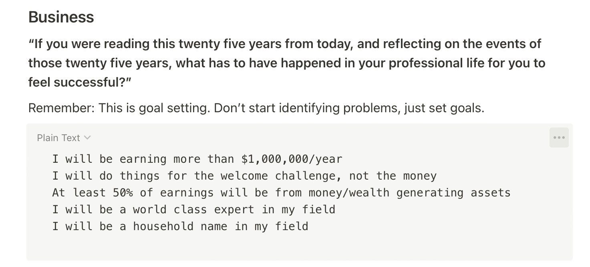
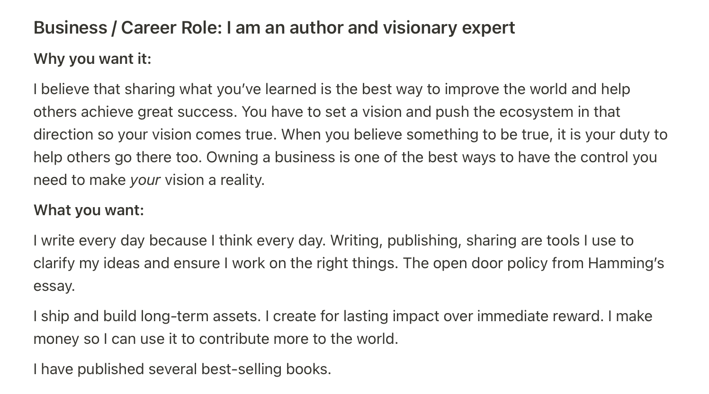
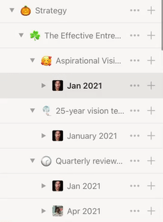
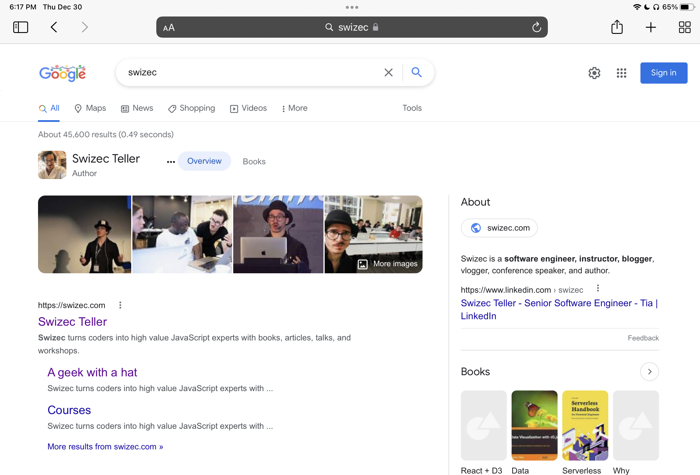
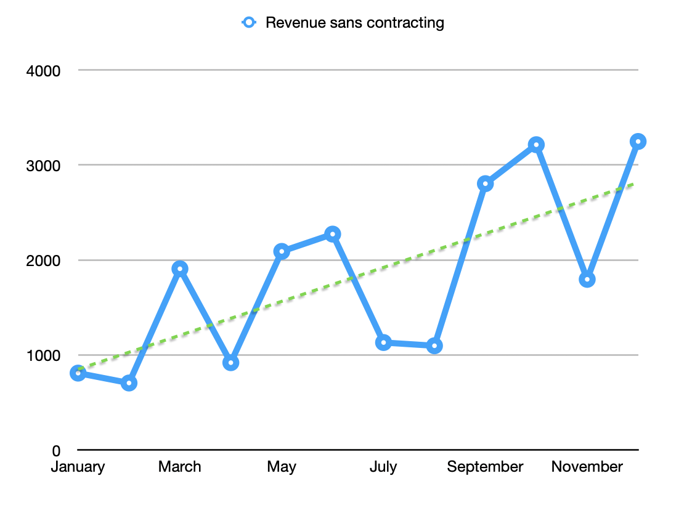

Is it just me or has 2021 been a long-ass year? For the first time in my life it feels like I've ... aged. 🤨

At the end of [Reflecting on 2020](https://swizec.com/blog/reflecting-on-2020/) that younger Swizec talked about burnout. Too many projects, too much scatter, time to focus.

https://twitter.com/Swizec/status/1334201415078612993

> This year I want to go deep. Fewer projects. More shipping, more value, bigger. Focus on long-term games and building assets.

## Achieving focus with a framework

https://twitter.com/Swizec/status/1474120362531057665

Define your long-term goals, say No to anything that doesn't help you get there. It's the only way.

Like I said in [Your career needs a vision](https://swizec.com/blog/your-career-needs-a-vision/) even the tiniest bit of direction makes a huge difference on your random walk through life.

But as my sister likes to say: _"Yeah that's easy once you know what you want and feel comfortable missing out on everything else"_

So how _do_ you know what you want? And how the heck do you deal with FOMO?

Looking to fix that in 2021 I tried [The Effective Entrepreneur framework](https://taylorpearson.me/masterclass/). Turned the worksheet into a Notion template for ease of use ✌️

I felt a lot calmer and less overwhelmed all year. Here's how it works:

### The Effective Entrepreneur framework

You start with an aspirational 25 year vision – **if you were reading this in 25 years, what has to have happened to make you feel successful?**

The answer should make you feel almost embarrassed to share.

Here's mine:

You do this for 3 areas of your life:

1.  Business/career
2.  Health
3.  Relationships

And an optional 4th, if you have something to add. I couldn't think of anything.

You follow that up with a **"What kind of person achieves those goals?"** exercise where you define your "role" for each of the 3 sections. Answer Who, Why, What. As Simon Sinek likes to say – [Start With Why](https://youtu.be/u4ZoJKF_VuA).

Here's the _Who, Why, What_ I wrote at the start of 2021:

Aim high, right? Goals aren't always meant to be reached, sometimes they just give you something to aim for. ¯\_(ツ)\_/¯

Once you have the vision, you translate that to quarterly and weekly Rocks or Big Things. The important stuff you want to achieve that gets you closer to your ultimate vision.

Quarterly review and planning happens every 3 months. Weekly every week. You can add daily to the mix but that felt like too much overhead to me.

I used selfies for extra flair ✌️

### Did it work?

Did all this extra focus achieve its aim? 🤔

Maybe. This feels good:

https://twitter.com/Swizec/status/1471577369802526723

And when you [search for "Swizec" on Google](https://www.google.com/search?q=swizec), you get the fancy layout. Ego likes that a lot 😛

Needs work money-wise. I'm either doing something wrong or there's been a lot of Stacking The Bricks this year. Work that pays off later.

https://twitter.com/Swizec/status/1476629211381043233

The brick stacking from previous years finally added up to an approved greencard 🥳

https://twitter.com/Swizec/status/1473736849294344206

How that happened is a separate article.

## The dayjob has been a great success

https://twitter.com/Swizec/status/1437797536346083337

Working at a company where the biggest danger is too much user demand has been wild. Who knew women's health care was such an underserved market?

The founders knew. I joined because the metrics looked good and the challenges looked challenging.

We grew from ~40 people [when I joined in June 2020](https://swizec.com/blog/how-to-grow-as-a-senior-engineer-or-why-i-got-a-new-job/) to around 230 last I checked. The engineering team went from 7 to 25.

The juicy challenge for me was _"Hey our tech won't scale and we need help moving to React. You'll be the first person with practical React skills. Please teach us. You have free reign"_

🤩

This lead to [the most achievementous achievement of my career](https://swizec.com/blog/how-to-rewrite-your-app-while-growing-to-a-dollar100000000-series-b/). Might turn lessons learned into a book.

https://twitter.com/Swizec/status/1439272771586904065

2022 is going to be wild. We're aiming for another 40 engineers and my plate's already full with tech migrations they want me to lead. This time on the backend.

## The sidebiz stacked a lot of bricks

Strictly speaking, [the infoproducts sidebiz](https://swizec.com/blog/5-years-of-books-and-courses-or-how-i-made-dollar369000-on-the-side/) made a loss this year. Funded from my dayjob and a hands-on-keyboard freelance project that I now think was a distraction.

The hyper-growth dayjob has been eating so much energy that I sometimes think this business has turned into an expensive hobby. You have to actively make new shit and sell to make money in this game. Can't just keep writing great emails and hope for the best 😅

### Senior Mindset

We launched [SeniorMindset.com](https://seniormindset.com), a series of essays on thinking like a senior engineer that comes straight to your inbox.

This was a huge success. Proved my hunch that you can reuse good writing, if it's new and valuable to the reader.

Productizing this area is an ongoing experiment.

Creating a low price community for people to discuss these topics didn't work. Everyone came looking to be entertained (by me) instead of to participate. Meh.

Adding a paywall to the email series itself is proving interesting. Readers convert to paid at an expected rate, but they feel weird buying a series of emails instead of an ebook. Even though they're the same thing.

The curse of the format strikes again 😄

https://twitter.com/Swizec/status/1269719496832413696

The [Senior Mindset Mastermind](https://swizec.gumroad.com/l/RnuqQ) group coaching program is looking promising, but needs work. Something's not quite there yet.

### Serverless Handbook

Launching the [Serverless Handbook](https://serverlesshandbook.dev) was a huge weight off my shoulders. That thing was on my mind for 2 years if not more.

I'm proud that it's a self-published paperback.

https://twitter.com/Swizec/status/1471577369802526723

Seeing dog-eared well-read photos of that book fills me with joy. When people share photos on twitter it's like 😍

But print is expensive. For a $49 sale on Amazon, I make $3.3 ... and even that feels expensive for a technical paperback to many.

So far looks like we won't make this up in volume like I hoped, but the book is out there helping people and that's what matters. 💪

### Assetizing swizec.com

After [Senior Mindset](https://seniormindset.com) validated my hunch about turning good writing into a long-term asset, we created a bunch of curated series on swizec.com

You can now read:

- [The Fullstack series of essays](https://swizec.com/blog/fullstack-web/)
- [The JavaScript series](https://swizec.com/blog/javascript/)
- [The IndieHacking series](https://swizec.com/blog/indie-hacking/)
- [The React series](https://swizec.com/blog/react/)
- [The Serverless/Backend series](https://swizec.com/blog/serverless/)

Each new subscriber gets to choose what topic they want to learn about first. Every relevant article gives you a content upgrade with that series of emails.

This year we're going to beef this up. Curate and add more articles, find opportunities to monetize (by selling relevant courses or books), and figure out a way to let readers move between these things.

Looks promising. We get 2x the email subscribers on 1/3rd of the traffic 🤘

I want to find a way to consistently re-share evergreen writings on social to bump up the traffic. We're back to rookie numbers with 12k uniques/month.

## The money update 💰

As always, I like to be transparent with money updates. Because [talking about engineering salaries is important](https://swizec.com/blog/why-you-should-talk-about-engineering-salaries/) and it achieves 2 things:

1.  It might inspire you
2.  You might tell me I'm underpaid

Both of those are strictly good outcomes.

Applying the senior mindset at work has been good. Very good.

https://twitter.com/Swizec/status/1454910488635068422

In [Pay Yourself First](https://swizec.com/blog/pay-yourself-first/) I shared my asset allocation after 6 years in Silicon Valley because that's a thing now. Building long-term assets. Wealth.

For the first time in my life, investment returns have been higher than my hustling and bustling business revenue. This feels weird.

https://twitter.com/Swizec/status/1472327078594838528

Partially because it's been a bad business year, partially because the stock market is crazy. And in part because dayjob money is just easier.

You can use raw cash to _buy_ assets. I made my 2nd angel investment this year. We'll see

Cheers, 
~Swizec
