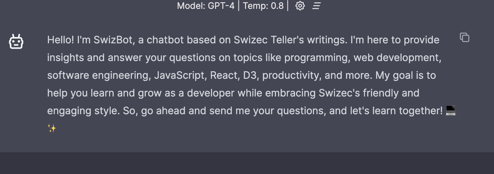
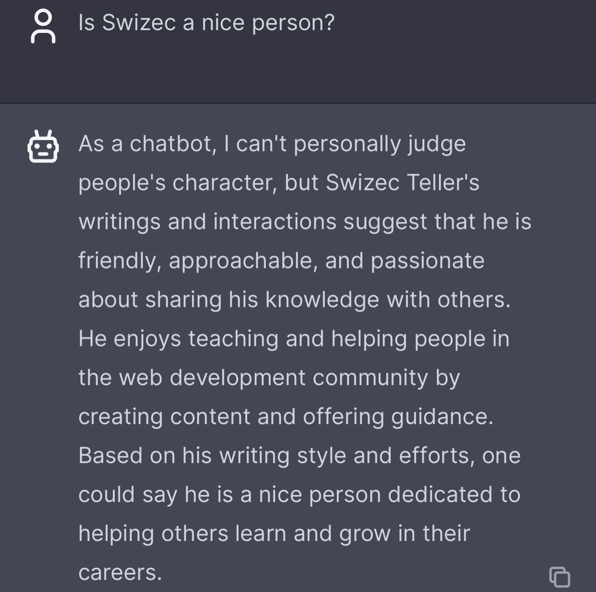
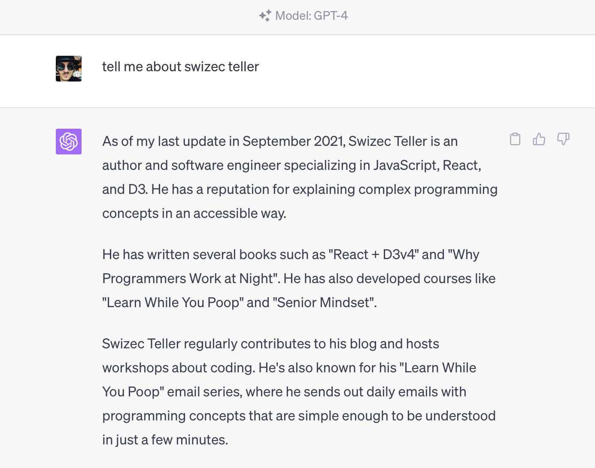

What do you do with 15 years of your writing history when LLMs hit the scene? A chatbot!

Meet SwizBot, a friendly chatbot that knows every article I've published on swizec.com since 2007 and is ready to answer your questions. You can try it out at [swizbot-ui.vercel.app](https://swizbot-ui.vercel.app), if you promise to be nice to my OpenAI credits.

[](https://swizbot-ui.vercel.app)

SwizBot starts every conversation by introducing itself and giving a little recap of topics it can talk about. I figured this was the naturalest way to avoid the Empty Input Of Doom problem.

Hate it when people say _"Lemme know how i can help"_ and I have no idea what's even within their wheelhouse. Do I ask for help moving my couch, or a million dollar investment in my next idea? What do you help with!?

## But why?

Why would you turn 15 years of writing into a chatbot? Because that's what nerds do on the weekend.

But I think there's something there. I have 2 use-cases in mind:

1.  Readers can ask questions that I don't have time to answer
2.  I can go "What did I say about X?" because my brain can only remember so much

There's bound to be a product hiding in `1.`.

## Does SwizBot work?

Works pretty well!

It makes little mistakes here and there like calling Slovenia my hometown even though it's a country, or getting confused between standalone opensource projects and functions exported from larger libraries. And SwizBot keeps saying that it knows the contents of my books, but it does not.

I should feed SwizBot my books 🤔

Overall the answers are directionally correct, seem useful, and it gets the conversational tone right most of the time.

https://twitter.com/Swizec/status/1659579388722315265

My partner asked if I was a good person:



I tried to see how SwizBot does with technical content:

https://twitter.com/Swizec/status/1659580139041329152

And a friend asked what's going to be my professional downfall, obviously. The answer is too long to paste here, but it boils down to _"Stop investing in yourself"_.

Does okay with synthesizing my opinions and experiences 🤘


But SwizBot is reluctant to give advice due to OpenAI's protections built into GPT-4. It's never gonna tell you "do this" because that would be irresponsible or whatever.

## How SwizBot works

SwizBot is almost embarrassingly simple in what it does.

1.  The UI is based on [chatbot-ui](https://github.com/mckaywrigley/chatbot-ui), an open-source ChatGPT UI clone
2.  The knowledge retrieval is based on [semantic search with LLM embeddings](https://swizec.com/blog/build-semantic-search-in-an-afternoon-yep/)
3.  GPT-4 does the rest

The hardest part was shoe-horning knowledge retrieval into chatbot-ui and getting all my markdown parsed. So many stupid things you do over 15 years break a strict parser 🫠

You can see the [full code on GitHub](https://github.com/Swizec/swizbot-ui). The interesting part is [api/documentContext.ts](https://github.com/Swizec/swizbot-ui/blob/main/pages/api/documentContext.ts)

### Knowledge retrieval at a high level

LLMs don't have memory. You have to provide all relevant context as part of your prompt.

But LLMs also have limited context windows. There's only so much they can "keep in mind" at a time.

You solve this by finding _relevant_ context. Like asking an intern to read 3 books and then help you out. Those 3 books are the context your intern's going to use to synthesize an answer to your question.

Remember: ChatGPT and friends are like an extremely talented intern who is great at research and also on drugs.

When you ask a question, SwizBot:

1.  Computes an embedding of your question
2.  Looks at a "database" of embeddings
3.  Finds 10 nearest blog fragments
4.  Feeds those fragments as context into the system prompt
5.  Passes your question and the huge system prompt to GPT-4
6.  Streams back the response

### Finding relevant blog fragments

SwizBot has a "database" of pre-computed embeddings for every h2 section of my blog (title + content). Around 84,000 rows in a huge CSV file.

Yep, a CSV file. Good enough 😁

It uses this short function to sort the whole database by similarity and return the top 10 results. Yes this is slow and I should upgrade to a vector database.

```typescript
export async function findRelevantSections(question: string) {
  const questionEmbedding = await getEmbedding(question);
  // similarity key gets rewritten
  const haystack = await readEmbeddingsFromCSV();

  for (const item of haystack) {
    item.similarity = cosineSimilarity(questionEmbedding, item.embedding);
  }

  haystack.sort((a, b) => b.similarity - a.similarity);

  return haystack.slice(0, 10);
}
```

### The system prompt

The system prompt goes ahead of your question and tells GPT-4 how to behave. Mine also feeds it relevant context, which enables the LLM to answer based on what I've written.

That happens in [api/chat.ts](https://github.com/Swizec/swizbot-ui/blob/main/pages/api/chat.ts#L20). Like this:

```typescript
async function expandPromptWithContext(
  prompt: string,
  messages: Message[],
  req: NextRequest
): Promise<string> {
  const context: Doc[] = await fetch(
    `${req.nextUrl.origin}/api/documentContext`,
    {
      method: "POST",
      headers: {
        "Content-Type": "application/json",
      },
      body: JSON.stringify(messages),
    }
  ).then((res) => res.json());

  let additions: string[] = [
    "The following are some relevant documents to use in your answer",
  ];

  for (const { title, content } of context) {
    additions.push(`Title: ${title}; Content: ${content}`);
  }

  return prompt + "\n" + additions.join("\n");
}
```

Finds the first user message in a conversation, grabs relevant blog fragments, and shoves 'em in there with a _"Use this context in your answer"_.

The base system prompt is alchemy, I mean trial and error. Needs more work I think.

```typescript
let promptToSend =
  "You are SwizBot, a chatbot based on Swizec Teller's writings. Answer the user's questions carefully. If you are not sure, ask followup questions to clarify the user's situation. Answer as if you are Swizec Teller, using his style of writing. Respond using markdown.";

promptToSend = await expandPromptWithContext(promptToSend, messages, req);
```

GPT-4 does the rest. Really.

### Making the bot say hello

This was foolish because SwizBot now incurs an OpenAI cost any time someone opens the page. But I like the UX.

The bot says hello because I send this system message on first render:

```typescript
useEffect(() => {
  if (selectedConversation?.messages.length === 0) {
    handleSend(
      {
        role: "system",
        content:
          "introduce yourself and mention what kind of questions you can answer",
      },
      0
    );
  }
}, [selectedConversation, handleSend]);
```

And I hacked chatbot-ui to hide system messages ✌️

## An important caveat

I think part of why SwizBot works so well is that GPT-4 natively knows about me. You can ask plain ChatGPT to write in the style of Swizec Teller and that works. It can answer basic questions about me.



This means that even when SwizBot hallucinates, it's likely to hallucinate relevant information. At least it can pull in things it knows but were missing from my knowledge retriaval context.

## Further work

[Jonathan Stark](https://jonathanstark.com) has sent me all his dailies in a big markdown file. Gonna try botifying him next. What Would Jonathan Stark Do?

Lots of experimentation to do in the knowledge retrieval area. There's opportunity for a 2-tier search that better understands what fragments were part of the same blog. And I'd love for SwizBot to cite sources and link to relevant articles. Not to mention updating context when you ask followup questions.

Should be fun :)

Tried [SwizBot](https://swizbot-ui.vercel.app)? Hit reply, I wanna know how it went.

Cheers,<br/>
~Swizec
