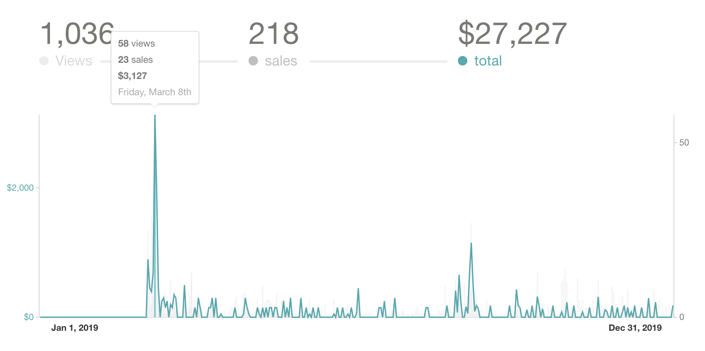
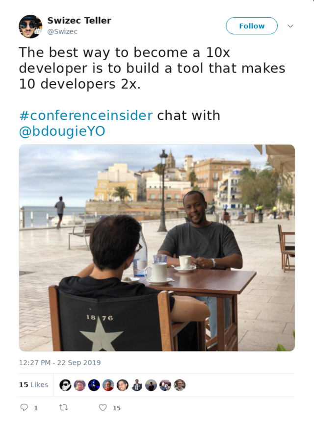

Friend, how do you feel about 2019?

_"Everything is awesome and I feel like a failure"_ about sums it up for me. Year-in-review posts from [2017](https://swizec.com/blog/how-i-sidehustled-dollar72167-last-year-and-what-i-wanna-do-next/) and [2018](https://swizec.com/blog/how-i-sidehustled-dollar180k-and-why-it-almost-killed-my-business/) are such a treat. Much success, such piss and vinegar! Look at Swiz go! 😍

Behind all that success, like [6x-ing my income in 4 years](https://swizec.com/blog/what-i-learned-while-6xing-my-income-in-4-years/), there lurked a secret: **It wasn't sustainable**.

At the end of 2018, I wrote this:

> That’s the theme for 2019. No more hustling. No more heroic efforts. Systems and processes and pipelines. Hustling got me this far, but it won’t get me to the next level.

And that's what I got.

Calculated plodding without excitement. Step after step like an orc. Steady course, progress every day, stop for nothing.

## The framing

I started 2019 with a dying product business, $909 in the bank, index funds I couldn't touch, $6000 buffer, an outstanding invoice for $30k, a strong consulting lead, 4 day/week dayjob, a half developed [ReactForDataViz](https://reactfordataviz.com/) course, and $20,000 in credit card debt.

**One goal: _survive_.**

2020 starts with $44,000 in the bank, 6 figures in long-term savings, all tax estimates paid, a half developed new course, full-time day job, [Serverless Handbook](https://serverlesshandbook.dev) in progress, and no credit card debt.

If a war story sounds interesting right now, keep reading. If not, hit reply and let me know what excites you about 2020. :)

_PS: You should also [help me help you in your career by answering these 3 questions](https://swizecteller.typeform.com/to/JjE6Wh)_

## Q1

Q1 was the most hardworkingest period of my life. So much happened the whole thing is a blur.

In those 3 months I had to:

- finish React For DataViz
- start and complete a wonderful dataviz consulting gig
- launch React For DataViz
- teach a full-day React DataViz workshop at Reactathon
- teach a full-day React + Serverless workshop at Reactathon
- develop the React + Serverless workshop from scratch
- train for and run a marathon
- transition to a new boss at the part-time dayjob
- keep publishing regular emails
- keep livecoding regularly
- manage freelancers building tools to help with Teachable
- manage freelancers building [reactfordataviz.com](https://reactfordataviz.com)
- deal with losing my long-time editor who went off to focus on a magnificent new day job

I pulled it off and then I was ded.

So ded that only an epic motorcycle trip to Yosemite could help me recover. _Freedom From Obligation_, I called it. Totally hope to repeat this year ✌️

### the consulting gig

The consulting gig was _amazing_. Helped me discover a whole new dataviz technique with React and a brand new section for RDV.

Look at that beauty. A donut chart smoothly turning into a bar chart 😍

Click on the pic to learn more about how it works.

### the workshops

Workshops, what can I say about the workshops ... Ben loves me. My Reactathon workshops sell out and get good feedback 🤘

The React Dataviz workshop I've done so often I could pull it off in my sleep by now ... so of course it was rough. Tempo was rusty, explanations just a little off, and the audience could tell my heart was distracted.

That's because the React + Serverless workshop was next day _and I was stressed as shit_.

First time you do a new workshop is always rough. Especially when it's so new, you barely know the topic yourself.

I think the audience could tell. They saw my excitement, they loved my piss and vinegar, but questioned my technology choices and sometimes shallow explanations.

Also look how tired I was:

That right there is a man who **got up at 1am** to finish prepping for a 7 hour workshop.

### React for DataViz

It launched. A week before the workshops.

React Hooks came out so I recorded a whole new section about working with hooks. Opensourced a `useD3` hook for the D3 Blackbox model while I was at it. Something I'd been promising for years.

👉 [d3blackbox.com](https://d3blackbox.com)

That makes it quicker to use some techniques I teach in [React For DataViz](https://reactfordataviz.com)

The launch went well.

I used a new 2 week launch funnel from Ramit Sethi's Breakthrough Launch course. Great course, watched 50% of his material before I said fuck it and pulled the trigger.

Paid $2000 for that course. Should probably finish 🤔

What I like about using Ramit's approach is that _subscribers love it_. I don't get angry unsubs and emails anymore. No more _"How dare you sell to us and not just shower us in wisdom and skills for free?"_

The new approach is the perfect mix between value-add and hard sell that people enjoy reading even if they don't buy 👌

### the marathon

3:24:29 baby

## Q2

Fuck what even happened in Q2 did I just spend all of it recovering from Q1? 🤨

Oh yeah, I spent most of it playing around with React + Serverless techniques including some lessons learned at that Reactathon workshop. Just building small apps, bringing ideas to life.

Until one day an idea struck: What if I charged people to watch me livecode?

[A paid live video series was born](https://gum.co/wkrIa). 10 to 20 sessions, twice a week, watch me build a whole app from idea to production.

Ran a quick launch with the new formula, charged $99, and boom, 80 sales with people begging to get in 💥

It sold like hotcakes and that surprised me. There's something here. 🤔

I celebrated Q2 by taking my shirt off in El Dorado.

Never underestimate the freedom of 3 days offline. 😌

## Q3

Q3 was summer and summers are boring. Nothing big ever happens in the summer.

Wrapped up the Modern React App live video series. Went great. Resulted in [an MVP app](https://spark-joy.netlify.com/) that I've been using in production the past few months.

Almost ready for a ProductHunt launch. Almost 🤞

I'd also been tinkering with the marketing engine around reactfordataviz.com with middling success.

September, I re-ran the React for DataViz launch to my whole mailing list. In part to see what happens, in part so I could visit Europe without writing regular emails.

### europe

Europe was the bomb.

Saw my mum and sister, flew them both to Spain, went to [FullStackFest in Barcelona](https://2019.fullstackfest.com/), taught a soldout-ish full-day workshop on React + GraphQL + Serverles, and starred in a new TV show pilot.

The TV show never materialized, production company got busy with other projects. Hope remains. It was really cool interviewing 9 greats from the JavaScript community over 3 days.

First 9 interviews I've ever done in my life too 😛

It's like an Anthony Bourdain Parts Unknown for nerds _and I'm the anthony bourdain_ 😍

No idea if I'm allowed to talk about it yet and I don't care, that shit was fun. Being in a real shoot with a real production crew is an experience. 7/7 would recommend.

### went back to full-time on the dayjob

I guess big things do happen in summer: In July I went back to full-time at the day job.

👉 [You can read more about it here](https://swizec.com/blog/after-9-months-of-freedom-today-i-start-a-new-job/)

The decision boils down to this:

> I love teaching. I love solving complex problems and breaking them down for everyone to understand. I love helping coders become engineers. That’s a $20k+ difference in salary. I love helping people get that shit and earn what they’re worth. But is that the biggest contribution I can make in the world? **If I win this game, was it worth winning?** You will never get more than about 1% conversions. You will never convert more than 5% on your sales page. You will never have more than 10% opt-ins on your email list. You will never churn less than 0.1% of email opens. That’s the physics. Can you make $10,000/year with infoproducts? Easy. Can you make $100,000/year with infoproducts? Yeah, just keep pulling that lever. Can you make $1,000,000/year? Tough. A few dozen people pulled it off. Can you make $10,000,000/year? Oof. Maybe like 5 people managed to do that?

It’s kinda soul crushing when you think about it. You’re putting in all that risk and hard work and the most you’ll ever have is a small business that lives and dies on its next launch.

**Like showbiz: You’re only as good as your last hit.**

So I leveraged my position, negotiated a good offer, and went back full-time to create time and space to think and ponder my next move. Free from the hustle to survive, I could make long-term bets once more.

## Q4

Middle of Q3 I realized reacfordataviz.com comes up 6th or 7th on Google when you search "react data visualization". _A sales page._ Bonkers. 🤯

So I started a monthly blog on the `/articles` page. An epic livecoding session with an in-depth writeup every month.

Create just enough buzz for a solid marketing engine without too much work on my part.

I missed December.

**Here's a cool number, though:** Through a combination of automated marketing funnels and on-page sales, every page view on reactfordataviz.com is worth 50cents.

And that creates a predictable $1600/month in revenue. Just what I was hoping for at the start of 2019 💪

The predictable part ... would be nice if $$ was higher. The automated marketing engine is missing a few parts still. Once that's done, I'm gonna have a nice money generating asset on my hands.

I hope.

Some time in Q4 I kind of lost steam. My timeboxes fell apart, my schedule got disrupted, my regular writing started slipping, the livecodings became irregular. Not sure what happened.

Probably a combination of things.

You know when you've got everything ticking just so and then you take on a liiiiittle extra and suddenly it all falls apart? That tiny perturbation in your schedule breaks everything.

Also I became excited about a new idea that won't let me sleep.

Oh and I have a new office after we moved in November, check it out 😍

That's a video.

### a start of something new

Those Build & Launch A Whole Product workshops and live video series have been selling far too well. Let's lean in. Let's make a proper self-paced course and go for a big splashy launch.

What if a single launch could make $50k early next year?

We'll see. Stay tuned. Aiming for end of January. I've been testing pieces of the puzzle, trying out some pricing, experimenting with potential upsells. It's gonna be great.

And then if that works oh boy do I have ideas, just you wait.

_Wanna help me help you in your career? [Answer these 3 questions](https://swizecteller.typeform.com/to/JjE6Wh)_

## Profit First or how I _actually_ saved \\\\\\$50k and paid off debt

Ok so I started this post talking about how my bank account went from $909 with debt to $50,000 without debt. Then all I did was talk about work.

Work was a big part of it. You gotta _do_.

The other part of the puzzle was reading [Profit First](https://profitfirstbook.com/) in early January and changing my approach to money. You should consider it too.

Core idea is based on the Richest Man in Babylon principle.

> Pay yourself first. A part of all I earn is mine to keep.

The Profit First formula goes like this:

- 5% of all income goes into profit
- 15% of all income goes into taxes
- 50% of all income goes into your salary
- 35% is what's left

That 35% is what your business must fit into. If it doesn't, optimize until it does. Profit, taxes, and your salary _come first_. **Your business has to fit into what's left**

Everything is a business. _YOU_ are a business my friend.

Salaried employee? Still a business. Money comes in with taxes deducted. Hope you've automated 401k payments, too.

And even of what's left after 401k and taxes, _you should still put 10% (at least) towards something, anything_. Then fit your life into what's left.

That 50k means I can go 6 months without income. That's one hell of a feeling my friend.

## The stuff that failed

I don't like to talk about success without mentioning failure. That paints a bad picture.

So here's some stuff that failed or flopped:

- _swizec.com redesign and rewrite into Gatsby_. Almost done, can't deploy anywhere because it's too massive. Haven't had time to fix
- _threadcompiler.com_. Wanted to build a blogging engine on twitter, gave up halfway because it wasn't coming together as well as I'd like
- _markdownemail.com_. Wanted to productize techletter.app and turn it into a service. Never got around to it.
- _wordpress-to-gatsby_. Built a bunch of tools to export wordpress into MDX in a scalable way, wanted to productize and build a service, didn't get around to it.
- _Conference Insider_. We recorded a whole pilot episode for a new TV show, had lots of fun, but didn't edit and release. I hear it's still in the works.
- _my personal life_. Stopped going on Facebook, cooled off on Twitter, chillaxed on YouTube. Sometimes it's like my friends don't even exist anymore. I think half of them are in the process of moving out of San Francisco. Haven't seen them in months. Stopped opening the groupchat.
- _an onboarding sequence for my mailing list_. I get new subscribers and they're thrown into the fray, it isn't great. Have been wanting to build a choose-what-you-want adventure using my existing evergreen content to ramp them up. Haven't
- _weekly Serverless Handbook chapter_. This one's been tough. I was gonna publish a new chapter every week and dude am I floundering and flopping about. Making good progress though, love how it's turning out :)

## The lesson

1.  Everything is a business
2.  Build your fuck you fund

Reality doesn't care how you feel. You either get it done, or you don't.

Stop worrying about perfection. Go do.

## What's next?

I want to help you improve your career in 2020. [Answer these 3 questions](https://swizecteller.typeform.com/to/JjE6Wh)

**And hit reply with what excites you in 2020**

For me it's all about launching a new course in January, writing Serverless Handbook, and building microproducts like markdownemail.com, markdownlandingpage.com, and spark-joy.netlify.com into money generating assets.

That's what excites me about 2020 my friend.

Cheers,  
~Swizec
