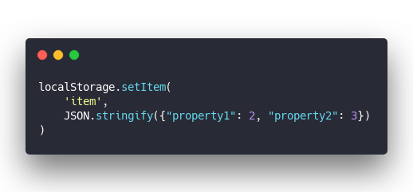
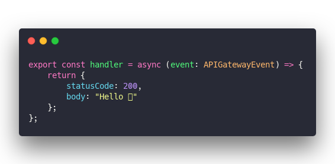
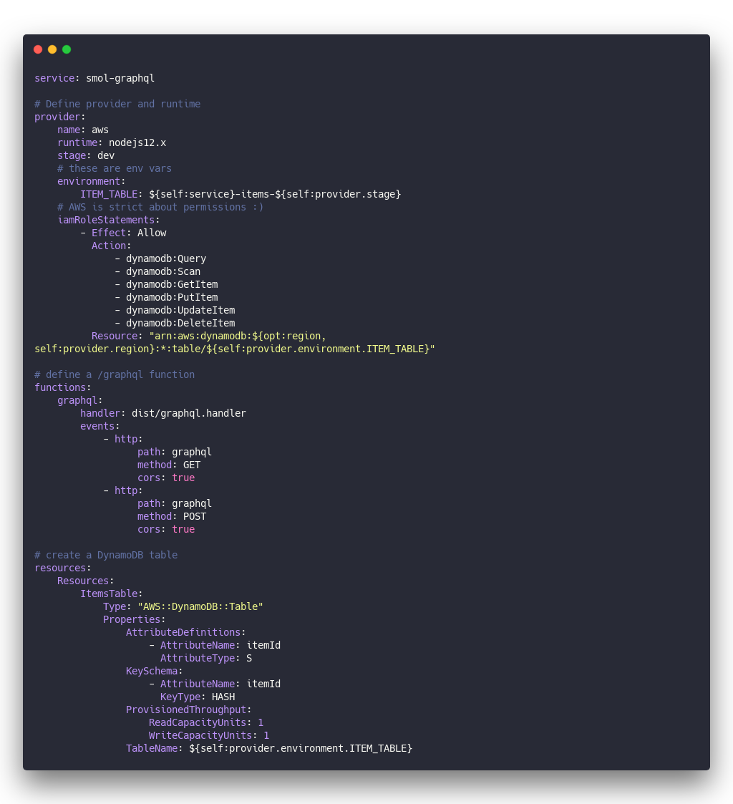
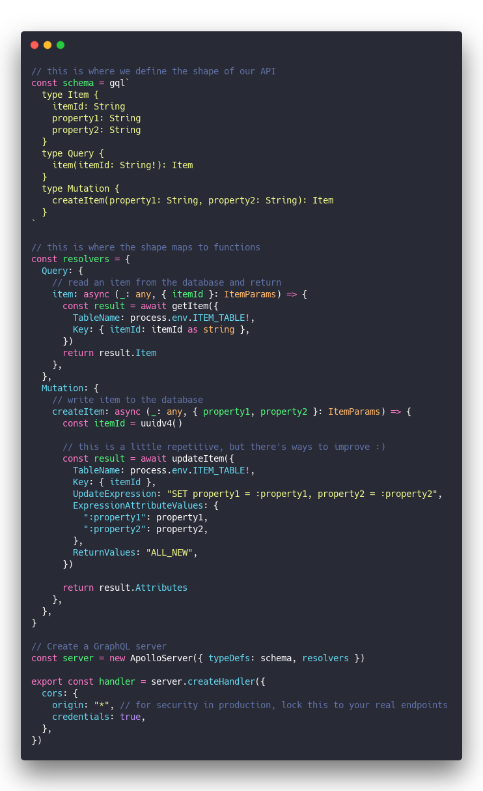
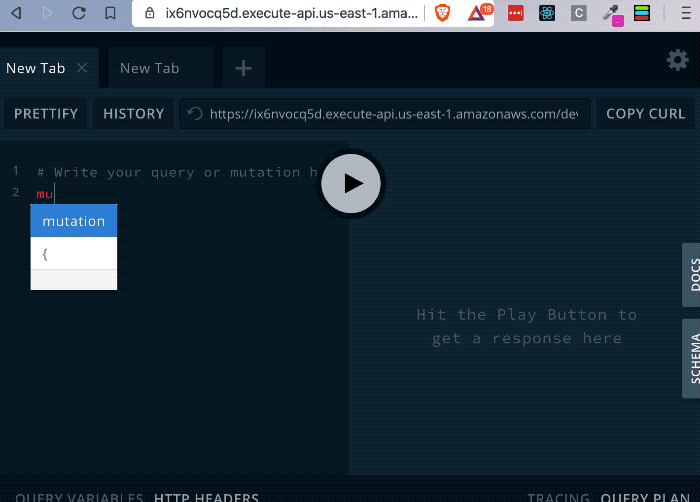
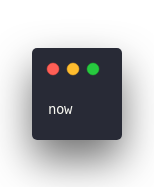

import { ContentUpgrades } from "@swizec/gatsby-theme-course-platform"

You're building an app. It needs to store some data. What do you do?

Easy.

Put it in local storage.

&t=seti&l=javascript&ds=true&wc=true&wa=true&pv=48px&ph=32px&ln=false&code=localStorage.setItem(%0A%09'item'%2C%20%0A%09JSON.stringify(%7B%22property1%22%3A%202%2C%20%22property2%22%3A%203%7D)%0A)>)

You can read `'item'` next time users visit your app. Yay.

Unless they're on a different computer. Or browser. Or need to share between users.

**Time to add a backend. How hard can it be?**

Start a RubyOnRails project, create a model for your data, add routes for reading and writing, add some glue code in your controller, install the JBuilder gem, write a JSON view, create a migration file, run the Postgres database locally, start your Rails app and you're ready to test.

Then you go to AWS, create a new EC2 instance, pick from a billion Linux distributions, set up an HTTP server like Nginx, run your Rails app, add a cronjob to restart the app when it dies, buy a new domain on Namecheap, set up its DNS servers, wait a few hours, point the domain to your server ...

... and you still need the production database.

You now have a virtual server and database running 24/7. Unless they die.

You're in charge of keeping them up, maintaining configuration, waking up at 3am if something goes wrong, and paying for every second of every day _even if nobody uses your app_.

Just to store some data.

Yes, services like Heroku make it easier. Docker gives you pre-configured Linux machines, and Kubernetes does whatever Kubernetes does. Helps keep your servers alive? Maybe improve deployments?

Did I mention you still have to host your webapp somewhere?

You'll need a static file server, some CDN setup, optimize JavaScript builds for production ... you want your webapp to be fast. Can't have it hitting Rails for every little CSS file.

It's a lot of work.

Weeks of engineering time at my day job. 😅

There's a better way, my friend. Serverless for the backend, JAMStack for the frontend.

<ContentUpgrades.ServerlessHandbook />

## Serverless for the backend

The simplest serverless backends look just like functions.

&t=seti&l=typescript&ds=true&wc=true&wa=true&pv=48px&ph=32px&ln=false&code=export%20const%20handler%20%3D%20async%20(event%3A%20APIGatewayEvent)%20%3D%3E%20%7B%0A%09return%20%7B%0A%09%09statusCode%3A%20200%2C%0A%09%09body%3A%20%22Hello%20%F0%9F%91%8B%22%0A%09%7D%3B%0A%7D%3B>)

That's all it takes. That's a server 😍

I like to use TypeScript for the backend so I make fewer mistakes. That's where the `APIGatewayEvent` part comes from.

We [talked about GraphQL](https://serverlessreact.dev/#how-graphql-blows-rest-out-of-the-water) last week, so let's see what it takes to build a basic GraphQL API with serverless.

You need just 2 files:

- an infrastructure definition
- a lambda function that creates your GraphQL server

### infrastructure as code

&t=seti&l=yaml&ds=true&wc=true&wa=true&pv=48px&ph=32px&ln=false&code=service%3A%20smol-graphql%0A%0A%23%20Define%20provider%20and%20runtime%0Aprovider%3A%0A%20%20%20%20name%3A%20aws%0A%20%20%20%20runtime%3A%20nodejs12.x%0A%20%20%20%20stage%3A%20dev%0A%20%20%20%20%23%20these%20are%20env%20vars%0A%20%20%20%20environment%3A%0A%20%20%20%20%20%20%20%20ITEM_TABLE%3A%20%24%7Bself%3Aservice%7D-items-%24%7Bself%3Aprovider.stage%7D%0A%20%20%20%20%23%20AWS%20is%20strict%20about%20permissions%20%3A)%0A%20%20%20%20iamRoleStatements%3A%0A%20%20%20%20%20%20%20%20-%20Effect%3A%20Allow%0A%20%20%20%20%20%20%20%20%20%20Action%3A%0A%20%20%20%20%20%20%20%20%20%20%20%20%20%20-%20dynamodb%3AQuery%0A%20%20%20%20%20%20%20%20%20%20%20%20%20%20-%20dynamodb%3AScan%0A%20%20%20%20%20%20%20%20%20%20%20%20%20%20-%20dynamodb%3AGetItem%0A%20%20%20%20%20%20%20%20%20%20%20%20%20%20-%20dynamodb%3APutItem%0A%20%20%20%20%20%20%20%20%20%20%20%20%20%20-%20dynamodb%3AUpdateItem%0A%20%20%20%20%20%20%20%20%20%20%20%20%20%20-%20dynamodb%3ADeleteItem%0A%20%20%20%20%20%20%20%20%20%20Resource%3A%20%22arn%3Aaws%3Adynamodb%3A%24%7Bopt%3Aregion%2C%20self%3Aprovider.region%7D%3A*%3Atable%2F%24%7Bself%3Aprovider.environment.ITEM_TABLE%7D%22%0A%20%20%20%20%20%20%20%20%20%20%0A%23%20define%20a%20%2Fgraphql%20function%0Afunctions%3A%0A%20%20%20%20graphql%3A%0A%20%20%20%20%20%20%20%20handler%3A%20dist%2Fgraphql.handler%0A%20%20%20%20%20%20%20%20events%3A%0A%20%20%20%20%20%20%20%20%20%20%20%20-%20http%3A%0A%20%20%20%20%20%20%20%20%20%20%20%20%20%20%20%20%20%20path%3A%20graphql%0A%20%20%20%20%20%20%20%20%20%20%20%20%20%20%20%20%20%20method%3A%20GET%0A%20%20%20%20%20%20%20%20%20%20%20%20%20%20%20%20%20%20cors%3A%20true%0A%20%20%20%20%20%20%20%20%20%20%20%20-%20http%3A%0A%20%20%20%20%20%20%20%20%20%20%20%20%20%20%20%20%20%20path%3A%20graphql%0A%20%20%20%20%20%20%20%20%20%20%20%20%20%20%20%20%20%20method%3A%20POST%0A%20%20%20%20%20%20%20%20%20%20%20%20%20%20%20%20%20%20cors%3A%20true%0A%20%20%20%20%20%20%20%20%20%20%20%20%20%20%20%20%20%20%0A%23%20create%20a%20DynamoDB%20table%0Aresources%3A%0A%20%20%20%20Resources%3A%0A%20%20%20%20%20%20%20%20ItemsTable%3A%0A%20%20%20%20%20%20%20%20%20%20%20%20Type%3A%20%22AWS%3A%3ADynamoDB%3A%3ATable%22%0A%20%20%20%20%20%20%20%20%20%20%20%20Properties%3A%0A%20%20%20%20%20%20%20%20%20%20%20%20%20%20%20%20AttributeDefinitions%3A%0A%20%20%20%20%20%20%20%20%20%20%20%20%20%20%20%20%20%20%20%20-%20AttributeName%3A%20itemId%0A%20%20%20%20%20%20%20%20%20%20%20%20%20%20%20%20%20%20%20%20%20%20AttributeType%3A%20S%0A%20%20%20%20%20%20%20%20%20%20%20%20%20%20%20%20KeySchema%3A%0A%20%20%20%20%20%20%20%20%20%20%20%20%20%20%20%20%20%20%20%20-%20AttributeName%3A%20itemId%0A%20%20%20%20%20%20%20%20%20%20%20%20%20%20%20%20%20%20%20%20%20%20KeyType%3A%20HASH%0A%20%20%20%20%20%20%20%20%20%20%20%20%20%20%20%20ProvisionedThroughput%3A%0A%20%20%20%20%20%20%20%20%20%20%20%20%20%20%20%20%20%20%20%20ReadCapacityUnits%3A%201%0A%20%20%20%20%20%20%20%20%20%20%20%20%20%20%20%20%20%20%20%20WriteCapacityUnits%3A%201%0A%20%20%20%20%20%20%20%20%20%20%20%20%20%20%20%20TableName%3A%20%24%7Bself%3Aprovider.environment.ITEM_TABLE%7D>)

This might look scary, but imagine doing it by hand. Eeeevery time you want to make a small change.

It's your whole infrastructure. Defines your runtime environment, API endpoints, even creates a database using DynamoDB. And it hooks everything up on its own.

Your infrastructure becomes code.

That way you always know what's running in production. Every branch of your project can use a different setup, every feature can add what it needs. Never mess around by hand ever again. ✌️

We go into more detail in my new course, [ServerlessReact.Dev](https://serverlessreact.dev)

### a small GraphQL server

&t=seti&l=typescript&ds=true&wc=true&wa=true&pv=48px&ph=32px&ln=false&code=%2F%2F%20this%20is%20where%20we%20define%20the%20shape%20of%20our%20API%0Aconst%20schema%20%3D%20gql%60%0A%20%20type%20Item%20%7B%0A%20%20%20%20itemId%3A%20String%0A%20%20%20%20property1%3A%20String%0A%20%20%20%20property2%3A%20String%0A%20%20%7D%0A%20%20type%20Query%20%7B%0A%20%20%20%20item(itemId%3A%20String!)%3A%20Item%0A%20%20%7D%0A%20%20type%20Mutation%20%7B%0A%20%20%20%20createItem(property1%3A%20String%2C%20property2%3A%20String)%3A%20Item%0A%20%20%7D%0A%60%0A%0A%2F%2F%20this%20is%20where%20the%20shape%20maps%20to%20functions%0Aconst%20resolvers%20%3D%20%7B%0A%20%20Query%3A%20%7B%0A%20%20%20%20%2F%2F%20read%20an%20item%20from%20the%20database%20and%20return%0A%20%20%20%20item%3A%20async%20(_%3A%20any%2C%20%7B%20itemId%20%7D%3A%20ItemParams)%20%3D%3E%20%7B%0A%20%20%20%20%20%20const%20result%20%3D%20await%20getItem(%7B%0A%20%20%20%20%20%20%20%20TableName%3A%20process.env.ITEM_TABLE!%2C%0A%20%20%20%20%20%20%20%20Key%3A%20%7B%20itemId%3A%20itemId%20as%20string%20%7D%2C%0A%20%20%20%20%20%20%7D)%0A%20%20%20%20%20%20return%20result.Item%0A%20%20%20%20%7D%2C%0A%20%20%7D%2C%0A%20%20Mutation%3A%20%7B%0A%20%20%20%20%2F%2F%20write%20item%20to%20the%20database%0A%20%20%20%20createItem%3A%20async%20(_%3A%20any%2C%20%7B%20property1%2C%20property2%20%7D%3A%20ItemParams)%20%3D%3E%20%7B%0A%20%20%20%20%20%20const%20itemId%20%3D%20uuidv4()%0A%0A%20%20%20%20%20%20%2F%2F%20this%20is%20a%20little%20repetitive%2C%20but%20there's%20ways%20to%20improve%20%3A)%0A%20%20%20%20%20%20const%20result%20%3D%20await%20updateItem(%7B%0A%20%20%20%20%20%20%20%20TableName%3A%20process.env.ITEM_TABLE!%2C%0A%20%20%20%20%20%20%20%20Key%3A%20%7B%20itemId%20%7D%2C%0A%20%20%20%20%20%20%20%20UpdateExpression%3A%20%22SET%20property1%20%3D%20%3Aproperty1%2C%20property2%20%3D%20%3Aproperty2%22%2C%0A%20%20%20%20%20%20%20%20ExpressionAttributeValues%3A%20%7B%0A%20%20%20%20%20%20%20%20%20%20%22%3Aproperty1%22%3A%20property1%2C%0A%20%20%20%20%20%20%20%20%20%20%22%3Aproperty2%22%3A%20property2%2C%0A%20%20%20%20%20%20%20%20%7D%2C%0A%20%20%20%20%20%20%20%20ReturnValues%3A%20%22ALL_NEW%22%2C%0A%20%20%20%20%20%20%7D)%0A%0A%20%20%20%20%20%20return%20result.Attributes%0A%20%20%20%20%7D%2C%0A%20%20%7D%2C%0A%7D%0A%0A%2F%2F%20Create%20a%20GraphQL%20server%0Aconst%20server%20%3D%20new%20ApolloServer(%7B%20typeDefs%3A%20schema%2C%20resolvers%20%7D)%0A%0Aexport%20const%20handler%20%3D%20server.createHandler(%7B%0A%20%20cors%3A%20%7B%0A%20%20%20%20origin%3A%20%22*%22%2C%20%2F%2F%20for%20security%20in%20production%2C%20lock%20this%20to%20your%20real%20endpoints%0A%20%20%20%20credentials%3A%20true%2C%0A%20%20%7D%2C%0A%7D)>)

And you're done.

In those 50 lines of code, you've defined the shape of your API with a GraphQL schema, mapped it to resolver functions, and created a server. It even comes with a playground so you can test your API.

Heck, here's a link 👉 [try this basic API](https://ix6nvocq5d.execute-api.us-east-1.amazonaws.com/dev/graphql)

GraphQL machinery handles data transformations and understanding queries. Serverless machinery sets up your servers, keeps them running, and exposes a URL to the world.

**Your frontend skills transfer directly to the backend.** _If you can write a JavaScript function, you can write your backend._ And that's amazing, my friend.

You'll learn this in more detail with [ServerlessReact.dev](https://serverlessreact.dev)

## Serverless runs only when it needs to

Serverless keeps your code ready, _but not running_. You only pay what you use.

That's why I'm so ready to host that example above and give you a link. Costs me nothing. Server only runs when you hit the link.

You visit the URL and that's when the magic happens.

Serverless wakes up a server, creates a new instance, routes the URL to your function, and calls your code. Code talks to a database, gets the data, and returns. Just like a normal function.

All within milliseconds.

👉 **simple servers, running simple functions; on demand**. It's brilliant.

## JAMStack to host the frontend

That's your backend then. What about the webapp?

Well, there's a bunch of startups solving that problem. The industry looked at how hard this was and thought _"Nah, we can fix this"_

And they did!

Netlify is great because it's popular. But Zeit's my favorite. Just because of how slick it is.

Go into your webapp folder and run

&t=seti&l=null&ds=true&wc=true&wa=true&pv=48px&ph=32px&ln=false&code=now>)

That's it. You have a globally deployed webapp with a public URL, CDN configuration, static builds at deploy, and everything else a modern app needs.

Don't know about you, my friend, but this is the most excited I've been about web development since I discovered React in 2015.

Cheers, ~Swizec

PS: yes both Netlify and Zeit added support for cloud functions in the latter parts of 2019. As much as I love the bleeding edge, I think staying a year or two behind the curve is best. They both use AWS Lambda under the hood anyway :)

PPS: don't forget, [ServerlessReact.Dev](https://serverlessreact.dev) that teaches you this wonderful new stack in detail is $100 off just this week
